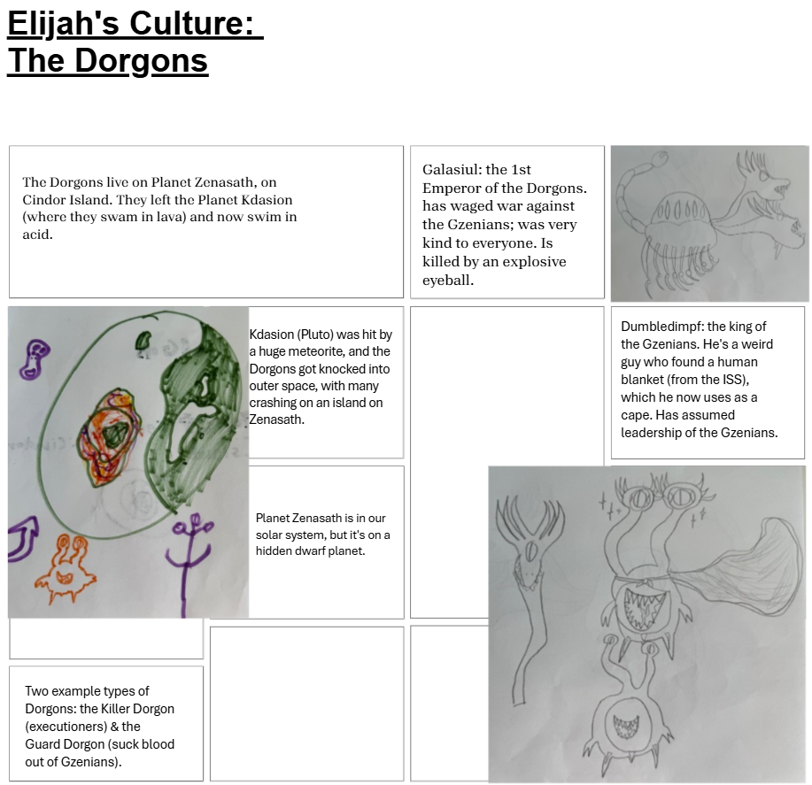

# Week 11: Word Order

## Thus far we’ve worked on Component 3...

- Lexicon
- Nouns
- Verbs

---

## For Today: Word Order

- What is the word order of your:
- Noun phrases?
- Verb phrases?
- Prepositional phrases?
- Your sentence?

---

## Noun Phrases

- Consists of:
- Nouns (N) -- this is the “head”
- Determiners (a(n), the, this, my; Det)
- Adjectives (A)
- Prepositional Phrases (PP)
- ** There is a set word order in English **

---

## This Word Order applies to all Noun Phrases

- The quick fox in the forest
- Det + A + N + PP

---

## This Word Order applies to all Noun Phrases

- That old chair on the floor
- Det + A + N + PP

---

## Possible Word Orders in NPs

- The fox quick in the forest (Spanish)
- Det + N + A + PP
- The quick in the forest fox (Japanese)
- Det + A + PP + N
- Fox quick the in the forest (Welsh)
- N + A + Det + PP

---

## Which do you choose?				Mɤɧøɴ

- “That small metra in the water”
- Literal translation:
- ɣɤ  	  ɴekowe    iɴ         	ɓɤ-meɴ
- “That” “small”      “metra”   	“in-water”

---

## Possible Word Orders in NPs

- ɣɤ      iɴ        ɴekowe    ɓɤ-meɴ
- That metra small in the water (Spanish)
- Det + N + A + PP
- ɣɤ  	ɴekowe  ɓɤ-meɴ          iɴ
- That small in the water metra (Japanese)
- Det + A + PP + N
- iɴ     ɴeke  	ɣɤ  	 ɓɤ-meɴ
- Fox quick that in the forest (Welsh)
- N + A + Det + PP

---

## Positions of Head - Where is the noun?

- ɣɤ      iɴ        ɴekowe    ɓɤ-meɴ
- That metra small in the water (Spanish)
- Det + N + A + PP
- ɣɤ  	ɴekowe  ɓɤ-meɴ          iɴ
- That small in the water metra (Japanese)
- Det + A + PP + N
- iɴ     ɴekowe  	ɣɤ  	 ɓɤ-meɴ
- Metra small that in the water (Welsh)
- N + A + Det + PP

- Transitional

- Head Final

- Head Initial

---

## How to choose?

- Suffixes vs. Prefixes
- Languages that have suffixes tend to be head-final
- Languages that have prefixes tend to be head-initial
- ku-ta-ʛu
- you-it-drink

---

## Positions of Head - Where is the noun?

- ɣɤ      iɴ        ɴekowe    ɓɤ-meɴ
- That metra small in the water (Spanish)
- Det + N + A + PP
- ɣɤ  	ɴekowe  ɓɤ-meɴ          iɴ
- That small in the water metra (Japanese)
- Det + A + PP + N
- iɴ     ɴekowe  	ɣɤ  	 ɓɤ-meɴ
- Metra small that in the water (Welsh)
- N + A + Det + PP

- Transitional

- Head Final

- Head Initial

---

## Which do you choose?

- Prefixes = head-initial!
- iɴ     ɴeke  	ɣɤ  	 ɓɤ-meɴ
- Metra small that in the water (Welsh)
- N + A + Det + PP

---

## How to choose?

- 2.    Don’t have suffixes or prefixes (or have a mixture of the two)?
- These languages tend to be head-initial or transitional.

---

## It’s your turn!

- ɣɤ      iɴ        ɴekowe    ɓɤ-meɴ
- That metra small in the water (Spanish)
- Det + N + A + PP
- ɣɤ  	ɴekowe  ɓɤ-meɴ          iɴ
- That small in the water metra (Japanese)
- Det + A + PP + N
- iɴ     ɴekowe  	ɣɤ  	 ɓɤ-meɴ
- Metra small that in the water (Welsh)
- N + A + Det + PP

- Transitional

- Head Final

- Head Initial

- Work with your group to determine the order of words in your noun phrase and translate “that quick fox in the woods” (or something similar)

---

## Verb Phrases

- Consists of:
- Verbs (V) -- this is the “head”
- Noun Phrases (NP)
- Prepositional Phrases (PP)
- ** There is a set word order in English **

---

## This Word Order applies to all Noun Phrases

- Eyes the man from the grass.
- V + NP + PP

---

## Which do you choose?				Mɤɧøɴ

- “Hears a dinosaur from the sand.”
- Literal translation:
- won  	  we    		ɧaŋ-ɭa
- “hears” “(a) dino” 	“from-sand”

---

## Positions of Head - Where is the verb?

- won  	  we    			ɧaŋ-ɭa
- hear(s)	(a) dino			from-sand (Welsh)
- V + NP + PP
- ɧaŋ-ɭa 	  we 			won
- From-sand 	(a) dino		hear(s)	(Japanese)
- PP + NP + V

- Head Final

- Head Initial

---

## Which do you choose?				Mɤɧøɴ

- won  	  we    			ɧaŋ-ɭa
- hear(s)	(a) dino			from-sand (Welsh)
- V + NP + PP
- ɧaŋ-ɭa 	  we 			won
- From-sand 	(a) dino		hear(s)	(Japanese)
- PP + NP + V

- Head Final

- Head Initial

---

## It’s your turn!

- Modify your word order following what you’ve already done with your NPs, and translate:
- “Hears a man from the sand.”

---

## Prepositional Phrases

- Consists of:
- Prepositions (P) -- this is the “head”
- Noun Phrase (NP)
- ** There is a set word order in English **

---

## Prepositional 		vs. 		Postpositional

- “In bed”						*“Bed in”
- “On the way”					*“The way on”
- “From my nose”					*“My nose from”
- “With a spoon”					*“A spoon with”
- *“Ago 20 years”					“20 years ago”

- Head Initial

- Head Final

---

## Which do you choose?				Mɤɧøɴ

- Must be head-initial (already chose that route!)
- Location: 		in Undersplash			ɓɤ-wisiyesi
- Source:			from Undersplash		ɧaŋ-wisiyesi
- Instrument:		with Chomper			ti-çampa
- Possession:		Chomper’s			xɤ-çampa

---

## Which do you choose?

- Extend the work you’ve done with NPs & VPs to choose a PP word order.  Then translate the following sentence:
- “From the water”

---

## Sentences

- 3 most common word orders:
- VSO			Kicks the boy the ball. 		- Head-Initial
- SOV			The boy the ball kicks. 		- Head-Final
- SVO			The boy kicks the ball. 		- Transitional

---

## Sentences

- 3 most common word orders:
- VSO					Kicks the boy the ball.
- SOV					The boy the ball kicks.
- SVO					The boy kicks the ball.

---

## Which do you choose?				Mɤɧøɴ

- Must be head-initial (already chose that route!)	-  	VSO
- ʀuɗe çampa meɴ. “Chomper gives water” (generally) →
- ʀɤnʀuɗe çampa meɴ we. “Chomper gives water to the dinosaur.”
- onʀuɗe çampa meɴ iɴ. “Chomper gives water to the metra.”
- sønʀuɗe çampa meɴ ɓiŋ. “Chomper gives water to the seaweed.”

---

## Which do you choose?

- Extend the work you’ve done with NPs, VPs, & PPs to choose a sentence word order.  Then translate the following sentence:
- “That small person in the water hears a dog from the sand.”

---

## Y’ALL YOU CAN TRANSLATE YOUR FINAL PROJECT NOW

# Week 11: Word Order

## Review

- Headedness:
- Prefixes, Suffixes, Mix
- Head-Initial, Head-Final, Transitional
  - Noun Phrases
  - Verb Phrases
  - Adpositional Phrases
  - Sentences

---

## Dorgon Word Order: Let's Review the Grammar

- Nominals
  - Number
  - Case
- Verbs
  - Tense
  - Mood
  - Valence
  - Incorporation

---

## Dorgon Word Order – What do we choose?

- Nominals
  - Number
  - Case
- Verbs
  - Tense
  - Mood
  - Valence
  - Incorporation

---

## Next Time – We'll translate some Dorgon

---

## In Class Activity – Let's Translate Constances's Language: ŋɶbu

- Word Order: Transitional
- Nominals:
  - Number: sg., du., tr., pa., pl.
  - Case: subj., DO, IO, 'before', 'after', 'from', 'with, 'of'
  - Articles; 'a', 'the'
- Verbs:
  - Person/number
  - Tense
  - Mood
  - Voice

---

## In Class Activity – ŋɶbu

- Let's translate together:
- I stand before a mountain.  The fire burns the crops.

---

## In Class Activity – ŋɶbu

- With your groupmates:
- Compose a sentence in ŋɶbu with at least one noun, one adjective, and one verb.

---

## Now return to your language

- Translate a sentence like:
- I stand before a mountain. The fire burns the crops.
- What grammar do you lack to do?

# Week 11: Word Order

## Question 15

- How does your language treat questions? Are question words moved to the beginning of the sentence (through so-called “wh-movement”), or are they left in the normal position of nouns & adverbs? (Be sure to define each word / phrase that you've invented for your language, which you cite)

---

## Remember – Component 3 due Monday!

- Any other questions about what you need to do?

---

---

## In Class Activity – Let's Translate Pxsinunr

- Behold!  I am Galasiul.  I am the greatest of all (the) Dorgons.
- As emperor, all Dorgons bow at my feet.
- (The) Killer Dorgons lay their weapons at my feet.
- (The) Guard Dorgons hide their fangs in my magnificent presence.
- I have travelled a great distance, from Kdasion to this small island on Zenasath.
- Behold! There is Dumbledimpf. He is a small idiot. He wears a blankie with shame.
- Behold! An eye of fire comes to me.
