# Day 13: Language History; Writing Systems

## Today

- Overview of history questions in component 4
- Fundamentals of writing systems

---

## All languages have a history – discuss with your neighbors

- How old is English?
- Where does English come from?
- More broadly, where does language come from?

---

- Proto-Indo-European (PIE)
- Indo-European (IE) languages

---

## What did PIE sound like?

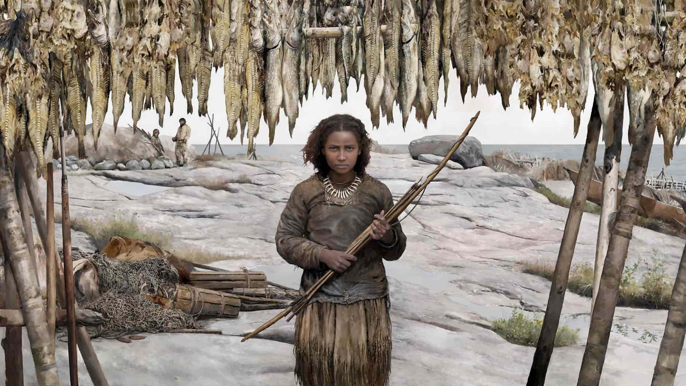

- https://www.espoo.fi/en/events/espooevents:af7mlp3mre

---

## What did PIE sound like?

- I remember him,
- The undefeated Thunderer,
- He who defeats enemies,
- He whom the Broad Earth bore,
- He killed the Serpent!

- A son was born from Father Sky and the Broad Earth.
- Thunderer, by name.
- He drinks mead with the immortal gods.
- He has protected men and livestock, the two-footed and the four-footed,
- He killed the Serpent!

- A serpent was born in the water, in the depths, in the darkness.
- At first, the Serpent overcame the Thunderer and the Immortal gods.
- He killed men and livestock, the two-footed and the four-footed.
- The Thunderer escaped and received the hammer from the Fashioner.
- He killed the Serpent!

---

## https://phillbarnett.com/

- https://publires.unicatt.it/en/persons/riccardo-ginevra

---

## What did PIE sound like?

- Memónh₂a tóm,
- N̥tr̥h₂tóm Tn̥h₂ántm̥,
- H1i̯ós ḱétrums tr̥h₂uti,
- H1i̯óm Pl̥th₂ús Dhéǵhōm bheret,
- H1é gwhent h1ógwhim!

- Suh₂nús Pəh₂trés Diu̯és Pl̥th₂áu̯s-kwe Dhəǵhmés ǵn̥h1to.
- Tn̥h₂ánts h1nómn̥.
- Médhu n̥mr̥tṓi̯s déi̯u̯ōi̯s pibh₃oti.
- U̯íh1roms péḱuh₂-kwe pēh₂st, du̯ipédm̥s kwétu̯rpedm̥s-kwe pēh₂st.
- H1é gwhent h1ógwhim!

- Ǵn̥h1tó h1ógwhis udéni, bhudhnói, h1régwesu.
- H1ógwhis próteros Tn̥h₂ántm̥ N̥mr̥tóms déi̯u̯oms-kwe tr̥h₂ut.
- H1é gwhent u̯íh1roms péḱuh₂-kwe, du̯ipédm̥s kwétu̯r̥pedm̥s-kwe.
- Tn̥h₂ánts bhunékt u̯áǵrom-kwe Tu̯r̥ḱtrés dēḱt.
- H1é gwhent h1ógwhim!

- Performed by Phill Barnett

---

## Let's go through this together.

- I remember him,
- The undefeated Thunderer,
- He who defeats enemies,
- He whom the Broad Earth bore,
- He killed the Serpent!

- Memónh₂a tóm,
- N̥tr̥h₂tóm Tn̥h₂ántm̥,
- H1i̯ós ḱétrums tr̥h₂uti,
- H1i̯óm Pl̥th₂ús Dhéǵhōm bheret,
- H1é gwhent h1ógwhim!

---

- Suh₂nús Pəh₂trés Diu̯és Pl̥th₂áu̯s-kwe Dhəǵhmés ǵn̥h1to.
- A son was born from Father Sky and the Broad Earth.
- Tn̥h₂ánts h1nómn̥.
- Thunderer, by name.
- Médhu n̥mr̥tṓi̯s déi̯u̯ōi̯s pibh₃oti.
- He drinks mead with the immortal gods.
- U̯íh1roms péḱuh₂-kwe pēh₂st, du̯ipédm̥s kwétu̯rpedm̥s-kwe pēh₂st.
- He has protected men and livestock, the two-footed and the four-footed,
- H1é gwhent h1ógwhim!
- He killed the Serpent!

---

- Ǵn̥h1tó h1ógwhis udéni, bhudhnói, h1régwesu.
- A serpent was born in the water, in the depths, in the darkness.
- H1ógwhis próteros Tn̥h₂ántm̥ N̥mr̥tóms déi̯u̯oms-kwe tr̥h₂ut.
- At first, the Serpent overcame the Thunderer and the Immortal gods.
- H1é gwhent u̯íh1roms péḱuh₂-kwe, du̯ipédm̥s kwétu̯r̥pedm̥s-kwe.
- He killed men and livestock, the two-footed and the four-footed.
- Tn̥h₂ánts bhunékt u̯áǵrom-kwe Tu̯r̥ḱtrés dēḱt.
- The Thunderer escaped and received the hammer from the Fashioner.
- H1é gwhent h1ógwhim!
- He killed the Serpent!

---

## Identifying Sound Changes

- tó- ‘that one’
- tn̥h₂ánt- ‘thundering’
- tr̥h₂u- ‘cross’
- -t (in gwhent) ‘3 sg.’

- the, this, that, those, these
- thun-der
- through (OE þurh)
- -th (giveth, taketh)

- What does PIE *t generally become in English?

---

## Elsewhere

- tó- ‘that one’
- tn̥h₂ánt- ‘thundering’
- tr̥h₂u- ‘cross’
- -t (in gwhent) ‘3 sg.’

- is-te
- tonare
- trans
- id est (i.e.)

- What does PIE *t generally become in Latin?

---

## Identifying Sound Changes

- Diu̯- ‘god, Zeus’
- du̯i- ‘two’
- deḱ- ‘take’
- u̯ed-, udén- ‘water’

- Tues-day
- twice, twin
- MLG teche ‘order, array’
- wet, water

- What does PIE *d generally become in English?

---

## Elsewhere

- Diu̯- ‘god, Zeus’
- du̯i- ‘two’
- deḱ- ‘take’
- u̯ed-, udén- ‘water’

- deus, divus
- bi-
- dexter, decor, doceo, etc.
- unda

- What does PIE *d generally become in Latin?

---

## Identifying Sound Changes

- bhudhnó- ‘bottom’
- dheh1- ‘put, place, do’
- dhu̯or- ‘door’
- dʰeiǵʰ- ‘knead, build’

- OE bodan  ‘bottom’
- do
- door
- dough

- What does PIE *dh generally become in English?

---

## Elsewhere

- bhudhnó- ‘bottom’
- dheh1- ‘put, place, do’
- dhu̯or- ‘door’
- dʰeiǵʰ- ‘knead, build’

- fundus
- facio, fact-
- for-
- fict-

- What does PIE *dh generally become in Latin?

---

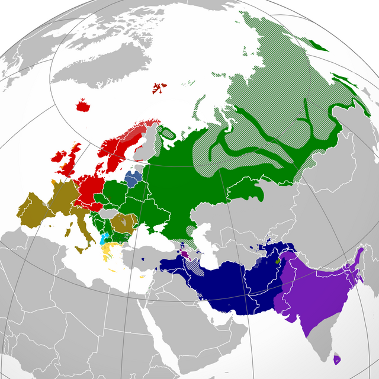

- These are the sorts of changes scholars identify in establishing genetic relationships between families.

---

## Question 1

- 1. What is the history of your language? Where does it come from? What is the history of your conlang's speakers?

---

## How to approach this question

- What is the backstory of your culture?
  - How did your group of people get to where they live?
  - Where did they come from?
  - How long has it been since your group of people left where they came from?

---

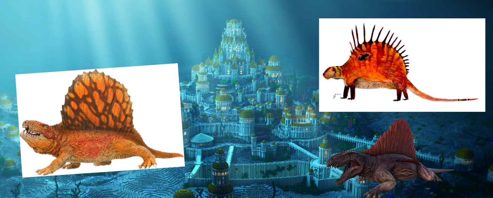

- The Mɤɧøɴ are a group of underwater dinosaurs -- what backstory would you invent for them?

---

## Question 2

- 2. Discuss one other language that your conlang is related to in detail. Describe this language's history, and the point at which your language and this second language diverged."

---

## How to approach this question

- Now focus on where your group of people came from
  - Think about their original culture
  - What other groups might have also originated from this culture?
  - What is their story?

---

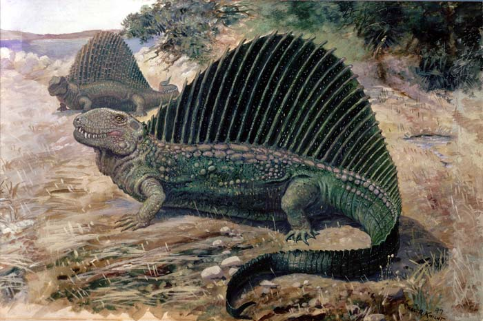

---

## Today

- Overview of history questions in component 4
- Fundamentals of writing systems

---

## Writing

- What are writing systems?

---

## In making your writing system, you have two tasks...

- What are the symbols used in the system?
- What type of writing system is it?
- Today’s task -- experimenting with the look of your language’s symbols

---

## Symbols?

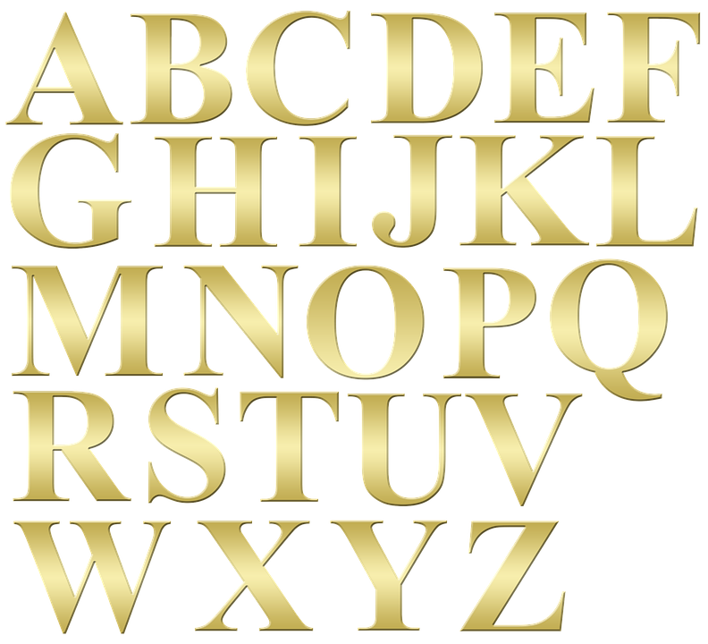

---

## Symbols?

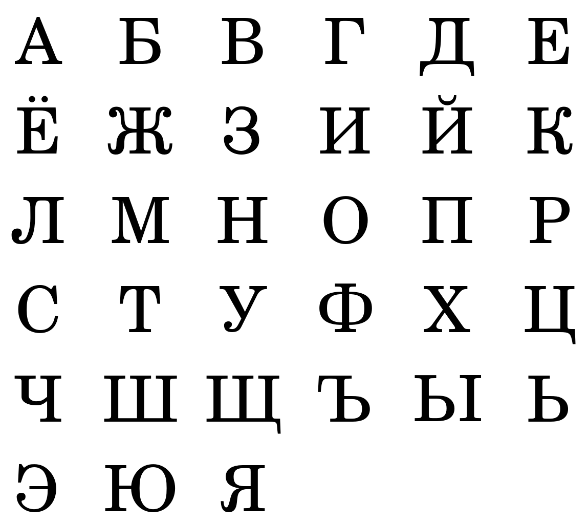

---

## Symbols?

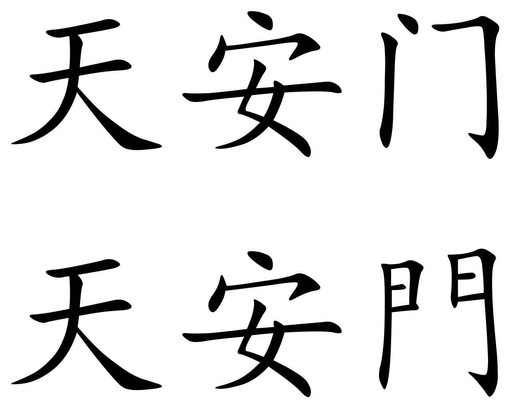

---

## Symbols?

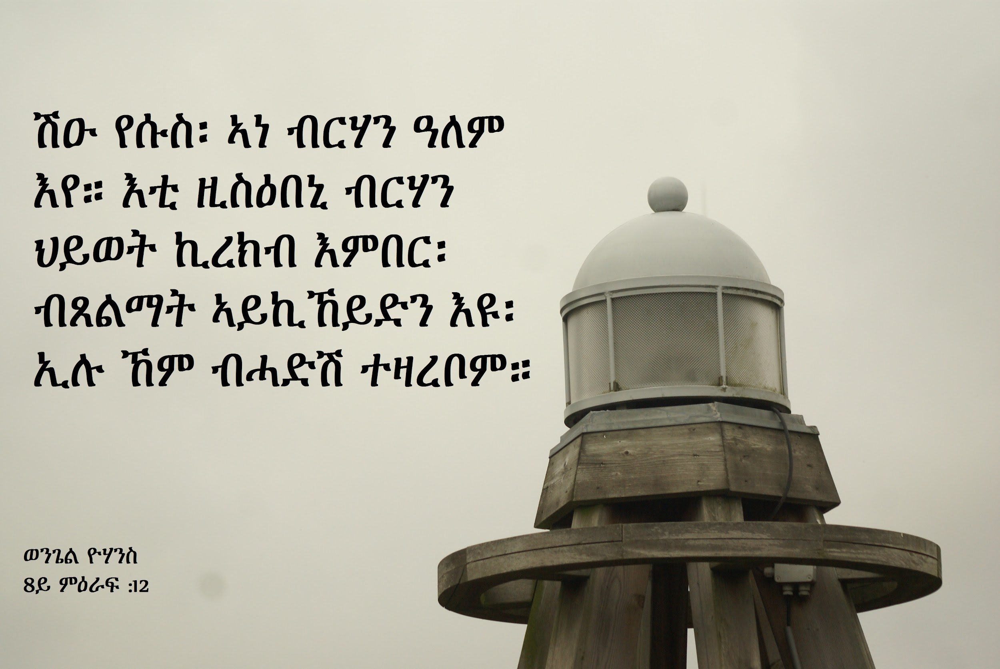

---

## With your group

- Visit https://omniglot.com/, click on each category under “Writing Systems”: “alphabets”, “abjads”, “abugidas”, etc.
- Choose three writing systems that you like the look of
- Think:
  - What about these writing systems appeals to you?
  - Are the characters angular? Circular?
  - Do the characters run together or are they separate (i.e. curvise vs. block)?
  - When your group of people write things down, what are they writing on?
- Mɤɧøn -- underwater rock carvings

---

## Next task - Let’s sketch 5 symbols

- https://sketch.io/sketchpad/

---

## Alex’s Creations

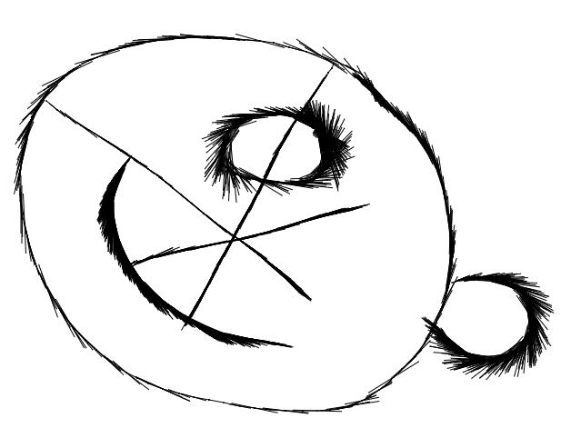

# Day 13: Language History; Writing Systems

## Review

- History:
  - Where does your group come from?
  - What is a related group?
- Writing Systems
  - What are they?
  - Five symbols!

---

## Last time: 5 symbols

---

## Next task - Let’s sketch 5 more symbols

- https://sketch.io/sketchpad/

---

## Let’s begin by attributing a function to those symbols...

- When making a writing system, you have to decide:
- Do the symbols represent sounds?   (phonographic)
- Do they represent meaning?      (logographic)
- Or are they part of a hybrid system?

---

## Today: Writing Systems that Represent Sounds

- Symbols represent sound segments
  - Alphabet
  - Abjad
  - Abugida / Alphasyllabary
- Symbols represent syllables
  - Syllabary

---

## Syllabaries

- Each symbol represents a unique syllable in the language
- <If> <Eng><lish> <had> <a> <syl><la><ba><ry> <we> <would> <write> <like> <this>

---

## Syllables

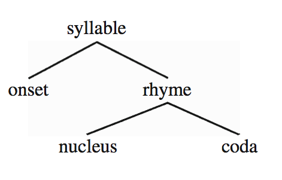

- C	V			C
- c	a			t
- d	o			g

---

## Japanese Hiragana

---

## Cherokee Syllabary

---

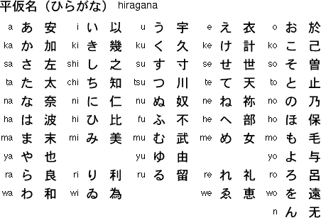

- さす
- のき
- あした
- うら

---

## English as a Syllabary?

- Is English a good candidate for using a syllabary?
- Onsets (1, 25) + (2,  ~42) + (3 x ~ 9) = 76
- Nuclei – 18 (14 vowels + syllabic liquids, nasals)
- Codas –  ~100
- 18 + (76 x 18) + (100 x 18) + (76 x 18 x 100) = 139,986!!!!!

---

## Syllabaries

- Many of the world’s languages that utilize syllabaries have very restrictive syllable structure
- Syllables look like CVCVCVCVCV
  - CV = consonant + vowel
  - cf. Hawaiian meli kalikamaka ‘Merry Christmas’
  - cf. Japanese meri kurisumasu ‘Merry Christmas’
- In a syllabary, each grapheme should represent a syllable
  - And what does every syllable have?
  - A nucleus! (usually a vowel, V)
  - So each grapheme – at the bare minimum – should represent a nucleus

---

## Should Mɤɧøɴ have a syllabary?

---

|  | Bilabial | Alveolar | Retroflex | Palatal | Velar | Uvular |
|---|---|---|---|---|---|---|
| Stop voiceless implosive | p ɓ | t ɗ |  |  | k ɠ | q ʛ |
| Nasal | m | n |  |  | ŋ | ɴ |
| Fricative voiceless voiced |  | s |  | ç | x  ɧ ɣ |  |
| Glide | w |  |  | j |  |  |
| Liquid |  |  | ɭ |  |  | ʀ |

---

|  | Front | Central | Back |
|---|---|---|---|
| High | i |  | u |
| Mid | e ø |  | ɤ o |
| Low |  | a |  |

---

## What’s really important: Phonotactics

---

## So… syllables are either CV or CVN

- This means:
- pi	pe	pø	pa	pɤ	po	pu
- pim	pem	pøm	pam	pɤm	pom	pum
- pin	pen	pøn	pan	pɤn	pon	pun
- piŋ	peŋ	pøŋ	paŋ	pɤŋ	poŋ	puŋ
- piɴ	peɴ	pøɴ	paɴ	pɤɴ	poɴ	puɴ

- 7 x 5 = 35 symbols
- 21 consonants
- 35 x 21 = 735 symbols!!!!

---

## Japanese Hiragana has  a “Cheat”

---

## Cherokee Syllabary also has a “Cheat”

---

## Creating a “Cheat” for Mɤɧøɴ

- This means:
- pi	pe	pø	pa	pɤ	po	pu
- m
- n
- ŋ
- ɴ

- 11 symbols
- 21 consonants
- 7 vowels
- 7 x 21 = 147 + 7 + 4 = 158 symbols

---

## Should Dorgon have a syllabary?

- Behold! I am Galasiul. I am the greatest of all (the) Dorgons.
- unb! sa galasjul pfode. sa gpfapfa ekesxdg-aŋk-on pfode.
- As emperor, all Dorgons bow at my feet.
- ikacoɳɟa, kθu ekebase sxdo ekepfodg-aŋk-on.
- (The) Killer Dorgons lay their weapons at my feet.
- modlx-ekexon-a ekesxa ekebase sxdo.

---

## Should your language have a syllabary?

---

## Next task - Let’s sketch 5 more symbols

- https://sketch.io/sketchpad/

# Day 13: Language History; Writing Systems

## Review

- What are writing systems?
- Types of writing systems: phono-, logo-
- Syllabaries

---

## Segmental Writing Systems

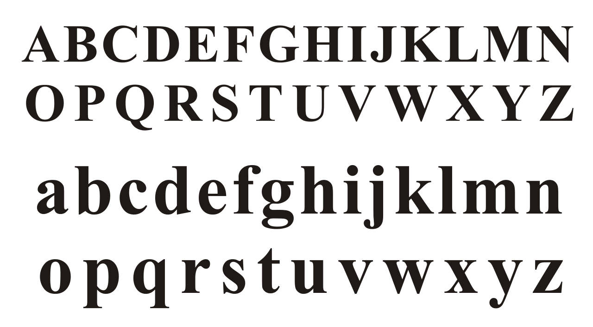

---

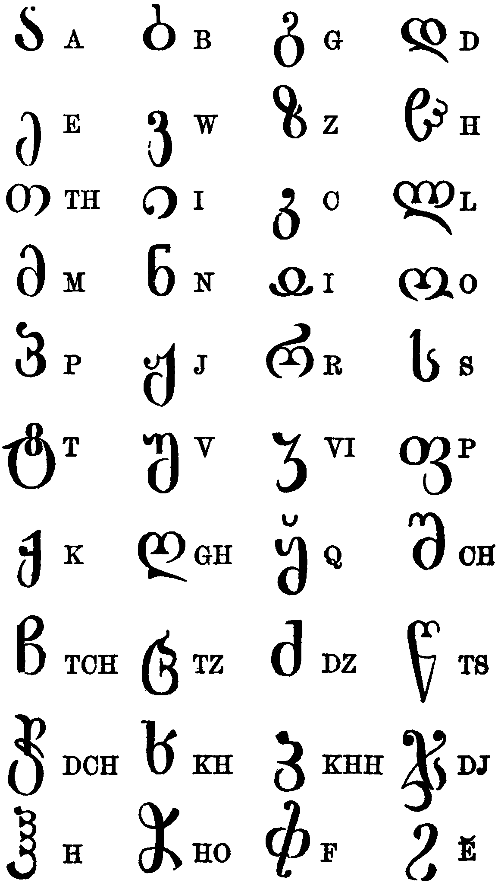

---

## Alphabet

- Has symbols for both consonants and vowels
- May contain:
  - Digraphs -- two letters = 1 sound
    - sh, th, ch
  - One letter = 2 sounds
    - x

---

## Should Mɤɧøɴ have an alphabet?

---

## What it could look like:

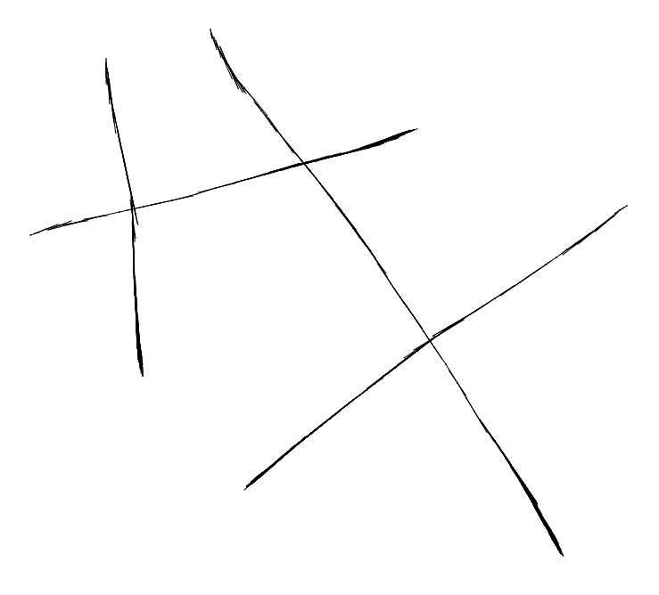

- < p >

- < t >

- < k >

- < a >

- < e >

---

## Should Mɤɧøɴ have an alphabet?

- Yes:
  - There are both consonants and vowels in the language
  - It’s super easy
- No:
  - It’s super boring

---

- ʔ

---

## Abjad

- Only has symbols for consonants

---

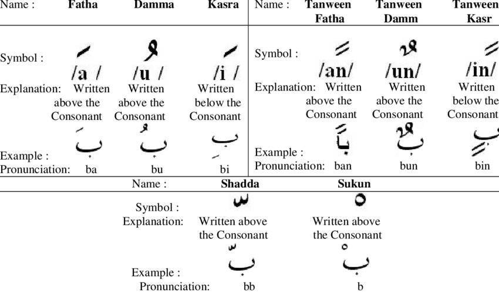

---

## Should you have an abjad?

- Cn y’ll rd ths sntnc? Ths s wht nglsh wld lk lk f th lphbt wr n bjd.

---

## Should your language have an abjad?

- Are the vowels predictable through context?
  - If yes, then absolutely.
  - If no, then no.

---

## Should your language have an abjad?

- Are the vowels predictable through context?
  - If yes, then absolutely.
  - If no, then no.
- Yesterday, I sng a sng.

---

## Should your language have an abjad?

- Are the vowels predictable through context?
  - If yes, then absolutely.
  - If no, then no.
- At noon I sng a sng.

---

## Should your language have an abjad?

- Are the vowels predictable through context?
  - If yes, then absolutely.
  - If no, then no.
- T nn sng sng.

---

## Should Mɤɧøɴ have an abjad?

---

## What it could look like:

- < p >

- < t >

- < k >

- < q >

- < m >

---

## Should Mɤɧøɴ have an abjad?

- Let’s take a look at a line that was translated:
- Çi ɗekampaa ʀiɴɤ Wisiyesi. → Ç ɗkmp ʀɴ Wsys.
- “Once upon a time, there was a city named Undersplash.”

- pa ‘past’ vs. paa ‘super past’

- çi ‘progressive’ vs. çɤ ‘could’

---

## Should Dorgon have an abjad?

- Behold! I am Galasiul. I am the greatest of all (the) Dorgons.
- unb! sa galasjul pfode. sa gpfapfa ekesxdg-aŋk-on pfode.
- As emperor, all Dorgons bow at my feet.
- ikacoɳɟa, kθu ekebase sxdo ekepfodg-aŋk-on.
- (The) Killer Dorgons lay their weapons at my feet.
- modlx-ekexon-a ekesxa ekebase sxdo.

---

## Should your language have an abjad?

---

## Devanagari (Sanskrit, Hindi)

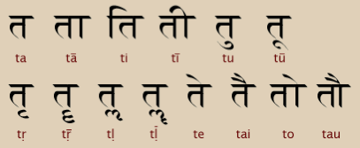

---

## Ge’ez (Amharic, Tigrinya)

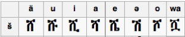

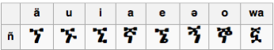

---

## Abugida (Alphasyllabary)

- Kind of like an abjad, in that the consonant symbols are the focus
- But is an alphabet, in that it has symbols for both consonants and vowels
- Arranged by syllables, with vowels usually marked by “diacritics” (extra squiggles, lines, etc.)

---

## Should Mɤɧøɴ have an abugida?

---

## What it could look like:

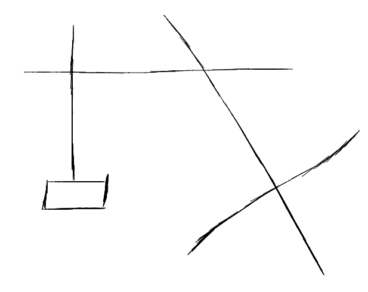

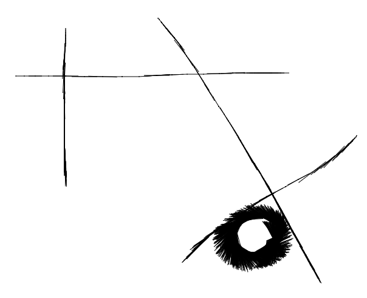

- < pɤ > (no modification - most common vowel in language)

- < pi >		<pa>		  <qa>

---

## Should Mɤɧøɴ have an abugida?

- Yes:
  - There are both consonants and vowels in the language
  - It’s super easy and cool
- No:
  - Nada!

---

## Activity: which system works best?

- Pick a single consonant in your language from your consonant inventories.
- Next, write down all of the vowels in your vowel system. (If your language is tonal, don’t forget about tones!)
- Finally, identify your phonotactics -- how many syllable combinations would your language have?
  - 5-10?
  - Or a TON?

---

## If there's time: Let’s sketch 5 more symbols

- https://sketch.io/sketchpad/
