# Week 13: Writing Systems

## Timeline for Remainder of Cousre

- Today: finishing up writing systems
- Wednesday (11/20): work on translating language for component 4,
- Friday (11/22): work on final project, start preparing for translation
- Monday (11/25): work on final project, start preparing for translation; submit to me before break!
- Monday (12/2): continue translating final projects; prepare for presentations; course evals
  - If your project is ready to go by the end of 12/2, I'll make reference audio for you!
- Wednesday (12/4): continue working on final projects
- Friday (12/6): begin final presentations

---

## Last week: 15 symbols

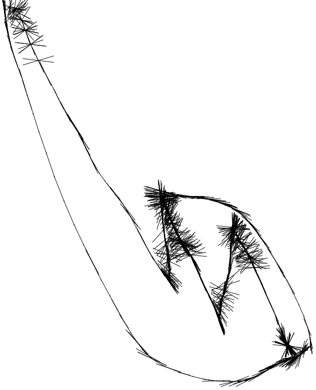

---

## Today: let's add 5 more!

- https://sketch.io/sketchpad/

---

## Review

- Writing Systems
- "Phonographic" Systems

---

## Chinese

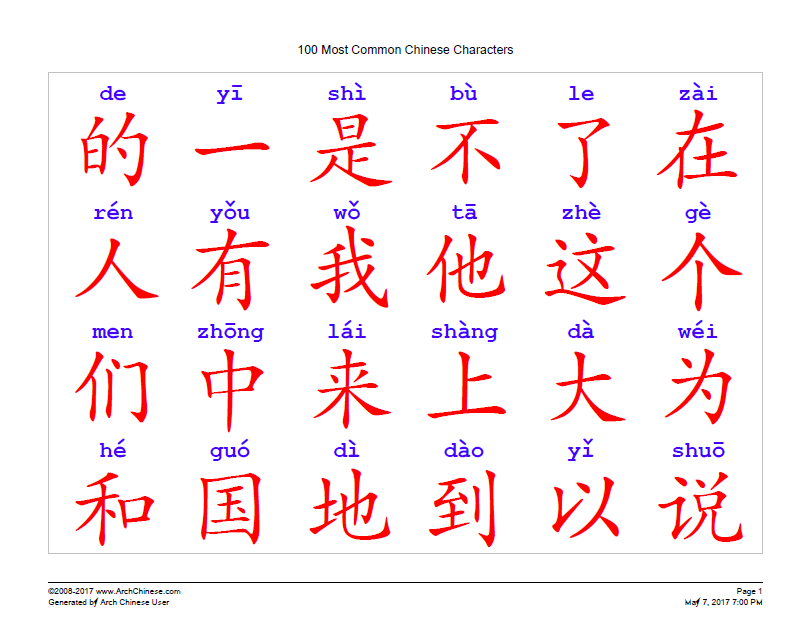

---

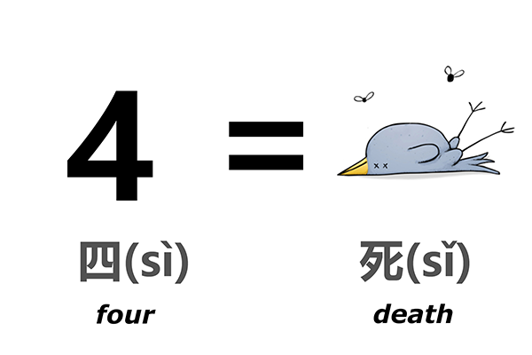

---

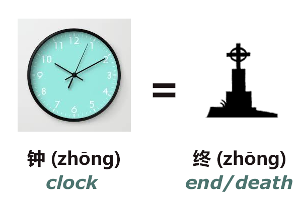

---

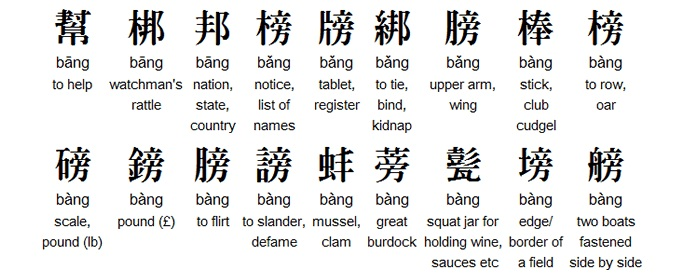

- Every word has its own unique sign.

---

## Homophones =/= Homographs

- English has tons of these, too. (Even though English has an alphabet, there are a ton of logographic features within it):
- To / two / too
- Beat / beet
- Ail / ale
- Fir / fur
- Sweet / suite
- Tacks / tax

---

## What it could look like:

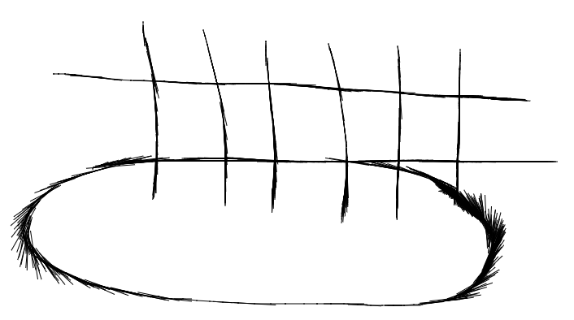

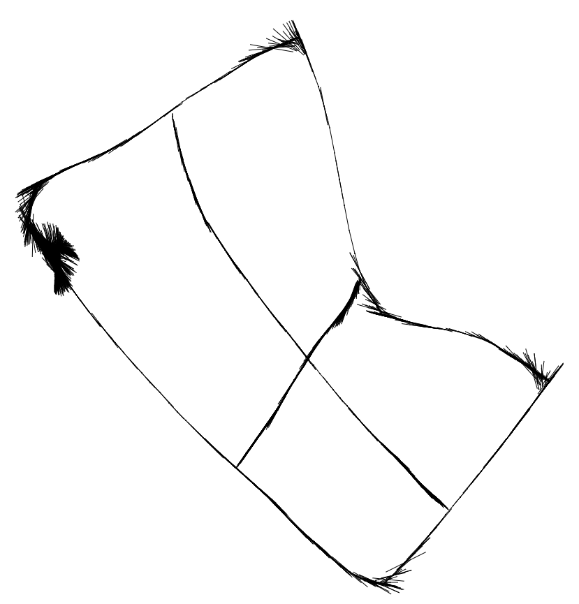

- < ne >
- “and”

- < çiɴ >
- “wife”

- < wisi >
- “under”

- < ʀiɴɤ >
- “city”

- < sɤpainoɭ>
- “king”

---

## Why would you choose a logographic system?

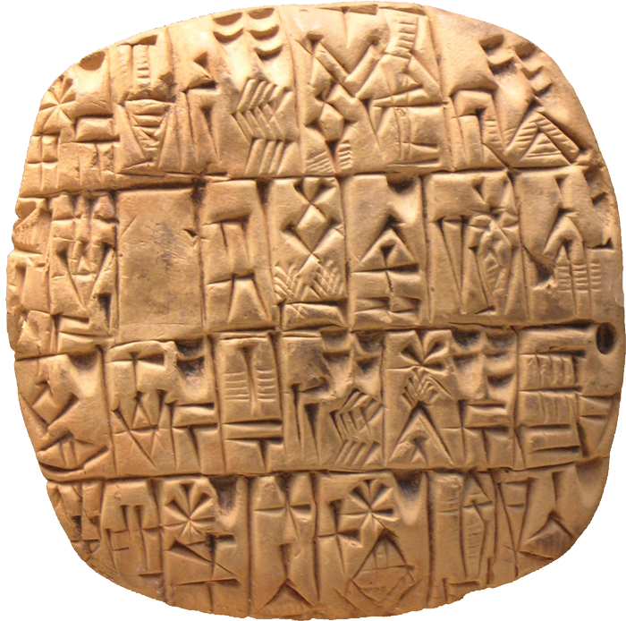

---

## Logograms mixed w/ phonograms: determinatives

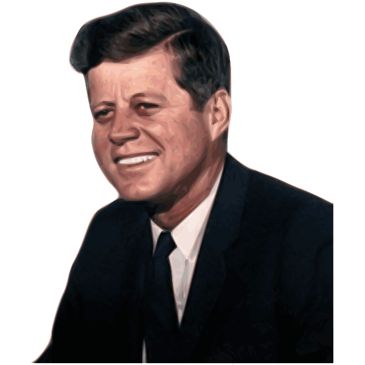

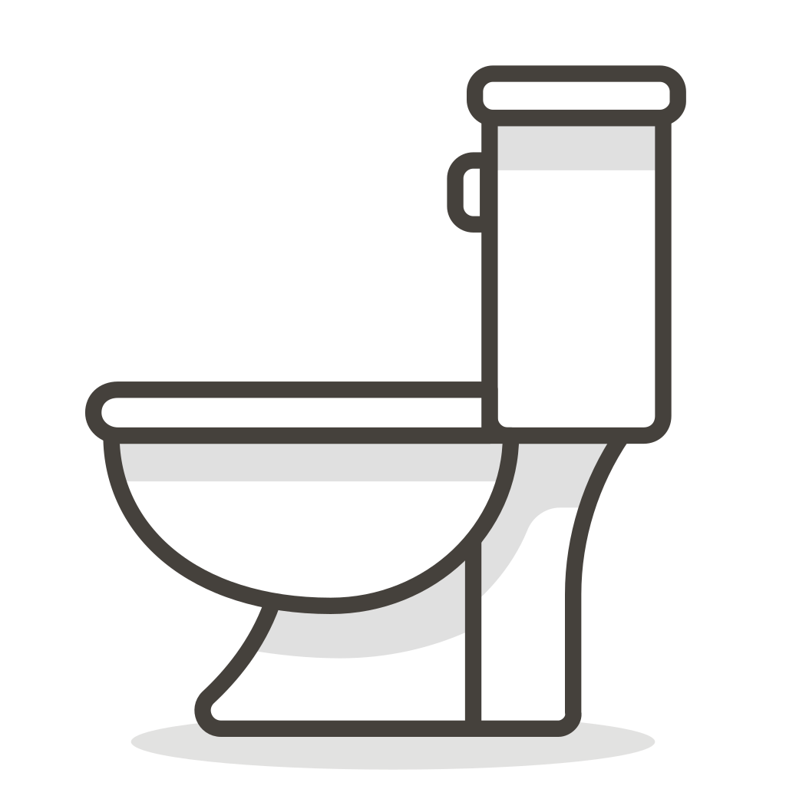

- John 		vs.		john

---

## Determinatives

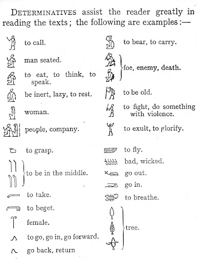

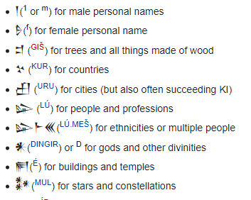

---

## Okay, what should Dorgon (Pxsinunr) have?

- unb! sa galasjul pfode. sa gpfapfa ekesxdg-aŋk-on pfode.
- ikacoɳɟa, kθu ekebase sxdo ekepfodg-aŋk-on.
- modlx-ekexon-a ekesxa ekebase sxdo.
- p-eke:mg-iŋ ekesxa bace-bke-mb sxdo ekebzomp.
- brpu-psi-gpfa, ikakdasion ubz-im-on ça basenasaθ.
- unb! sa dumbldimpf pfa. sa dpθmɳima pfa. dzu-solix ipam pfa.
- unb! su udo pfopkin sxden.

---

## What Elijah decided

---

## Component 4 - Pull up Model

- 3. What type of writing system does your conlang use? If your system writes sounds -- is it an alphabet, an abjad, an alphasyllabary (abugida), or a syllabary? If it is a logographic system, how does your system create new words (i.e., in what way can your logographic system write sounds?)?

---

## Component 4 - Pull up Model

- 4. Show, in detail, how your writing system works, complete with illustrations and examples. (If you choose to take a picture of your system to include it in your project component, this is fine, but make sure it is legible.)
- If you choose an alphabet or an abjad, you must create characters for all sounds in your language.
- If you choose to make an alphasyllabary, syllabary, or logographic system, you must create at least 20 original symbols for your language.

---

## Component 4 - Pull up Model

- 5. For this last question, you will be asked to first translate three sentences from English into your conlang. You will then write out these sentences using your newly constructed writing system. As before, make sure that your answers are LEGIBLE.
- a. Where do you come from?
- b. I speak __________ (name of your language).
- c. If you can understand this, you know too much.

# Week 13: Writing Systems

## Timeline for Remainder of Cousre

- Today: work on translating language for component 4
- Friday (11/22): work on final project, start preparing for translation
- Monday (11/25): work on final project, start preparing for translation; submit to me before break!
- Monday (12/2): continue translating final projects; prepare for presentations; course evals
  - If your project is ready to go by the end of 12/2, I'll make reference audio for you!
- Wednesday (12/4): continue working on final projects
- Friday (12/6): begin final presentations

---

## Translating Sentences in Component 4

- a. Where do you come from?
- b. I speak __________ (name of your language).
- c. If you can understand this, you know too much.

---

## Lexicon

- Where  ______
- come   _____
- this    ça

# Week 13: Writing Systems

## Timeline for Remainder of Cousre

- Today: work on final project, start preparing for translation
- Monday (11/25): work on final project, start preparing for translation; submit to me before break!
- Monday (12/2): continue translating final projects; prepare for presentations; course evals
  - If your project is ready to go by the end of 12/2, I'll make reference audio for you!
- Wednesday (12/4): continue working on final projects
- Friday (12/6): begin final presentations
