# Week 15: Making the Final Product

## Instructions

- Here is what you need to do for your final component.
- 1) Components 1-4 edited. Edits to the past components should reflect comments and feedback from your instructor, any changes made to the language after a component was submitted, and changes made to keep the language consistent.
- ii) A creative work translated from English into your language.  Your component must include:
- a) An interlinear translation. Put this translation at the end of your Google document.
- b) A video recording of the translation, in which all group members perform the language in roughly an equal fashion. This recorded must be accompanied by images/video and the translation itself in video format. See Creating Your Own Language, a How To: Final Project and the models provide for more. You should upload a file or submit a link to your creative work in this Canvas assignment.
- c) You will present your language & your video to the class, in person, on Wednesday, May 5.

---

## Overview of Mɤɧøɴ

- Their culture
- Their sound system
- Their word system
- Their writing system

---

## Culture

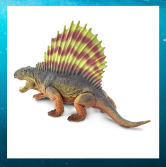

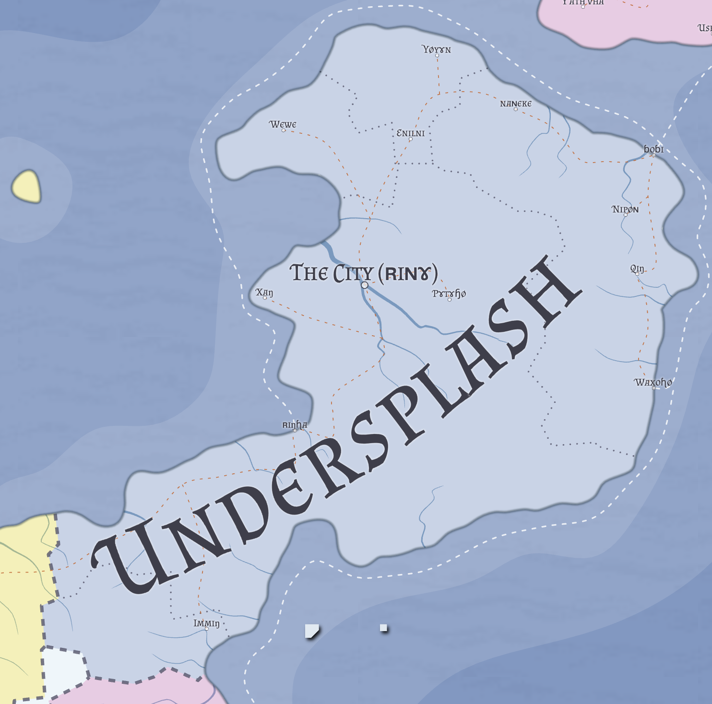

---

## Sound System

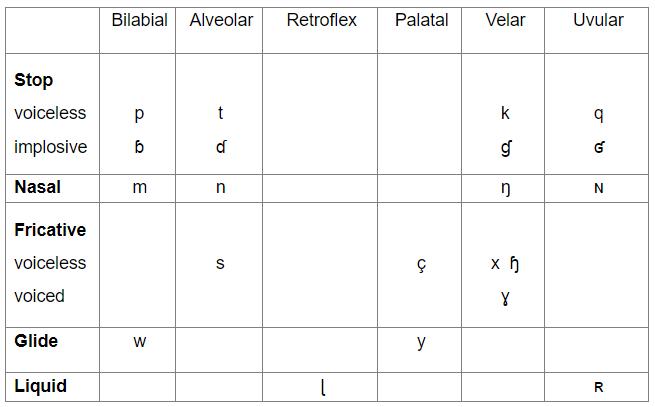

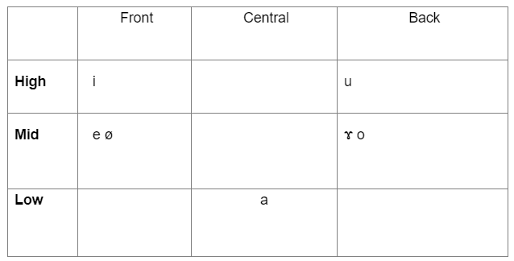

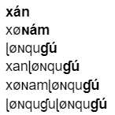

---

## Word System

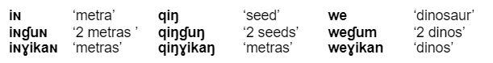

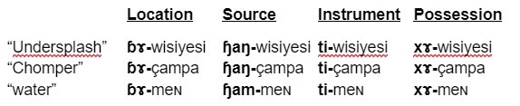

---

## Word System

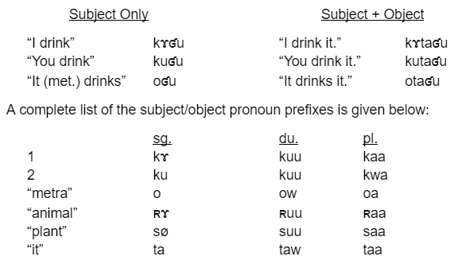

---

## Writing System

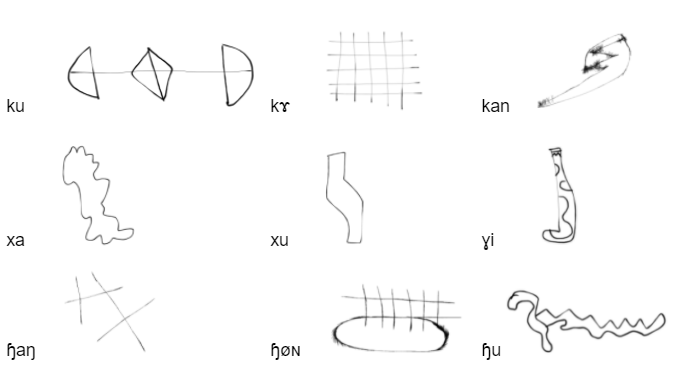

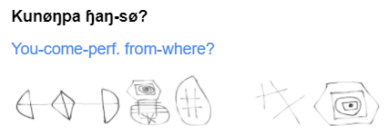

---

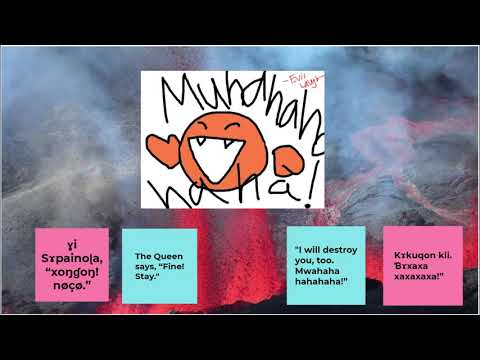

---

## How we did it

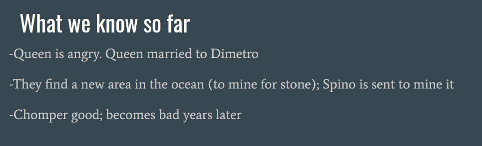

- Composed the work in English first

---

## How we did it

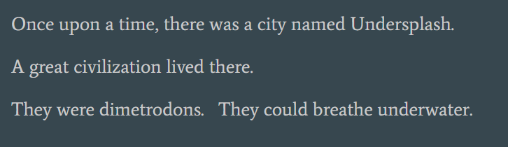

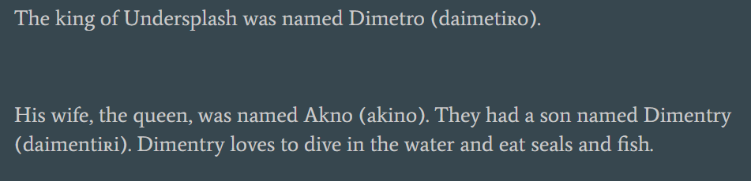

- Composed the work in English first

---

## How we did it

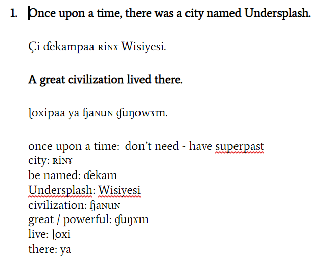

- 2. Interlinear translation, paying attention to how grammar differs between English & Metra

---

## How we did it

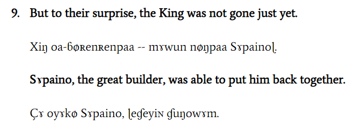

- 2. Interlinear translation
- Also focus on idioms / non-literal expressions -- is there a way that you can express it more simply?

- But they were surprised

---

## How we did it

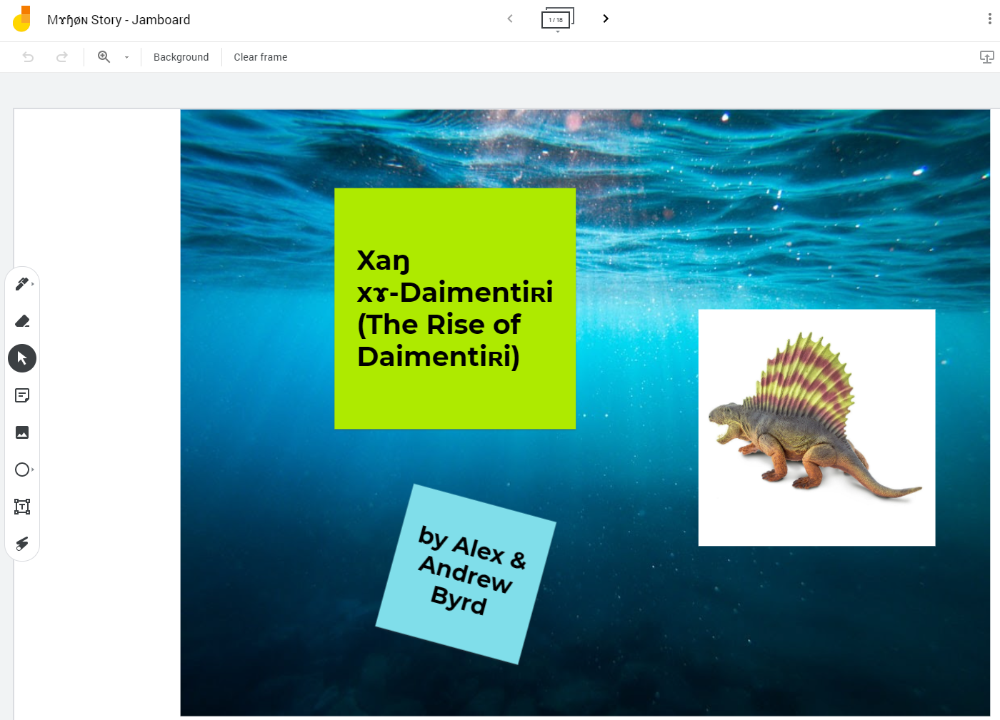

- 3. Create visuals using Jamboard (you can use anything, really!)
- Each slide “snipped” as image files

---

## How we did it

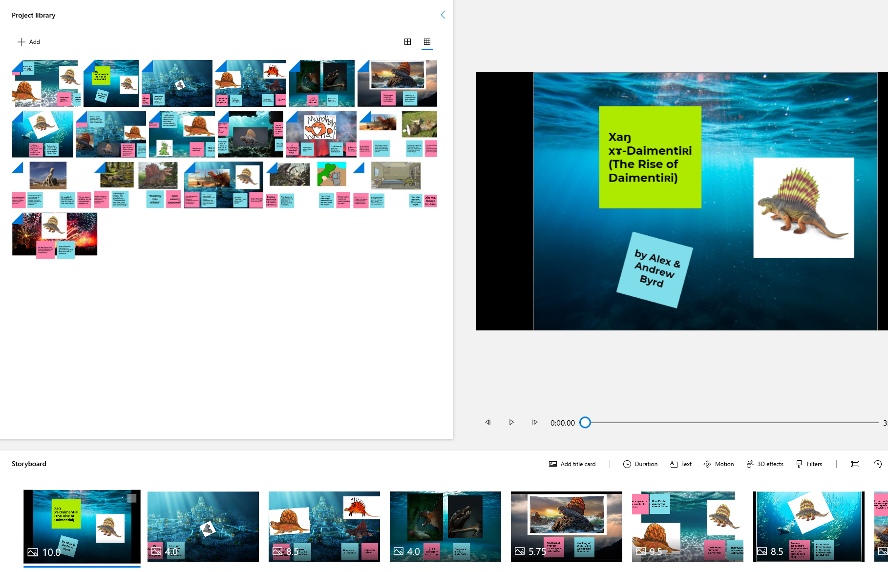

- 4. Created a project in Microsoft Photos (PC) within the Video Editor (it’s free!)

---

## How we did it

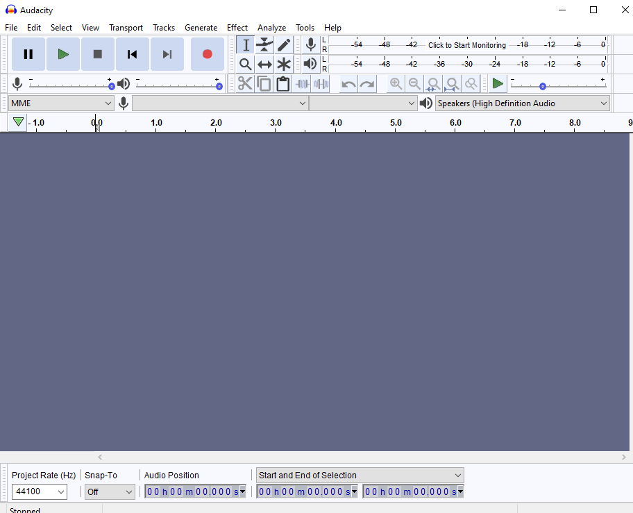

- 5. Recorded audio using Audacity (it’s free!)

---

## How we did it

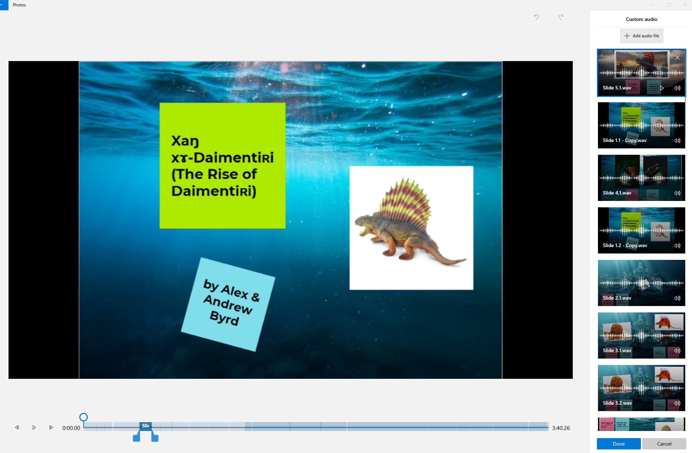

- 6. Custom Audio in Photos

---

## How we did it

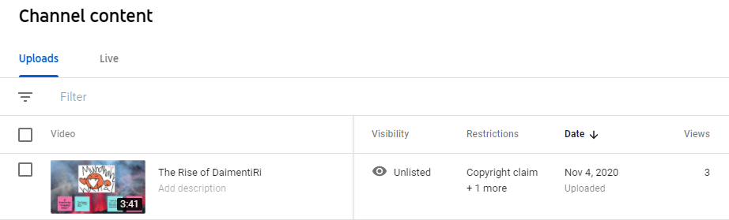

- 7. Uploaded to Youtube as “unlisted”

---

## Working on a Mac / iPad?

- https://www.apple.com/imovie/

---

## First Step : WRITE SOMETHING

- Wednesday, 12/1 -- Rough Draft of Your Creative Work
- It does NOT have to be a story (like Alex’s and mine)
- It can be: a poem, a song, a skit, a cartoon, a video game, etc. etc. etc.
- You need to have the creative work sketched out, in English

---

- Monday / Wednesday, 12/6 - 12/8 -- Presentation
- Who are your language speakers, what is their culture? Where do they come from?
- What is the sound system?
- What is the word system?
- What is the writing system?
