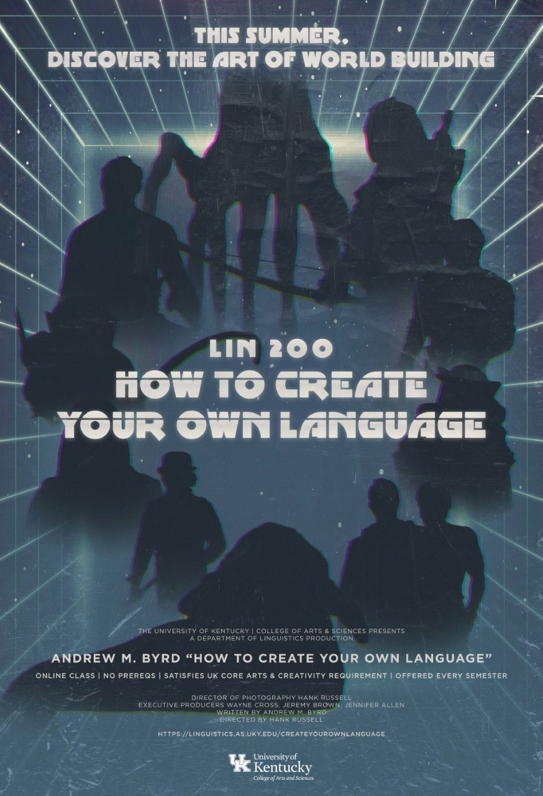
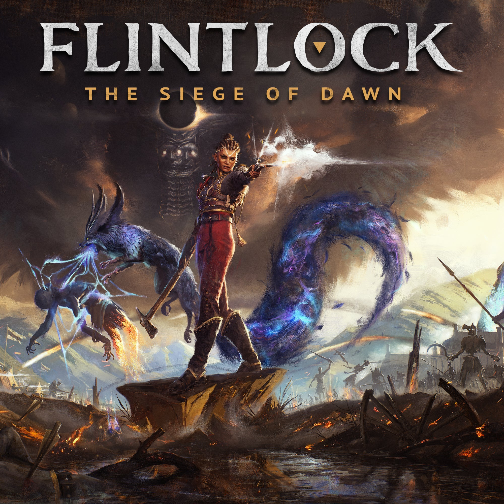
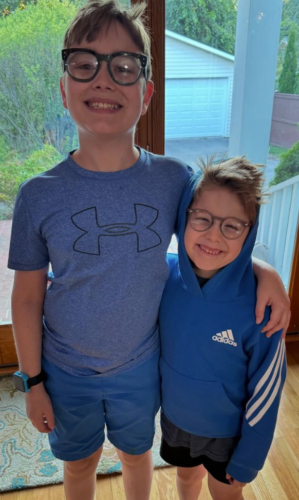
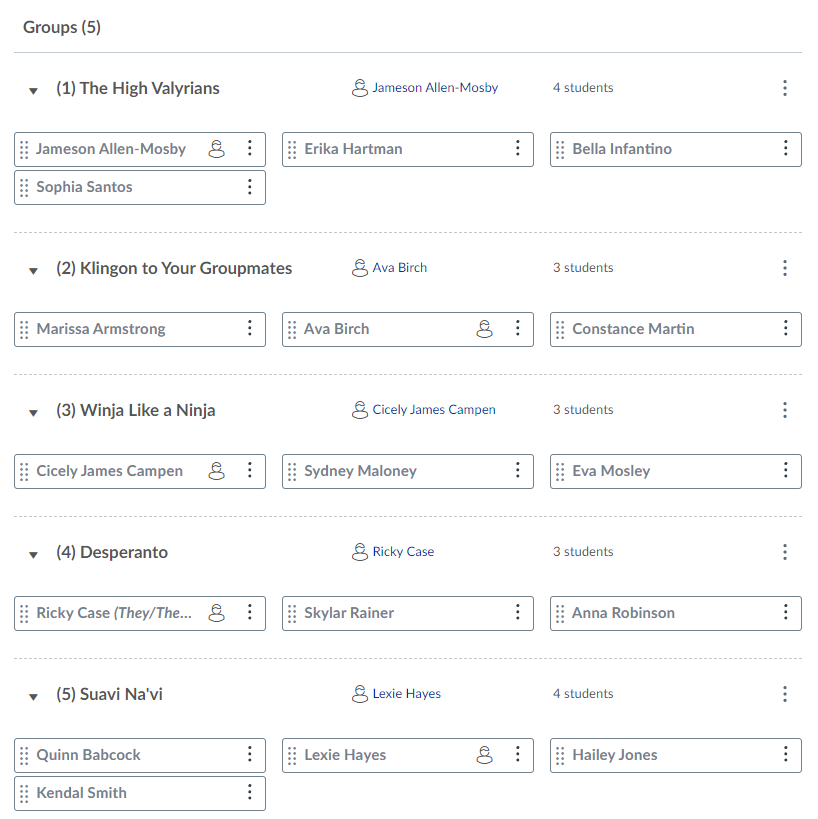
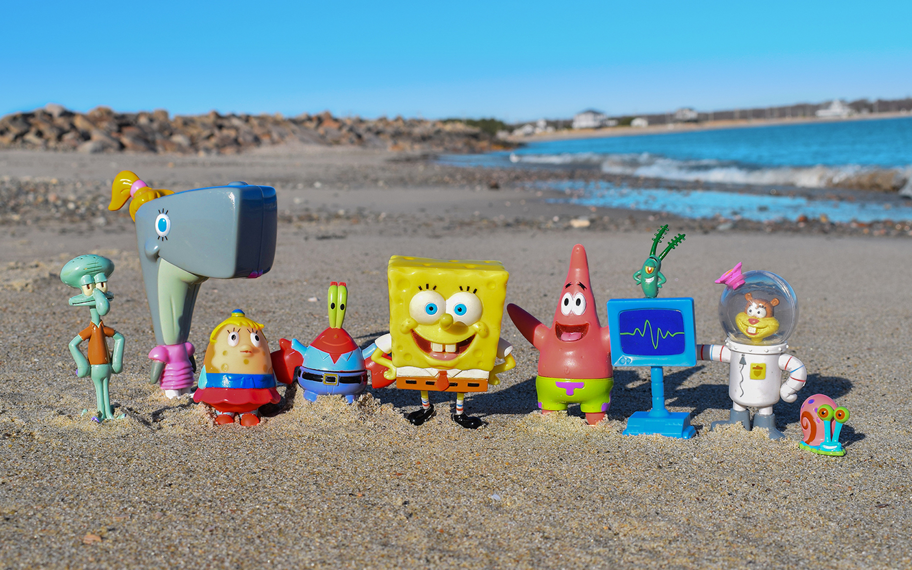

# Day 1: So You've Decided to Create Your Own Language...

## Welcome!

---

## My Linguistics Background

- Trained in historical linguistics
  - Indo-European languages
  - Sounds
- Current research focuses:
  - DERBi PIE
  - Phylogenetics
  - Public materials for learning about PIE

---

## Why I teach / do conlangs...

- Recordings of PIE went viral
- Together with my wife (Brenna Byrd, German prof. @ UK), hired to make historical constructed languages (conlangs):
  - History Channel (Vikings)
  - National Geographic (Origins)
  - Ubisoft (Far Cry Primal)
  - Most recent conlang that I can talk about: Th'anthk (Flintlock: Siege of Dawn – though much of it replaced last minute with lines in English :( )

---

## About LIN 200…

- Designed to be fully online
- What that means for you:
  - Much of the conceptual learning will be at home
  - In class we do the creating!

---

## What this really means!

- Most of your language will be constructed IN CLASS
- This will give you the most / best feedback for you from your groupmates and me
- Coming to class is very important!

---

## How you will learn about how languages work

- In a variety of ways:
- Class Videos
- The Art of Language Invention (+ questions)
- In-class activities

---

## As professional conlangers, we have to make pitches based off of material that's been given to us

---

## In Primal:

- Names we were given:
  - Tensay
  - Takkar
  - Wenja
  - Izila
  - Udam
  - Urki

---

## In Flintlock:

- God names we were given:
  - Enki

---

## In this class:

---

## Designing Dorgon

- After the first component, you'll be working together in your groups to pitch ideas of linguistic features to my seven year old, Elijah

---

## Designing Dorgon

- Sound System & Lexicon (week 7)
- How Nouns Work (week 8)
- How Verbs Work (week 9)
- Writing System (week 13)

---

## All of this is preparation for: creating your own language

- Most important part of the course!
- You'll be doing this in four components, capped off with a final creative work, such as a story, poem, performance, etc.

---

## Let’s check out the Canvas course shell

- Syllabus
- Home Page
- Modules: how-to, videos, check-in quizzes, project components

---

## Office Hours: MWF 9:15/30-9:50

---

## Prior linguistic experience & grading

- How will your languages be graded?

---

## Groups

---

## Final Note

- Arts & Creativity ≠ Unimportant !!!

---

## For the rest of today

- E-mail Dr. Byrd with your UK e-mail address
- Join the LIN 200 Discord server
- Get to know your neighbors!  Each of you will answer the following questions, giving answers which another group member will type up in Discord.
- 1) Introduce yourselves. What is your name? Where are you from? What is your major? Why are you taking LIN 200?
- 2) Discuss any background you might have with languages, linguistics, and conlangs.
- 3) Tell your group members your favorite sci-fi or fantasy movie, TV show, or video game. Does it have a conlang? What is your favorite part of about its culture?

---

## Next Time

- Starting to create your own culture!

# Day 2: Devising your own culture

## The first goal: preliminary world-building

- Each student will be creating their own preliminary universes within a Whiteboard framework.
- Next Wed, you will make a “pitch” for that universe in class.
- You have roughly two minutes to make your pitch.

---

## The Instructions (all students can begin working)

- 1) What is the name and make-up of your group of people? Are they human? Non-human? Post pictures from your Whiteboard session to help the rest of the class visualize what they look like.
- 2) Describe the location where your people live. Where is it located (next to a river? on top of a mountain? on the Moon?)? Why does your group live in this region?
- 3) Now focus on the government and economy of your people. Who is in charge of the group? How do they generate resources to survive?
- 4) Finally, think about specific individuals in your group. Choose three individuals. Describe their personalities, their professions, and how their relationship with the other two individuals you've chosen.

---

## Let’s Practice with An Existing Fantasy Culture

---

- 1) What is the name and make-up of your group of people? Are they human? Non-human? Post pictures from your Jamboard session to help the rest of the class visualize what they look like.
- 2) Describe the location where your people live. Where is it located (next to a river? on top of a mountain? on the Moon?)? Why does your group live in this region?
- 3) Now focus on the government and economy of your people. Who is in charge of the group? How do they generate resources to survive?
- 4) Finally, think about specific individuals in your group. Choose three individuals. Describe their personalities, their professions, and how their relationship with the other two individuals you've chosen.

---

## Let’s Practice with An Existing Fantasy Culture

---

- 1) What is the name and make-up of your group of people? Are they human? Non-human? Post pictures from your Whiteboard session to help the rest of the class visualize what they look like.
- 2) Describe the location where your people live. Where is it located (next to a river? on top of a mountain? on the Moon?)? Why does your group live in this region?
- 3) Now focus on the government and economy of your people. Who is in charge of the group? How do they generate resources to survive?
- 4) Finally, think about specific individuals in your group. Choose three individuals. Describe their personalities, their professions, and how their relationship with the other two individuals you've chosen.

---

## Elijah's Culture

- LIN 200 Honors (F24).whiteboard

---

## Now it's your turn!

---

## What will you be doing?

- Each student will be creating their own preliminary universes within a Whiteboard framework.
- On Friday, you'll continue working on it, and share with your group members.
- Next Wednesday, you will make a “pitch” for that universe in class.
- We, as a class, will give you constructive feedback, which you'll use to build upon in your first component.
- You have roughly two minutes to make your pitch.

---

- 1) What is the name and make-up of your group of people? Are they human? Non-human? Post pictures from your Whiteboard session to help the rest of the class visualize what they look like.
- 2) Describe the location where your people live. Where is it located (next to a river? on top of a mountain? on the Moon?)? Why does your group live in this region?
- 3) Now focus on the government and economy of your people. Who is in charge of the group? How do they generate resources to survive?
- 4) Finally, think about specific individuals in your group. Choose three individuals. Describe their personalities, their professions, and how their relationship with the other two individuals you've chosen.

# Day 3: Devising your own culture

## Last Time

---

- 1) What is the name and make-up of your group of people? Are they human? Non-human? Post pictures from your Jamboard session to help the rest of the class visualize what they look like.
- 2) Describe the location where your people live. Where is it located (next to a river? on top of a mountain? on the Moon?)? Why does your group live in this region?
- 3) Now focus on the government and economy of your people. Who is in charge of the group? How do they generate resources to survive?
- 4) Finally, think about specific individuals in your group. Choose three individuals. Describe their personalities, their professions, and how their relationship with the other two individuals you've chosen.

---

## What will you be doing?

- Each student will be creating their own preliminary universes within a Whiteboard framework.
- Next Wednesday, you will make a “pitch” for that universe in class.
- We, as a class, will give you constructive feedback, which you'll use to build upon in your first component.
- You have roughly two minutes to make your pitch.

---

## Today

- Continue working on your universe
- Discuss your universe with your groupmates at 10:35, offer feedback/help when needed!

---

## Now it's your turn!

---

## 10:35 -- Be sure to discuss your work with your groupmates!

- 1) What is the name and make-up of your group of people? Are they human? Non-human? Post pictures from your Whiteboard session to help the rest of the class visualize what they look like.
- 2) Describe the location where your people live. Where is it located (next to a river? on top of a mountain? on the Moon?)? Why does your group live in this region?
- 3) Now focus on the government and economy of your people. Who is in charge of the group? How do they generate resources to survive?
- 4) Finally, think about specific individuals in your group. Choose three individuals. Describe their personalities, their professions, and how their relationship with the other two individuals you've chosen.
