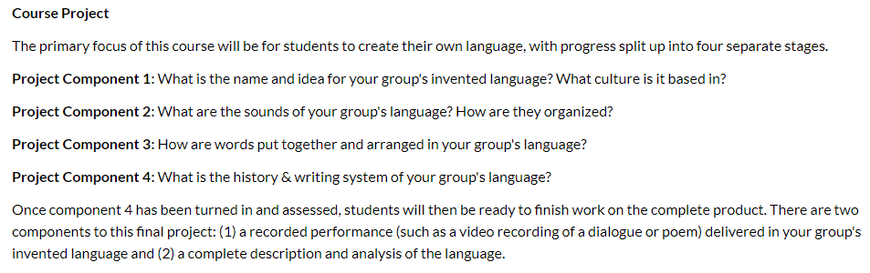
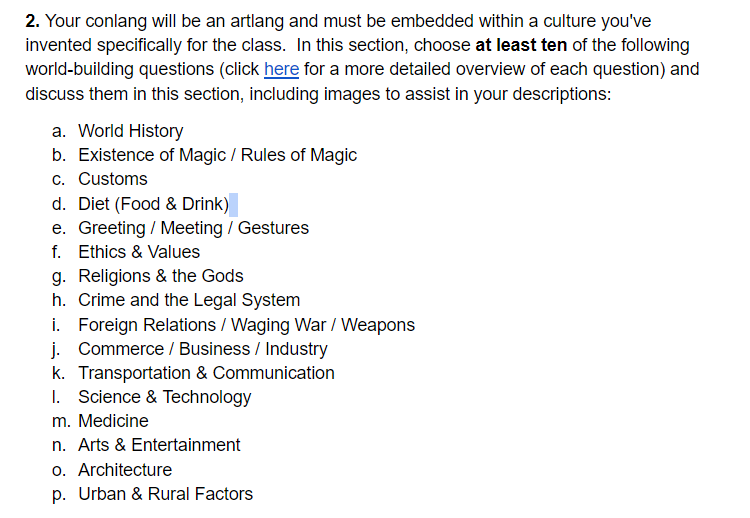
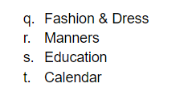

# Day 4: Culture Pitches

## What we’ll doing today

- Briefly present your culture to the class
- Overview of Component 1 -- what will it look like?

---

## What we’ll doing next time

- Developing your culture further
- Work on a short story, poem, song, or any form of short media about your culture (due next Monday)

---

## For Monday

- Be sure to watch all three intro videos & do the readings!
- https://uk.instructure.com/courses/2111202/modules

---

## Culture Pitches

- LIN 200 Honors (F24).whiteboard

---

## Component One

- In this component, you'll be establishing the world in which your ConLang exists. Now is the time to get creative!
- For each project component, you'll be working within a Onedrive doc, which you'll access here.
- For this component you will:
- Edit the docx to answer the questions listed in "Component 1". There is no need (or way) to submit a file on Canvas.
- Delete any instructions so that each number only includes your answers.
- If you have a question, @ Dr. Byrd in the docx or in Discord.

# Day 5: Developing Your Culture Further

## Friendly reminder about assignments & presentations

---

---

## Reminder: Component One

- In this component, you'll be establishing the world in which your ConLang exists. Now is the time to get creative!
- For each project component, you'll be working within a Onedrive doc, which you'll access here.
- For this component you will:
- Edit the docx to answer the questions listed in "Component 1". There is no need (or way) to submit a file on Canvas.
- Delete any instructions so that each number only includes your answers.
- If you have a question, @ Dr. Byrd in the docx or in Discord.

---

## For next time (Monday)

- Be sure to watch all three intro videos and do the readings!
- https://uk.instructure.com/courses/2111202/modules

---

## What we’ll doing today

- Developing your culture further
- Beginning work on a short story, poem, song, or any form of short media about your culture (due next Monday)

---

- If there's time...
