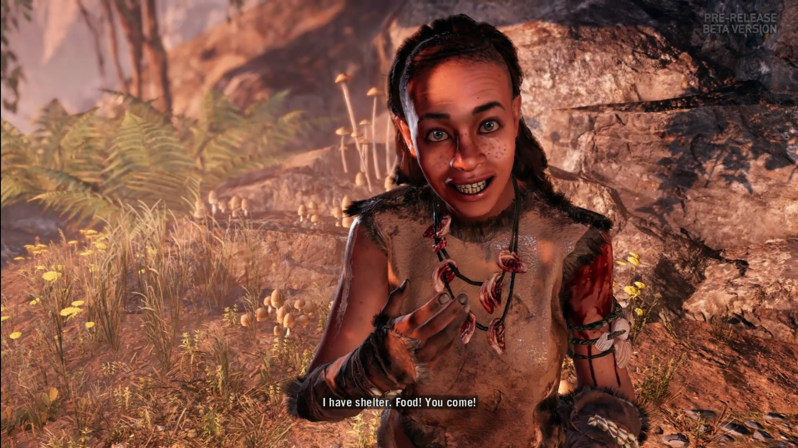
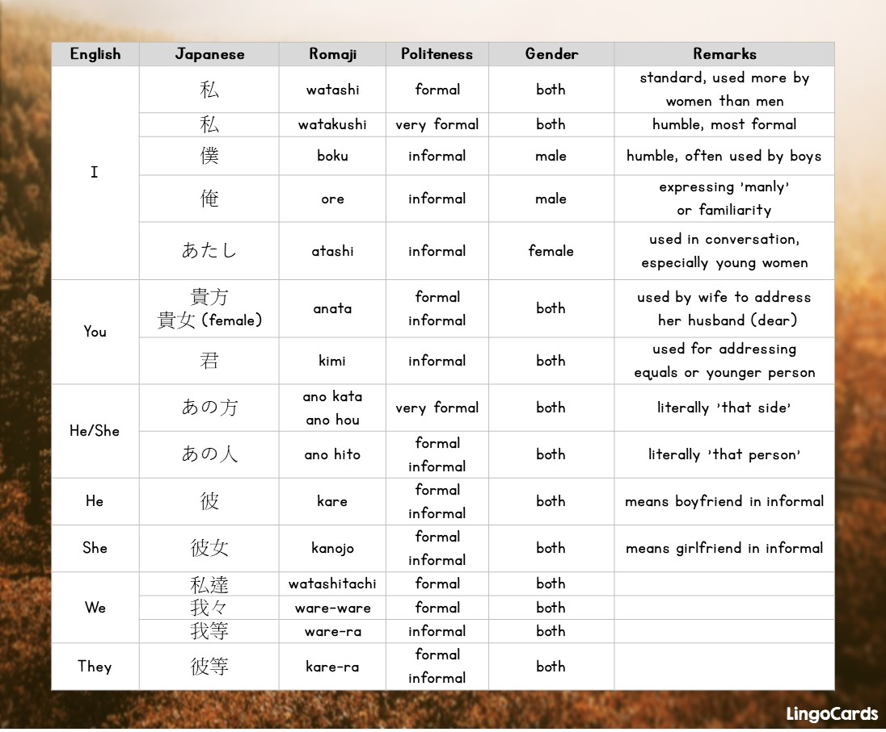
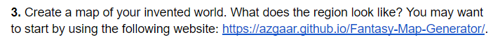
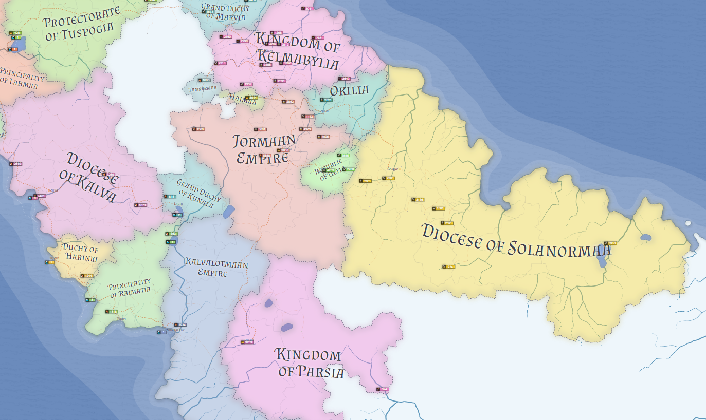
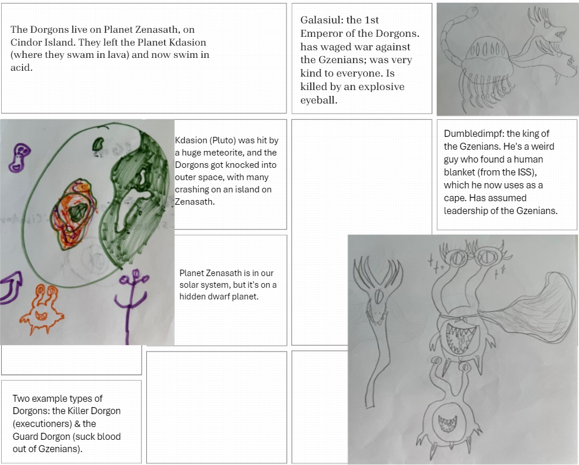
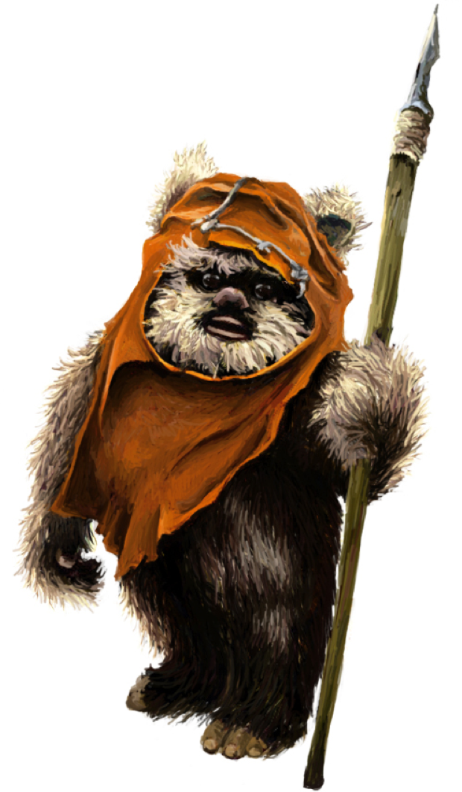
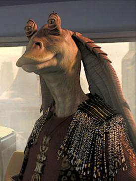

# Week 3: Culture

## Warm-up Questions: Episode #1 recap

- Select the qualities of spoken language that makes a conlang feel “legit”.
  - A writing system with many different symbols
  - Having its own acoustic “brand”, a particular rhythm in speech
  - Having variable sentence lengths
  - Producing words that carry distinct meanings
  - The Tolkien estate’s seal of approval
- What is Ubese? And why do many not consider it a conlang?
- What is another language in media? Search for an example of a conlang we have not discussed and consider what is “good” or “bad” about it.

---

## This Week

- Monday:
  - Share your composition with your groupmates
  - Cultural features that may affect structure
  - Map
- Wednesday:
  - Linguistic Bias
- Friday:
  - Share your complete cultures with your groupmates
  - Finish any parts that need to be finished

---

- 4. What kinds of structures are in place in your culture that could potentially affect how the language is structured? Considerations include, but are not limited to, the following:
- Is your language exceptionally focused on politeness and proper titles (like, say Korean or Japanese)?
- Is the culture structured towards family units?
- Or is the culture primarily focused on civic duty and government loyalty?
- Is your culture individualistic and even anarchic?
- Is language something freely shared between different groups (such as those based in socio-economics, gender, nationality, etc.), or is a hierarchy strictly enforced?
- You don't need to have everything nailed down, but pick three of the ideas above (you may discuss other areas of culture, as long as you do so thoughtfully) and expand on them. Please be careful in your cultural choices; offensive depictions of cultures (fictional or otherwise) will not be tolerated. Remember that you will be sharing your ideas with other classmates throughout the semester.

---

## Why does this matter?

- Example: English pronouns

---

## Why does this matter?

- Example: Japanese pronouns

---

## Why does this matter?

- Example: Th'anthk pronouns

---

## Why does this matter?

- Example: gender
  - Indo-European
- Note: grammar is not determinative!
  - Turkish & Chinese gender
  - Chinese & Hopi tense

---

---

## Possible places to generate maps

- https://azgaar.github.io/Fantasy-Map-Generator/
- https://inkarnate.com/signup
- https://donjon.bin.sh/world/
- https://www.kassoon.com/dnd/world-map/

---

## Share Compositions!

# Week 3: Linguistic Bias

## With your neighbors: Episode #3 Recap

- What does it mean to have a negative language ideology?
- What influenced J.R.R. Tolkien in the creation of the languages of Middle Earth? What sorts of problems arise from these influences?
- What’s one way the Drs. Byrd avoided enforcing negative stereotypes in their conlangs, Wenja & Izila?

---

## What is linguistic bias?

- Bias = a tendency for prejudice towards a person or certain groups of people
    - Can result in unfair treatment, such as exclusion or discrimination
    - Can be conscious or unconscious as well as positive or negative

---

## What is linguistic bias?

- Linguistic bias = all that, but about language!
    - Echos existing stereotypes that are held about particular groups of people
    - These are judgments embedded within a language that reflect stereotypes and often disfavor certain groups of people
    - What are some examples of linguistic bias?
      - Have you personally experienced any?

---

## Linguistic bias

- Saying “like”
- Saying “y’all”
- Uptalk & Vocal Fry (High Rising Terminal, Creaky Voice)
- What biases do you think people have about these?

---

## If every language evokes bias, what can we do?

- Avoid pairing real-world cultural influences with linguistic influences
- Avoid stereotypes
- If you don’t know a culture, don’t make inferences
- Ask “am I doing this because this makes sense for this culture, or because I’m tying it to my own experiences and biases?”

---

## A recent example discussion

- With your neighbors, read the following article and discuss: https://medium.com/@allisonooo/do-we-judge-languages-by-their-sounds-exploring-linguistic-bias-in-entertainment-13da8300ae83
- What does the author point out about linguistic bias in conlangs?
  - Do you agree?

:::  {.notes}
https://medium.com/@allisonooo/a-conversation-with-david-j-peterson-d585a14589d1 interview with Peterson
:::

---

## Conlang Culture & Bias Discussions

- Which groups did you draw inspiration from (knowingly or unknowingly)?
- What sort of cultural biases might be in your culture?
- How can you combat these biases in your language?
- * See what biases you can spot, then see if your group spots different ones! *

---

## Conlang Culture & Bias: the Dorgons

- Which groups did Elijah draw inspiration from (knowingly or unknowingly)?
- What sort of cultural biases might be in his culture?
- How can we combat these biases in his language?

---

## Conlang Culture & Bias Discussions

- Which groups did you draw inspiration from (knowingly or unknowingly)?
- What sort of cultural biases might be in your culture?
- How can you combat these biases in your language?
- * See what biases you can spot, then see if your group spots different ones! *

---

- 5. What kinds of real-world cultures will you be drawing on to inspire or help guide the world of your conlang? As you mention these, you must discuss what sorts of biases to avoid in your language's creation.
- For instance, let's say you were inventing an artlang for a group of people who lived in the rural mountains of the Eastern US, whose sound system bears a striking similarity to that of Southern American English.  Moreover, the people who speak your conlang are unusually friendly and/or ignorant -- in this case negative biases would be affecting both your language and culture.

# Week 3: Finishing up Component 1

## Review of Bias

- Bias = a tendency for prejudice towards a person or certain groups of people
    - Linguistic bias = all that, but about language
    - It occurs in real languages & conlangs
    - Linguistic bias will happen
    - Occurs in all aspects of language
- We can control how our conlangs are biased
- We can respect linguistic variety and cultural diversity

---

## Turn & Talk

- Have you experienced linguistic bias this week (or at any time)?
- What are some ways you can avoid importing bias into your Culture/Conlang?

---

## Don't Be Like...

---

## Today

- Finish up your component, consult with group members & Dr. Byrd if you need help
- Component 1 due next Monday (9/16) at 10 am
- Next week we'll be shifting gears, learning about more technical, "linguisticky" kind of stuff.
- Watch Episodes 5, 6, and read pp. 25-46 of Peterson before Monday.
