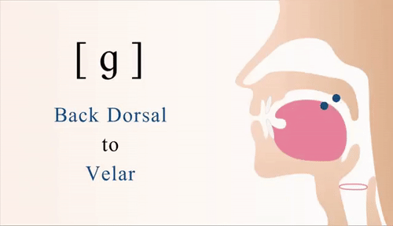
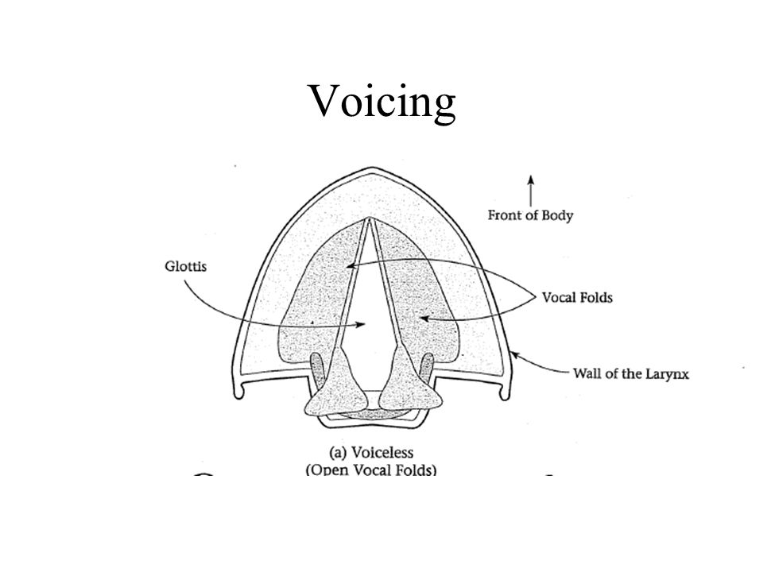
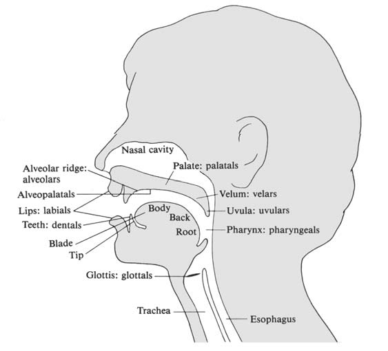
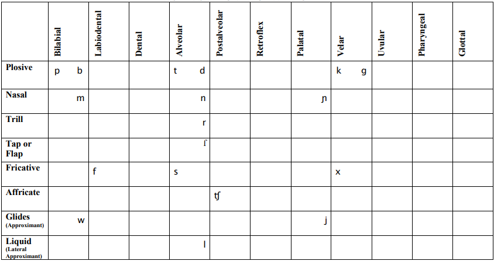
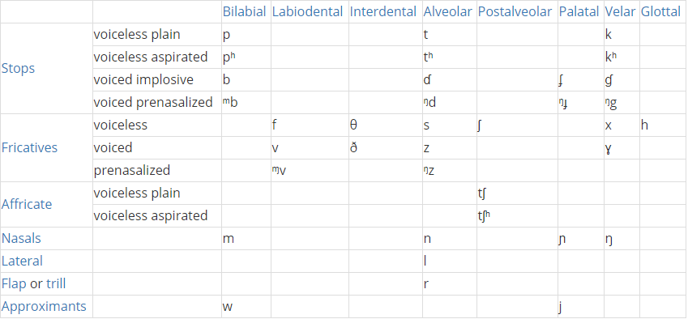
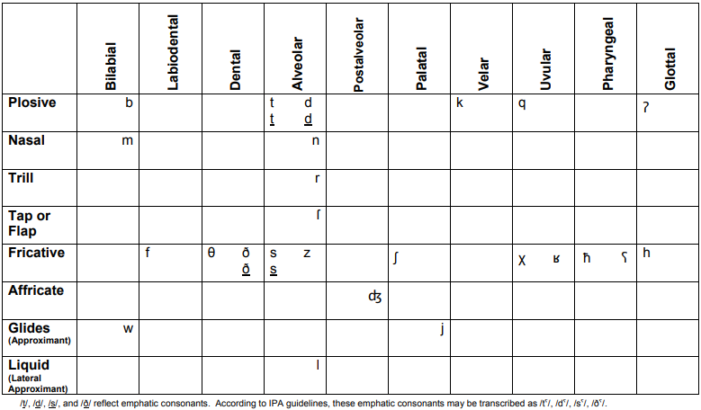
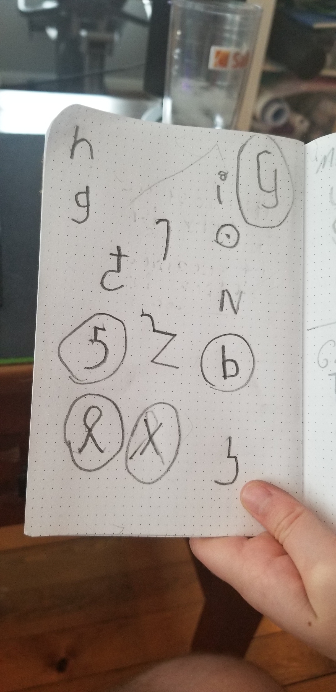
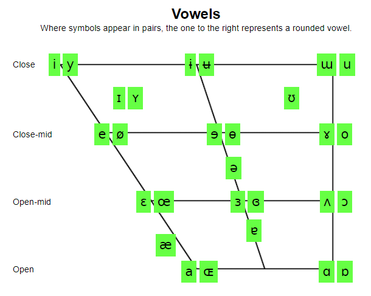

# Week 4: Day 1: Consonants

## Today

- Basic Properties of Consonants
- Consonant Systems:
  - English
  - Spanish
  - Swahili
  - Arabic
- Working on a Consonant System for Dorgon

- Next Time

- Pick five non-English consonants that you really like, using ipachart.com
- Compile all of the names you've created for your culture, to give you a starting point for your consonant system

---

## What is in Component 2?

- Consonants
- Vowels
- Phonotactics
- Prosody

---

## Warm-up with your Group

- There are 21 consonants in English, because there are 21 consonants in the English alphabet
  - True
  - False
- What are the three properties of consonants?  Choose an English consonant, then visit ipachart.com to identify the values of these properties.
- How does understanding the properties of consonants help us as conlangers? What might we achieve through breaking or deviating from these properties in our own conlang?

---

---

---

|  | Bilabial | Labiodental | Interdental | Alveolar | Alveopalatal | Palatal | Velar | Glottal |
|---|---|---|---|---|---|---|---|---|
| Stop voiceless voiced | p b |  |  | t d |  |  | k g | ʔ |
| Nasal | m |  |  | n |  |  | ŋ |  |
| Fricative voiceless voiced |  | f v | θ ð | s z | ʃ ʒ |  |  | h |
| Affricate voiceless voiced |  |  |  |  | t͡ʃ d͡ʒ |  |  |  |
| Glide | w |  |  |  |  | j |  |  |
| Liquid |  |  |  | r, l |  |  |  |  |

---

- Voicing
- Place
- Manner

|  | Bilabial | Labiodental | Interdental | Alveolar | Alveopalatal | Palatal | Velar | Glottal |
|---|---|---|---|---|---|---|---|---|
| Stop voiceless voiced | p b |  |  | t d |  |  | k g | ʔ |
| Nasal | m |  |  | n |  |  | ŋ |  |
| Fricative |  | f v | θ ð | s z | ʃ ʒ |  |  | h |
| Affricate voiceless voiced |  |  |  |  | t͡ʃ d͡ʒ |  |  |  |
| Glide | w |  |  |  |  | j |  |  |
| Liquid |  |  |  | r, l |  |  |  |  |

---

- voiceless

|  | Bilabial | Labiodental | Interdental | Alveolar | Alveopalatal | Palatal | Velar | Glottal |
|---|---|---|---|---|---|---|---|---|
| Stop voiceless voiced | p b |  |  | t d |  |  | k g | ʔ |
| Nasal | m |  |  | n |  |  | ŋ |  |
| Fricative |  | f v | θ ð | s z | ʃ ʒ |  |  | h |
| Affricate voiceless voiced |  |  |  |  | t͡ʃ d͡ʒ |  |  |  |
| Glide | w |  |  |  |  | j |  |  |
| Liquid |  |  |  | r, l |  |  |  |  |

---

- voiceless
- alveolar

|  | Bilabial | Labiodental | Interdental | Alveolar | Alveopalatal | Palatal | Velar | Glottal |
|---|---|---|---|---|---|---|---|---|
| Stop voiceless voiced | p b |  |  | t d |  |  | k g | ʔ |
| Nasal | m |  |  | n |  |  | ŋ |  |
| Fricative |  | f v | θ ð | s z | ʃ ʒ |  |  | h |
| Affricate voiceless voiced |  |  |  |  | t͡ʃ d͡ʒ |  |  |  |
| Glide | w |  |  |  |  | j |  |  |
| Liquid |  |  |  | r, l |  |  |  |  |

---

- voiceless
- alveolar
- stop

|  | Bilabial | Labiodental | Interdental | Alveolar | Alveopalatal | Palatal | Velar | Glottal |
|---|---|---|---|---|---|---|---|---|
| Stop voiceless voiced | p b |  |  | t d |  |  | k g | ʔ |
| Nasal | m |  |  | n |  |  | ŋ |  |
| Fricative |  | f v | θ ð | s z | ʃ ʒ |  |  | h |
| Affricate voiceless voiced |  |  |  |  | t͡ʃ d͡ʒ |  |  |  |
| Glide | w |  |  |  |  | j |  |  |
| Liquid |  |  |  | r, l |  |  |  |  |

---

- Voicing
- Place
- Manner

|  | Bilabial | Labiodental | Interdental | Alveolar | Alveopalatal | Palatal | Velar | Glottal |
|---|---|---|---|---|---|---|---|---|
| Stop voiceless voiced | p b |  |  | t d |  |  | k g | ʔ |
| Nasal | m |  |  | n |  |  | ŋ |  |
| Fricative voiceless voiced |  | f v | θ ð | s z | ʃ ʒ |  |  | h |
| Affricate voiceless voiced |  |  |  |  | t͡ʃ d͡ʒ |  |  |  |
| Glide | w |  |  |  |  | j |  |  |
| Liquid |  |  |  | r, l |  |  |  |  |

---

- Voicing
- Place
- Manner

|  | Bilabial | Labiodental | Interdental | Alveolar | Alveopalatal | Palatal | Velar | Glottal |
|---|---|---|---|---|---|---|---|---|
| Stop voiceless voiced | p b |  |  | t d |  |  | k g | ʔ |
| Nasal | m |  |  | n |  |  | ŋ |  |
| Fricative |  | f v | θ ð | s z | ʃ ʒ |  |  | h |
| Affricate voiceless voiced |  |  |  |  | t͡ʃ d͡ʒ |  |  |  |
| Glide | w |  |  |  |  | j |  |  |
| Liquid |  |  |  | r, l |  |  |  |  |

---

- Voicing
- Place
- Manner

|  | Bilabial | Labiodental | Interdental | Alveolar | Alveopalatal | Palatal | Velar | Glottal |
|---|---|---|---|---|---|---|---|---|
| Stop voiceless voiced | p b |  |  | t d |  |  | k g | ʔ |
| Nasal | m |  |  | n |  |  | ŋ |  |
| Fricative |  | f v | θ ð | s z | ʃ ʒ |  |  | h |
| Affricate voiceless voiced |  |  |  |  | t͡ʃ d͡ʒ |  |  |  |
| Glide | w |  |  |  |  | j |  |  |
| Liquid |  |  |  | r, l |  |  |  |  |

---

- b
- f
- h
- ʔ
- ʒ

|  | Bilabial | Labiodental | Interdental | Alveolar | Alveopalatal | Palatal | Velar | Glottal |
|---|---|---|---|---|---|---|---|---|
| Stop voiceless voiced | p b |  |  | t d |  |  | k g | ʔ |
| Nasal | m |  |  | n |  |  | ŋ |  |
| Fricative voiceless voiced |  | f v | θ ð | s z | ʃ ʒ |  |  | h |
| Affricate voiceless voiced |  |  |  |  | t͡ʃ d͡ʒ |  |  |  |
| Glide | w |  |  |  |  | j |  |  |
| Liquid |  |  |  | r, l |  |  |  |  |

---

## Let’s take a look at another language: Spanish

- Spanish:
- https://en.wikipedia.org/wiki/Help:IPA/Spanish

- https://www.ipachart.com/

---

---

## Let’s take a look at another language: Swahili

- Swahili:
- https://www.youtube.com/watch?v=zyup0YLKCvw

- https://www.ipachart.com/

---

---

## Let’s take a look at another language: Arabic

- Arabic:
- https://www.youtube.com/watch?v=lkvY_eWetdQ

- https://www.ipachart.com/

---

---

## Discuss in your groups: which types of sounds do these four systems all have?

- (Note: plosive = stop)

---

## Dorgons – Let's make a consonant system

- What words do we already have from Elijah?
  - Zenasath		[ˈzinəsæθ]
  - Cindor 		[ˈsɪndɔɹ]
  - Kdasion		[ˈkdæsiɑn]
  - Dorgon		[ˈdɔɹgɑn]
  - Galasiul		[gəˈlæsiəɫ]
  - Gzenian		[ˈgzɛniɑn]
  - Dumbledimpf	[ˈdʌmbl̩dɪmpf]
  - (note: these word have an American English pronunciation – we’ll need to modify them to produce an original language!)

---

## Dorgons – Let's make a consonant system

- With your group : write down all of the consonants in his words, then visit ipachart.com to see where they are found on the chart

---

## Dorgons – Let's make a consonant system

|  | Bilabial | Labiodental | Dental | Alveolar | Postalveolar | Retroflex | Palatal | Velar | Uvular | Pharyngeal | Glottal |
|---|---|---|---|---|---|---|---|---|---|---|---|
| Plosive |  |  |  |  |  |  |  |  |  |  |  |
| Nasal |  |  |  |  |  |  |  |  |  |  |  |
| Trill |  |  |  |  |  |  |  |  |  |  |  |
| Tap |  |  |  |  |  |  |  |  |  |  |  |
| Fricative |  |  |  |  |  |  |  |  |  |  |  |
| Lateral Fric |  |  |  |  |  |  |  |  |  |  |  |
| Approx |  |  |  |  |  |  |  |  |  |  |  |
| Lateral Approx |  |  |  |  |  |  |  |  |  |  |  |

---

## For today's class credit: choose 5 non-English consonants before class & upload their symbols in  your Discord group.

- https://www.ipachart.com/

# Week 4: Day 2: Consonants

## Last Time

- Consonant Properties:
  - Voicing
  - Place
  - Manner

---

## Review

- Last time you started working on the Dorgon consonant system

---

## Today

- We'll be examining how my older son & I fashioned our C inventory for Metra
- We'll discuss "rules" for fashioning a C system
- With these in mind, we'll return to the Dorgon inventory
- We'll finish up by beginning work on your consonant inventories

---

## Metra Phonology - Starting with 5 consonants

---

|  | Bilabial | Labiodental | Interdental | Alveolar | Alveopalatal | Palatal | Velar | Uvular | Glottal |
|---|---|---|---|---|---|---|---|---|---|
| Stop voiceless voiced |  |  |  |  |  |  |  | q |  |
| Nasal |  |  |  |  |  |  |  |  |  |
| Fricative voiceless voiced |  |  |  |  |  | ç | x  ɧ ɣ |  |  |
| Affricate voiceless voiced |  |  |  |  |  |  |  |  |  |
| Glide |  |  |  |  |  |  |  |  |  |
| Liquid |  |  |  |  |  |  |  |  |  |

---

## Choose 5 non-English consonants

- https://www.ipachart.com/

---

## Create a consonant chart that includes the five, non-English sounds you chose.

---

## From “Chapter 4: Consonants”

- All languages utilize stops in their consonant inventories. Nearly all languages have bilabial sounds like /p/, alveolar sounds like /t/, and velar sounds like /k/.
- If voicing does not matter within the inventory of stops, affricates, and fricatives, the voiceless sound is chosen. So you would have /p t k/, not /b d g/.
- The most common fricative is /s/.
- Nearly all languages have nasals, with /m/ and /n/ being the most common.
- Nearly all languages have /r/ and /l/, though some (most notably East Asian languages) do not contrast the two, typically merging them to /r/.
- Many languages have the glides /w/ and /y/, though these are often absent, especially between vowels.

- Go back to your other consonant choices to see if they can help fill in the gaps.

---

- All languages utilize stops in their consonant inventories. Nearly all languages have bilabial sounds like /p/, alveolar sounds like /t/, and velar sounds like /k/.

|  | Bilabial | Labiodental | Interdental | Alveolar | Alveopalatal | Palatal | Velar | Uvular | Glottal |
|---|---|---|---|---|---|---|---|---|---|
| Stop voiceless voiced |  |  |  |  |  |  |  | q |  |
| Nasal |  |  |  |  |  |  |  |  |  |
| Fricative voiceless voiced |  |  |  |  |  | ç | x  ɧ ɣ |  |  |

---

- If voicing does not matter within the inventory of stops, affricates, and fricatives, the voiceless sound is chosen. So you would have /p t k/, not /b d g/.

|  | Bilabial | Labiodental | Interdental | Alveolar | Alveopalatal | Palatal | Velar | Uvular | Glottal |
|---|---|---|---|---|---|---|---|---|---|
| Stop voiceless voiced | p |  |  | t |  |  | k | q |  |
| Nasal |  |  |  |  |  |  |  |  |  |
| Fricative voiceless voiced |  |  |  |  |  | ç | x  ɧ ɣ |  |  |

---

- The most common fricative is /s/.

|  | Bilabial | Labiodental | Interdental | Alveolar | Alveopalatal | Palatal | Velar | Uvular | Glottal |
|---|---|---|---|---|---|---|---|---|---|
| Stop voiceless voiced | p |  |  | t |  |  | k | q |  |
| Nasal |  |  |  |  |  |  |  |  |  |
| Fricative voiceless voiced |  |  |  | s |  | ç | x  ɧ ɣ |  |  |

---

- Nearly all languages have nasals, with /m/ and /n/ being the most common.

|  | Bilabial | Labiodental | Interdental | Alveolar | Alveopalatal | Palatal | Velar | Uvular | Glottal |
|---|---|---|---|---|---|---|---|---|---|
| Stop voiceless voiced | p |  |  | t |  |  | k | q |  |
| Nasal | m |  |  | n |  |  | ŋ | ɴ |  |
| Fricative voiceless voiced |  |  |  | s |  | ç | x  ɧ ɣ |  |  |

---

- Nearly all languages have /r/ and /l/, though some (most notably East Asian languages) do not contrast the two, typically merging them to /r/.

|  | Bilabial | Alveolar | Retroflex | Palatal | Velar | Uvular |
|---|---|---|---|---|---|---|
| Stop voiceless implosive | p ɓ | t ɗ |  |  | k ɠ | q ʛ |
| Nasal | m | n |  |  | ŋ | ɴ |
| Fricative voiceless voiced |  | s |  | ç | x  ɧ ɣ |  |
| Glide | w |  |  | y |  |  |
| Liquid |  |  | ɭ |  |  | ʀ |

---

- Many languages have the glides /w/ and /j/, though these are often absent, especially between vowels.

|  | Bilabial | Alveolar | Retroflex | Palatal | Velar | Uvular |
|---|---|---|---|---|---|---|
| Stop voiceless implosive | p ɓ | t ɗ |  |  | k ɠ | q ʛ |
| Nasal | m | n |  |  | ŋ | ɴ |
| Fricative voiceless voiced |  | s |  | ç | x  ɧ ɣ |  |
| Glide | w |  |  | j |  |  |
| Liquid |  |  | ɭ |  |  | ʀ |

---

- Return to Dorgon – Any modifications needed?​

|  | Bilabial | Labiodental | Interdental | Alveolar | Alveopalatal | Palatal | Velar | Uvular | Glottal |
|---|---|---|---|---|---|---|---|---|---|
| Stop | b |  |  | d |  | c | k g |  |  |
| Nasal | m |  |  | n |  |  |  |  |  |
| Affricate | pf |  |  |  |  |  |  |  |  |
| Fricative |  |  | θ | s z |  | ç | x |  |  |
| Liquid |  |  |  | r, l |  |  |  |  |  |

---

## Return to Dorgon – Any modifications needed?

- All languages utilize stops in their consonant inventories. Nearly all languages have bilabial sounds like /p/, alveolar sounds like /t/, and velar sounds like /k/.
- If voicing does not matter within the inventory of stops, affricates, and fricatives, the voiceless sound is chosen. So you would have /p t k/, not /b d g/.
- The most common fricative is /s/.
- Nearly all languages have nasals, with /m/ and /n/ being the most common.
- Nearly all languages have /r/ and /l/, though some (most notably East Asian languages) do not contrast the two, typically merging them to /r/.
- Many languages have the glides /w/ and /y/, though these are often absent, especially between vowels.

---

- Dorgon Consonant System

- Follow the rules above: how would you modify the existing system?

|  | Bilabial | Labiodental | Interdental | Alveolar | Alveopalatal | Palatal | Velar | Uvular | Glottal |
|---|---|---|---|---|---|---|---|---|---|
| Stop | b |  |  | d |  | c | k g |  |  |
| Nasal | m |  |  | n |  |  |  |  |  |
| Affricate | pf |  |  |  |  |  |  |  |  |
| Fricative |  |  | θ | s z |  | ç | x |  |  |
| Liquid |  |  |  | r, l |  |  |  |  |  |

---

- All languages utilize stops in their consonant inventories. Nearly all languages have bilabial sounds like /p/, alveolar sounds like /t/, and velar sounds like /k/.

- Return to Dorgon – Any modifications needed?​

|  | Bilabial | Interdental | Alveolar | Palatal | Velar |
|---|---|---|---|---|---|
| Stop | b |  | d | c | k g |
| Nasal | m |  | n | ɳ | ŋ |
| Affricate | pf | tθ | ts | cç | k |
| Fricative |  | θ | s | ç | kx |
| Liquid |  |  | r, l |  |  |

---

- 2. If voicing does not matter within the inventory of stops, affricates, and fricatives, the voiceless sound is chosen. So you would have /p t k/, not /b d g/.

- Return to Dorgon – Any modifications needed?​

---

- 3. The most common fricative is /s/.

- Return to Dorgon – Any modifications needed?​

---

- 4. Nearly all languages have nasals, with /m/ and /n/ being the most common.

- Return to Dorgon – Any modifications needed?​

---

- 5. Nearly all languages have /r/ and /l/, though some (most notably East Asian languages) do not contrast the two, typically merging them to /r/.

- Return to Dorgon – Any modifications needed?​

---

- 6. Many languages have the glides /w/ and /y/, though these are often absent, especially between vowels.

- Return to Dorgon – Any modifications needed?​

---

## Now – your language

- Return to your five favorite sounds
- Identify any other consonants in your names created for component 1
- Describe all of your consonants featurally
- Align them in a feature chart
- Flesh out the system with common sounds following the six 'rules'

---

## Your Language's Consonant Inventory!

|  | Bilabial | Labiodental | Interdental | Alveolar | Alveopalatal | Palatal | Velar | Uvular | Pharyngeal | Glottal |
|---|---|---|---|---|---|---|---|---|---|---|
| Stop |  |  |  |  |  |  |  |  |  |  |
| Nasal |  |  |  |  |  |  |  |  |  |  |
| Affricate |  |  |  |  |  |  |  |  |  |  |
| Fricative |  |  |  |  |  |  |  |  |  |  |
| Liquid |  |  |  |  |  |  |  |  |  |  |
| Glide |  |  |  |  |  |  |  |  |  |  |

# Week 4: Day 3: Finishing Consonats, Beginning Vowels

## Component 1 & moving forward

- Grades for Component 1
- Final Project & past components

---

## Dorgon – with additional modifications (why?)

|  | Bilabial | Interdental | Alveolar | Palatal | Velar |
|---|---|---|---|---|---|
| Stop | p b |  | t d | c ɟ | k g |
| Nasal | m |  | n | ɳ | ŋ |
| Affricate | pf |  | ts |  |  |
| Fricative |  | θ (ð) | s (z) | ç (ʝ) | x (ɣ) |
| Liquid |  |  | r, l |  |  |

---

## Today

- Keep working on your C system
- Overview of Vowels

---

## For class credit: before next time

- Pick 3 non-English vowels that you like.

- https://www.ipachart.com/

---

## Consulting with your groupmates, finish up your C system

---

## For class credit: explore!

- Pick 3 non-English vowels that you like.

- https://www.ipachart.com/
