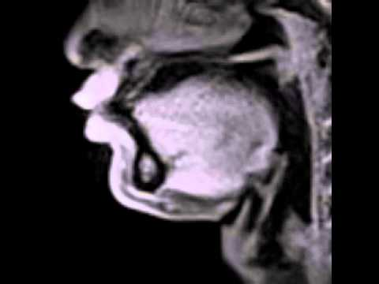
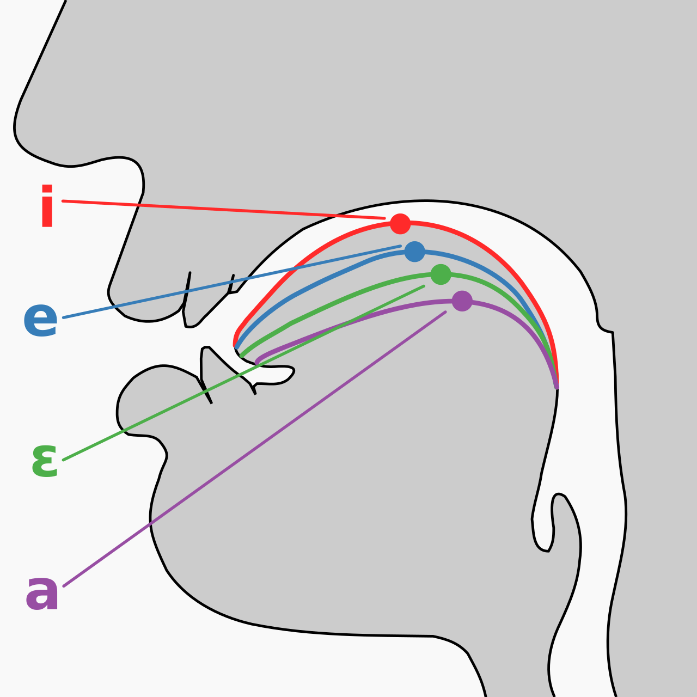
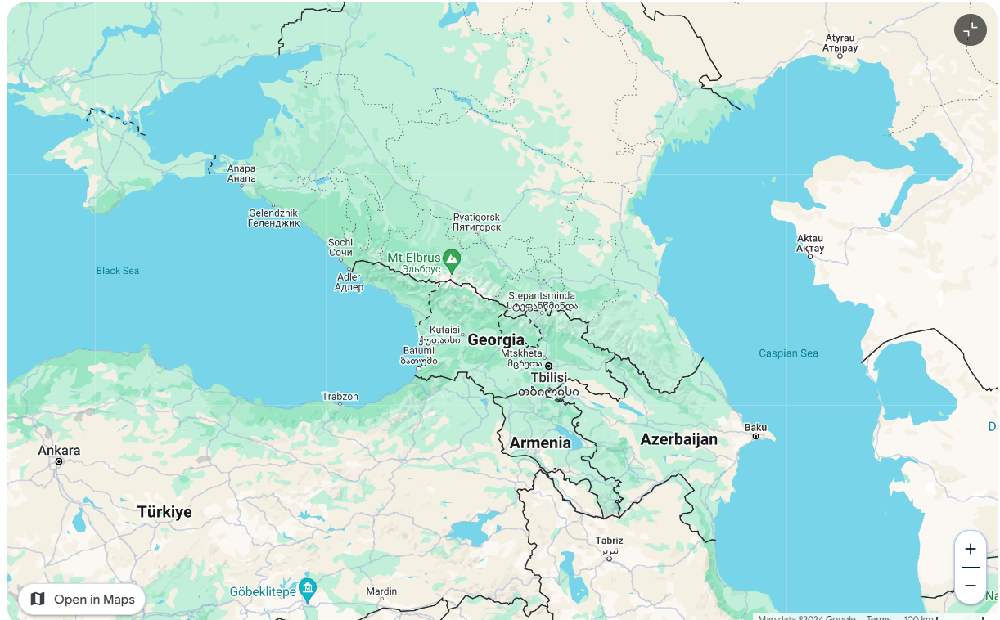
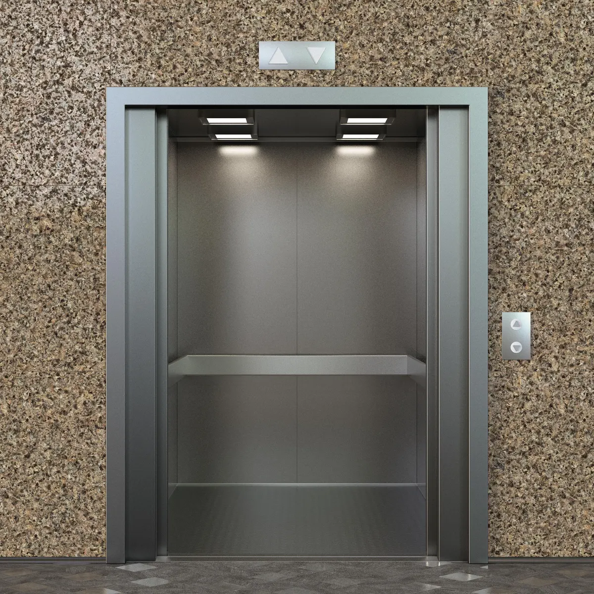
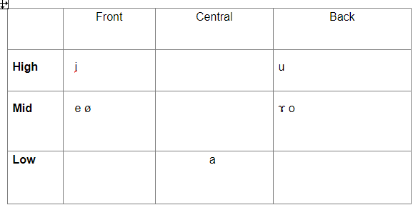
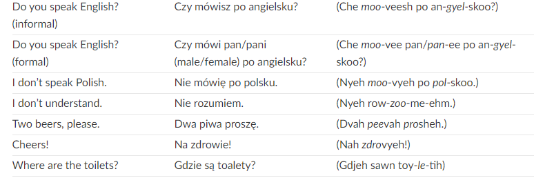
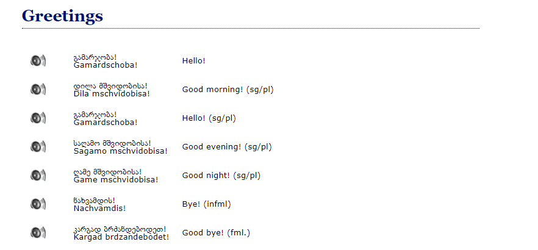
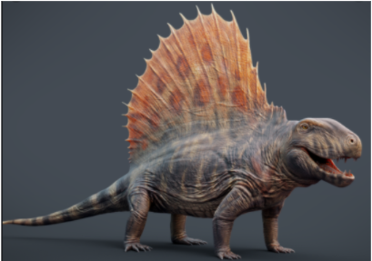

# Week 5: Day 1: Vowels

## What we’ll doing today & next time

- Vowels!
- What are the properties of vowels?
- How were the vowels of Metra constructed?
- Creating a vowel system for Dorgon
- Begin constructing your own vowel system

---

## Bonus Questions

- English actually has at least thirteen vowel sounds—we have just five vowel letters.
  - True
  - False
- Consonants are described by three features: voicing, manner, and place. What features do vowels have?
- What is the issue with having too few vowels?
- The most common vowel inventory contains seven vowels.
  - True
  - False

---

---

- Height
- Backness
- Tenseness
- Roundedness

---

- Feet
- Fit

|  | Front | Central | Back |
|---|---|---|---|
| High tense lax | i ɪ |  | u ʊ |
| Mid tense lax | e ɛ | ʌ ə | o ɔ |
| Low | æ | a | ɑ |

---

- Height
- Backness
- Tenseness
- Roundedness

|  | Front | Central | Back |
|---|---|---|---|
| High tense lax | i ɪ |  | u ʊ |
| Mid tense lax | e ɛ | ʌ ə | o ɔ |
| Low | æ | a | ɑ |

---

- Height
- Backness
- Tenseness
- Roundedness

- kʰip

|  | Front | Central | Back |
|---|---|---|---|
| High tense lax | i ɪ |  | u ʊ |
| Mid tense lax | e ɛ | ʌ ə | o ɔ |
| Low | æ | a | ɑ |

---

- High
- Backness
- Tenseness
- Roundedness

|  | Front | Central | Back |
|---|---|---|---|
| High tense lax | i ɪ |  | u ʊ |
| Mid tense lax | e ɛ | ʌ ə | o ɔ |
| Low | æ | a | ɑ |

---

- High
- Front
- Tenseness
- Roundedness

|  | Front | Central | Back |
|---|---|---|---|
| High tense lax | i ɪ |  | u ʊ |
| Mid tense lax | e ɛ | ʌ ə | o ɔ |
| Low | æ | a | ɑ |

---

- High
- Front
- Tense
- Roundedness

|  | Front | Central | Back |
|---|---|---|---|
| High tense lax | i ɪ |  | u ʊ |
| Mid tense lax | e ɛ | ʌ ə | o ɔ |
| Low | æ | a | ɑ |

---

- High
- Front
- Tense
- Unrounded

|  | Front | Central | Back |
|---|---|---|---|
| High tense lax | i ɪ |  | u ʊ |
| Mid tense lax | e ɛ | ʌ ə | o ɔ |
| Low | æ | a | ɑ |

---

- Height
- Backness
- Tenseness
- Roundedness

- kʰʌt

|  | Front | Central | Back |
|---|---|---|---|
| High tense lax | i ɪ |  | u ʊ |
| Mid tense lax | e ɛ | ʌ ə | o ɔ |
| Low | æ | a | ɑ |

---

- Height
- Backness
- Tenseness
- Roundedness

- kʰʊk

|  | Front | Central | Back |
|---|---|---|---|
| High tense lax | i ɪ |  | u ʊ |
| Mid tense lax | e ɛ | ʌ ə | o ɔ |
| Low | æ | a | ɑ |

---

- Height
- Backness
- Tenseness
- Roundedness

- kʰæt

|  | Front | Central | Back |
|---|---|---|---|
| High tense lax | i ɪ |  | u ʊ |
| Mid tense lax | e ɛ | ʌ ə | o ɔ |
| Low | æ | a | ɑ |

---

## Designing your vowel system

- What is the smallest vowel system you can have?

---

## Designing your vowel system

- What is the smallest vowel system you can have?

|  | Front | Central | Back |
|---|---|---|---|
| High tense lax | i |  | u |
| Mid tense lax |  |  |  |
| Low |  | a |  |

---

## Designing your vowel system

- Which types of languages tend to have fewer vowels?

---

## Designing your vowel system

- Which types of languages tend to have fewer vowels?

---

## Designing your vowel system

- How does the “elevator” metaphor help you in your vowel system’s design?

---

## Designing your vowel system

- How does the “elevator” metaphor help you in your vowel system’s design?

---

## Designing your vowel system

- Easy ways to make your system "non-English"

---

## Designing your vowel system

- Easy ways to make your system "non-English"

|  | Front | Central | Back |
|---|---|---|---|
| High tense lax | i ɪ |  | u ʊ |
| Mid tense lax | e ɛ | ʌ ə | o ɔ |
| Low | æ | a | ɑ |

---

---

---

## Metra Vowels

---

## Dorgons – Let's make a vowel system

- What words do we already have from Elijah?
  - Zenasath		[ˈzinəsæθ]
  - Cindor 		[ˈsɪndɔɹ]
  - Kdasion		[ˈkdæsiɑn]
  - Dorgon		[ˈdɔɹgɑn]
  - Galasiul		[gəˈlæsiəɫ]
  - Gzenian		[ˈgzɛniɑn]
  - Dumbledimpf	[ˈdʌmbl̩dɪmpf]
  - (note: these word have an American English pronunciation – we’ll need to modify them to produce an original language!)
  - Which vowels are particularly Englishy? (Think about your own language experiences)

---

## Dorgons – Let's make a vowel system

- What words do we already have from Elijah?
  - Zenasath		[ˈsinəsæθ]
  - Cindor 		[ˈsɪndɔɹ]
  - Kdasion		[ˈkdæsiɑn]
  - Dorgon		[ˈdɔɹgɑn]
  - Galasiul		[gəˈlæsiəɫ]
  - Gzenian		[ˈgzɛniɑn]
  - Dumbledimpf	[ˈdʌmbl̩dɪmpf]
  - (note: these word have an American English pronunciation – we’ll need to modify them to produce an original language!)
  - Which vowels (or vowel-like things) are particularly Englishy? (Think about your own language experiences)

---

## Dorgon Words

- Less-English sounding words
  - Zenasath		[ˈsenasaθ]
  - Cindor 		[ˈsindoɹ]
  - Kdasion		[ˈkdasian]
  - Dorgon		[ˈdoɹgan]
  - Galasiul		[gaˈlasiul]
  - Gzenian		[ˈgzenian]
  - Dumbledimpf	[ˈdumbaldimpf]

---

## For next time

- Draw up a vowel chart
  - Plot your 3 favorite non-English vowels
  - Find your names that you've already constructed – what vowels are in them?
  - Add basic vowels
  - Eliminate vowels that sound too similar, or that you have a hard time pronouncing
  - Simplify & balance your system, if needed

# Week 5: Day 2: Vowels, Phonotactics

## Today

- Finish Vowel system
- Syllables / Phonotactics
- For class credit:
- Subdivide your sounds into different groups (see slide 57)

---

## Bonus Questions

- What is a syllable? How does a syllable compare to, say, a consonant?
- Japanese is unique in that it has restrictions on how their words and syllables are pronounced.
  - True
  - False
- Say out loud “Fneischel”. How can you tell this is not an English word?
- Consider the following words. Why do or don’t they seem like they could be English?
  - Hraind
  - Farp
  - Txai

---

## What are syllables?

- σ

---

---

## Hawaiian

- https://hawaiian-words.com/common/

---

## Hawaiian

- Akua
- Ala
- Alelo
- Ali‘i
- Aloha
- Aloha ‘auinalā
- Aloha ‘oe
- Aloha ahiahi

---

## Hawaiian

- Akua
- Ala
- Alelo
- Ali‘i
- Aloha
- Aloha ‘auinalā
- Aloha ‘oe
- Aloha ahiahi

- (C)V

---

## Japanese

- https://www.transparent.com/learn-japanese/phrases.html

---

## Japanese

- Hai. Yes.
- はい。
- Iie. No.
- いいえ。
- O-negai shimasu. Please.
- おねがいします。
- Arigatō. Thank you.
- ありがとう。
- Dōitashimashite. You're welcome.
- どういたしまして。

- Sumimasen. Excuse me.
- すみません。
- Gomennasai. I am sorry.
- ごめんなさい。
- Ohayō gozaimasu. Good morning.
- おはようございます。
- Konbanwa. Good evening.
- こんばんは。
- O-yasumi nasai. Good night.
- おやすみなさい。

---

## Japanese

- Hai. Yes.
- はい。
- Iie. No.
- いいえ。
- O-negai shimasu. Please.
- おねがいします。
- Arigatō. Thank you.
- ありがとう。
- Dōitashimashite. You're welcome.
- どういたしまして。

- Sumimasen. Excuse me.
- すみません。
- Gomennasai. I am sorry.
- ごめんなさい。
- Ohayō gozaimasu. Good morning.
- おはようございます。
- Konbanwa. Good evening.
- こんばんは。
- O-yasumi nasai. Good night.
- おやすみなさい。

- (C)V(N)

- (C)V(C1C1V)

---

## Spanish

- https://www.rosettastone.com/spanish-words/

---

## Spanish

- Buenos días / Good morning
- Buenas tardes / Good afternoon
- Buenas noches / Good evening
- Hola, me llamo Juan / Hello, my name is John
- Me llamo… / My name is…
- ¿Cómo te llamas? / What’s your name?
- Mucho gusto / Nice to meet you
- ¿Cómo estás? / How are you?
- Estoy bien, gracias / I’m well thank you
- Disculpa. ¿Dónde está el baño? / Excuse me. Where is the bathroom?
- ¿Qué hora es? / What time is it?
- ¿Cómo se dice ‘concert’ en español? / How do you say ‘concert’ in Spanish?
- Estoy perdido/a / I am lost
- Yo no comprendo / I do not understand
- Por favor, habla más despacio / Would you speak slower, please
- Te extraño / I miss you
- Te quiero / I love you

---

## Spanish

- Buenos días / Good morning
- Buenas tardes / Good afternoon
- Buenas noches / Good evening
- Hola, me llamo Juan / Hello, my name is John
- Me llamo… / My name is…
- ¿Cómo te llamas? / What’s your name?
- Mucho gusto / Nice to meet you
- ¿Cómo estás? / How are you?
- Estoy bien, gracias / I’m well thank you
- Disculpa. ¿Dónde está el baño? / Excuse me. Where is the bathroom?
- ¿Qué hora es? / What time is it?
- ¿Cómo se dice ‘concert’ en español? / How do you say ‘concert’ in Spanish?
- Estoy perdido/a / I am lost
- Yo no comprendo / I do not understand
- Por favor, habla más despacio / Would you speak slower, please
- Te extraño / I miss you
- Te quiero / I love you

- (CL)V(s)

- (CL)V(L)

- (CL)V(N)

# Week 5: Day 3: Phonotactics

## Review

- You've made your C & V systems
- We began talking about phonotactics
  - "how you're allowed to put your sounds together"
  - All about syllables
- What was the syllable structure of:
  - Hawaiian?
  - Japanese?
  - Spanish?

---

## English

- https://www.dictionary.com/e/common-words/

---

## English

- do: accomplish, prepare, resolve, work out
- say: suggest, disclose, answer
- go: continue, move, lead
- get: bring, attain, catch, become
- make: create, cause, prepare, invest
- know: understand, appreciate, experience, identify
- think: contemplate, remember, judge, consider
- take: accept, steal, buy, endure
- see: detect, comprehend, scan
- come: happen, appear, extend, occur
- want: choose, prefer, require, wish
- look: glance, notice, peer, read
- use: accept, apply, handle, work
- find: detect, discover, notice, uncover
- give: grant, award, issue
- tell: confess, explain, inform, reveal

---

## English

- do: accomplish, prepare, resolve, work out
- say: suggest, disclose, answer
- go: continue, move, lead
- get: bring, attain, catch, become
- make: create, cause, prepare, invest
- know: understand, appreciate, experience, identify
- think: contemplate, remember, judge, consider
- take: accept, steal, buy, endure
- see: detect, comprehend, scan
- come: happen, appear, extend, occur
- want: choose, prefer, require, wish
- look: glance, notice, peer, read
- use: accept, apply, handle, work
- find: detect, discover, notice, uncover
- give: grant, award, issue
- tell: confess, explain, inform, reveal

- (s)(C)(R)V(C)(C)

---

## Polish

- https://www.inyourpocket.com/warsaw/the-polish-language-co-za-bzdura_74022f

---

## Polish

---

## Polish

- CCRVs/L/N

---

## Georgian

- https://www.17-minute-world-languages.com/en/georgian/

---

## Georgian

---

## Georgian

- !!!!!!!!!!!!!!!!!

- !!!!!

---

## Georgian

- gvprtskvni “you peeled us (like a potato)”

---

## Identifying your phonotactics

- Let’s begin by subdividing your sounds into different groups:
- C = all consonants (so, p/t/k)
- V = all vowels
- P = stops
- F = Fricatives
- O = Stops, Fricatives, Affricates
- N = Nasals			R = Nasals, Liquids, Glides
- L = Liquids			H = Fricatives + R
- G = Glides

- You might have other categories!!! (affricates, implosives, etc.)

- Use the IPA symbols

- Separate sounds with /

---

## Metra Phonology

---

|  | Bilabial | Alveolar | Retroflex | Palatal | Velar | Uvular |
|---|---|---|---|---|---|---|
| Stop voiceless implosive | p ɓ | t ɗ |  |  | k ɠ | q ʛ |
| Nasal | m | n |  |  | ŋ | ɴ |
| Fricative voiceless voiced |  | s |  | ç | x  ɧ ɣ |  |
| Glide | w |  |  | j |  |  |
| Liquid |  |  | ɭ |  |  | ʀ |

---

|  | Front | Central | Back |
|---|---|---|---|
| High | i |  | u |
| Mid | e ø |  | ɤ o |
| Low |  | a |  |

---

- C = p/t/k/q/ɓ/ɗ/ɠ/ʛ/s/ç/x/ɧ/ɣ/m/n/ŋ/ɴ/w/y/ɭ/ʀ
- P = p/t/k/q/ɓ/ɗ/ɠ/ʛ
- F = s/ç/x/ɧ/ɣ
- O = p/t/k/q/ɓ/ɗ/ɠ/ʛ/s/ç/x/ɧ/ɣ
- N = m/n/ŋ/ɴ
- G = w/y
- L = ɭ/ʀ
- V =  i/u/e/ø/ɤ/o/a
- R = m/n/ŋ/ɴ/w/y/ɭ/ʀ
- H = s/ç/x/ɧ/ɣ/m/n/ŋ/ɴ/w/y/ɭ/ʀ

---

## Identifying your phonotactics

- https://susurrus-llc.github.io/langua/gen/

---

## Identifying your phonotactics

- Make your language like:
- Hawaiian  	CV 				4)  English  		(F)(C)(R)V(C)(C)
- Japanese  	(C)V(N) 			5)  Polish  		(C)(C)(R)V(H)
- Spanish 	(C)(R)V(R) 		6)   Georgian	(C)(C)(C)(C)(C)(C)(C)(C)(C)V(C)
- *For each time you run the website, copy and paste the words that are generated into your google doc.
- *Feel free to be more specific in your categories, thus C could be O, R, F, etc.
- *Play with the word generator until you find a phonotactic structure you like.

---

## Finally - Name your language

- Mɤɧøɴ!

---

## Dorgon Phonology

- Classic 5-vowel system

|  | Bilabial | Interdental | Alveolar | Palatal | Velar |
|---|---|---|---|---|---|
| Stop | p b |  | t d | c ɟ | k g |
| Nasal | m |  | n | ɳ | ŋ |
| Affricate | pf |  | ts |  |  |
| Fricative |  | θ (ð) | s (z) | ç (ʝ) | x (ɣ) |
| Liquid |  |  | r, l |  |  |

---

## Let's do this for Dorgon

- Let’s begin by subdividing your sounds into different groups:
- C = all consonants (so, p/t/k)
- V = all vowels
- P = all stops
- A = affricates
- F = Fricatives
- O = Stops, Fricatives, Affricates
- N = Nasals			R = Nasals, Liquids
- L = Liquids			H = Fricatives + R

---

## Let's do this for Dorgon

- Let’s begin by subdividing your sounds into different groups:
- C =
- V = a/e/i/o/u
- P = p/t/c/k/b/d/ɟ/g
- A = pf/ts
- F = θ/s/ç/x
- O = p/t/c/k/b/d/ɟ/g/pf/ts/θ/s/ç/x
- N = m/n/ɳ/ŋ 			R = r/l/m/n/ɳ/ŋ
- L = r/l 			   H = θ/s/ç/x/r/l/m/n/ɳ/ŋ

---

## What do we know about Dorgon Phonotactics?

- Zenasath     [ˈsinasaθ]
- Cindor       [ˈsindoɹ]
- Kdasion     [ˈkdasian]
- Dorgon      [ˈdoɹgan]
- Galasiul      [gaˈlasiul]
- Gzenian      [ˈgzenian]
- Dumbledimpf  [ˈdumbaldimpf]

- What is allowed?
- In codas?  Are all sounds allowed?
- In onsets? Are all sounds allowed?
- Are there any syllables that don't have an onset?
- In consonant sequences? Are two or more consonants allowed in the onset, coda?

---

## Now it's your turn!

---

## Testing your language’s sound

- http://ipa-reader.xyz/
