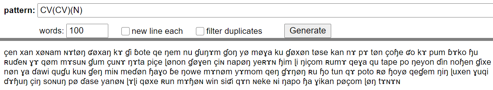
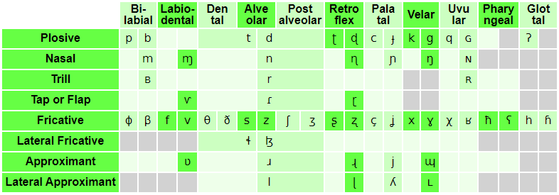

# Week 6: Day 1: Phonotactics, Phonotactic Rules

## Today

- We’ll discuss phonotactic (phonological) rules
- Dorgon phonotactics identified (broadly speaking)
  - Language name given!
- We’ll finish up with working towards identifying your phonotactics & language name

---

## Today

- Phonotactic Rules

---

## Today - Phonological Rules

- 6. Cite three phonotactic rules that occur within your language, with examples of each.
- Sample answer, based on English:
- "There are a number of phonotactic rules that occur in English.
- (1) The first is vowel nasalization, where vowels become nasalized before a nasal consonant (m, n, or ŋ).  Examples include tan, pam, tang - in all three instances the "a" vowel is nasalized. Contrast these vowels with tat, pap, and tack.
- (2) The second is voicing assimilation, where the plural ending "z" (written -es) is pronounced as "s" when it follows a voiceless sound. Examples include taps, tats, and tacks (all with "s"); contrast tabz (tabs), tadz (tads), and tagz (tags), all with "z".
- (3) The third is stop aspiration, where the voiceless stops "p, t, k" are pronounced with aspiration "pʰ, tʰ, kʰ" at the very beginning of the word or at the beginning of a stressed syllable. An example that includes both environments is potato: pʰotʰato, where the "p" aspirates at the beginning of the word, and "t" at the beginning of a stressed syllable."

---

## What to do?

- Assimilation

- Place

- Manner

- Voicing

---

## Examples

- (1) The first is vowel nasalization, where vowels become nasalized before a nasal consonant (m, n, or ŋ).  Examples include tan, pam, tang - in all three instances the "a" vowel is nasalized. Contrast these vowels with tat, pap, and tack.
- /tæn/		→ 		[tæ̃n]
- /pæm/		→ 		[pæ̃m]
- /tæŋ/		→ 		[tæ̃ŋ]

---

## Examples

- (2) The second is voicing assimilation, where the plural ending "z" (written -es) is pronounced as "s" when it follows a voiceless sound. Examples include taps, tats, and tacks (all with "s"); contrast tabz (tabs), tadz (tads), and tagz (tags), all with "z".
- /tæpz/ 		→ 		[tæps]
- /tætz/ 		→ 		[tæts]
- /tækz/ 		→ 		[tæks]

---

## A possible rule for Mɤɧøɴ

- /çen/		+ 	/ku/ 	→ 	[çeŋku]
- /xan/		+	/min/ 	→ 	[xammin]
- /xønam/		+	/ɗin/	→ 	[xønanɗin]

---

## What’s going on here?

- /çen/		+ 	/ku/ 	→ 	[çeŋku]
- /xan/		+	/min/ 	→ 	[xammin]
- /xønam/		+	/ɗin/	→ 	[xønanɗin]

---

## So what should you do?

- Focus on one property (place, manner, or voicing) of a certain class of sounds (stops, fricatives, nasals, etc.)
- Assimilation tends to affect the first sound, not the second ( 1 2 → 2 2, and not *1 2 → 1 1)
- Run ideas of possible phonotactic rules by me to gauge how plausible they are

---

## For Next Time

- With your phonotactics identified, see what types of sequences occur
- What sort of interesting combinations occur across syllable boundaries?
- Try to pronounce these combinations – do you find your mouth doing anything interesting in these cases?

---

## Px̩siˈnunʁ "Dorgon language" (literally "cycle")

- Pthmi
- Pçti
- Pski
- VC/VNC/CVC/CVNC/PPVC/PPVNC/VCV/VNCV/CVCV/CVNCV/PPVCV/PPVNCV

---

## Dorgon Syllable Structure

- (P)CV(N)C
- -fricatives, nasals, liquids, can be nuclei
- kket emŋ l ɳŋ nŋ ɳɳ tsndx gnx ɳmpfa dkçmθr ɟpemɳθ ic btmki aɳtsŋ xnmcl lnr pŋ ŋ g ɟcmsl dbŋ ŋ dcŋ ts θŋ ç tpsb nkn uɳku θsçr nx luç nmc dɟsŋ d cɟsɳpf ɟerɳ pθŋ dm dpθmɳ çst dgrpr dmgi bkab ogr btito tsrp eɳlm bdsŋ ŋ aŋ n nki rkθ pdxŋ mç lxŋ pθ aɟu toθɳ θox umni lɳxm nxxs gɟeɟ mnpn epf nrl gpçŋ gŋ us cdɳpf rmu nssu kkado ɳlɳɟ tpxnɳθ ete bnŋ ɳ klŋ d ggxɳte tgθmpf ggend nmɟs dθs ig ss ŋ mc iɳs tnmsɳ pkugθ ɳmɳ ɟθnxe imɳ kdθθθ rɳk tgɳgn kblb θɳx coŋ θ pɟxxo lɳpf pgsnpfθ pkimçe nnçe çngr snŋ ŋ ppŋ p kdxŋ um çb gbŋ tsɳ ɟkenç ckxp ɟgir dclmɳu nxgl tbinnɳ θntsx θɳmm seŋ t pxnŋ s xaɳn rxŋ l pkθθç ktmŋ ŋ iro ɟpɳn eg cupfx kbmŋ go çŋ gknɳb tkmmɟ rŋ ɳçx sse ggɳnbi θs dgoɳpf il ggumcθ ŋ m its bip lŋ du ŋ ɳx gdlŋ θer et pdçnpu apf çŋ ŋ ng cgrŋ lç opfç sump ŋ nç niŋ ŋ

---

## Dorgon Syllable Structure

- (P)CV(N)C
- -fricatives, nasals, liquids, can be nuclei
- pbsm mtsi ptem or ɟkamx rur csmr cmnl ɳɳtsç tbms oŋ s bdmps xnd rsŋ r bpxŋ θ ŋ ɳŋ m kgeŋ ce ttam rmɳ ɟdox dkmx θndm cbar enɟç rŋ kmnri θanpf sɳgr kbem mnç mçi gid rnɳ acɳ tan iɟ cpçɳtsm oɳcu pclr tdat cucn rŋ ɳpf bpipf onbç sbn nxln θatsŋ mkθ rkl dpçts kdθɳo kdsnθ bbix ag cprla mgn ŋ ets pfɳŋ b xɳɳp ŋ omŋ m ɟpçrŋ gdompf xlɳts θl ampm its pgnmɟ rngi ɟkrtr nom kknɳr rl gnnsu çmr ɟtsr tçŋ px gdete uŋ x rŋ θn θmθ cmnçç lss kdrmɳɳ smɟm uncu rgs lntsi nɳmr rt çnt lmŋ θ kkarɳ lmgl rθɳθŋ ek gɟlɳdç oɳcs nnnpi pŋ l xçɳ gbsm dpaŋ tŋ pbnɳk ɟcmmx namŋ ç nnxç sɟ ŋ ntsa rgɳ ŋ lŋ ɟx peɟ smɟ xoŋ s ɟotn pteç mte dgnsm nθɟ ɟɳŋ t gcspf kpθmpfi ŋ b bciŋ rx pknng lns gkrnɳ tsnθ cθt xmp ɳnŋ s gempfu ɳke ɳmɟ mɳs xɳps cbag çŋ gs ççɳrθ ɳŋ ts nnmbç çmpfr smθm at pdsmxθ nrt diɳr θŋ ge deŋ d ɟcoɳsl gtimb tŋ ŋ ɟ ccoɳɟa bglmx saŋ na nm rx

---

## The Dark Lord™ already started identifying some meanings/word formations in his language

- ɳm̩pfa 'dwarf’  ɳm̩pf 'short’
- btita 'goblin'
- btito 'menace'
- btit 'green'
- xʁaɪs 'dorgon pit’
- dpθ̩mɳ̩ 'confused’  dpθ̩mɳa 'someone who is confused; idiot’
- coɳɟa 'king’  coɳɟ 'ruling; being in charge'

---

## Let’s Work on Your Phonotactics

- Let’s begin by subdividing your sounds into different groups:
- C = all consonants (so, p/t/k)
- V = all vowels
- P = all stops
- A = affricates
- F = Fricatives
- O = Stops, Fricatives, Affricates
- N = Nasals			R = Nasals, Liquids
- L = Liquids			H = Fricatives + R

---

## Identifying your phonotactics

- https://susurrus-llc.github.io/langua/gen/

---

## Testing your language’s sound

- http://ipa-reader.xyz/

# Week 6: Day 2: Phonotactic (Phonological) Rules

## Review

- Phonotactics = ?
- Phonotactic (phonological) rules = ?

---

## Most Common Type of Phonotactic Rule?

---

## Pxsinunr (Dorgon)

- Biggest Syllable       =   (P)(C)V(N)(C)
- a		sa		psa
- an		san		psan
- ank		sank	psank

---

## Pxsinunr (Dorgon)

- Biggest Syllable       =   (P)(C)V(N)(C)
- tum iŋ​ pe cuŋ​s gam ba dtumk ddeɳb ɟɟenc pe aɳ eɳx oŋ​θ dpfuŋ​g si o uns ccenb te o dɟa cciŋ​g tɟa unb imt u oŋ​ tsint somd aŋ​θ dkaɳc i dcaɳp pi kduɳp eŋ​pf ktsonk pa ɟkaŋ​ tsu aɳx so po bba tse tɟu aŋ​t dɟan xo pco i pu em çomç kten bθo ge om eŋ​ ɟcinx aŋ​ tpo pfo dθeɳ u cko cu bdump gçumd tθo pfo o ɟanp eɳ eŋ​ i ɟtenc buŋ​g i ɟpfank iɳ ɟdu um aŋ​ eɳɟ on o kpfeɳx daŋ​ si im e iɳɟ tθon pθun bonç ga bθenpf cim ɟsa

---

## Pxsinunr (Dorgon)

- Syllables with Crazy Nuclei      =   (C)V(C)
- x		sx
- xt		sxt

---

## Pxsinunr (Dorgon)

- Syllables with Crazy Nuclei      =   (C)V(C)
- tɳ pfn pfx ɟŋ​ tɳ ts s txg dr bn x ds n r xm ɳ br ɳ çŋ​b θ xn sɳd pfms çç kl cn xx cç ŋ​ ɳ ɳ tn ŋ​ dɳp txp bçts r pɳ bxt ks ç xmθ glg xl r ɟç br s x θs x kr s l çng n dɳpf tsɳθ tθ gnk gɳb tn gx n tsɳ bsp kçt tss θ tsɳb ççx gs ç dnd ŋ​ sç çθɟ xns s pfnk tsɳp x ɳ pfxk cθ tsç xx ɳ l n ŋ​ ŋ​ r s θmc s gɳ tsxd tsnts r

---

## Pxsinunr (Dorgon) – What should we change?

- tum iŋ​ pe cuŋ​s gam ba dtumk ddeɳb ɟɟenc pe aɳ eɳx oŋ​θ dpfuŋ​g si o uns ccenb te o dɟa cciŋ​g tɟa unb imt u oŋ​ tsint somd aŋ​θ dkaɳc i dcaɳp pi kduɳp eŋ​pf ktsonk pa ɟkaŋ​ tsu aɳx so po bba tse tɟu aŋ​t dɟan xo pco i pu em çomç kten bθo ge om eŋ​ ɟcinx aŋ​ tpo pfo dθeɳ u cko cu bdump gçumd tθo pfo o ɟanp eɳ eŋ​ i ɟtenc buŋ​g i ɟpfank iɳ ɟdu um aŋ​ eɳɟ on o kpfeɳx daŋ​ si im e iɳɟ tθon pθun bonç ga bθenpf cim ɟsa tɳ pfn pfx ɟŋ​ tɳ ts s txg dr bn x ds n r xm ɳ br ɳ çŋ​b θ xn sɳd pfms çç kl cn xx cç ŋ​ ɳ ɳ tn ŋ​ dɳp txp bçts r pɳ bxt ks ç xmθ glg xl r ɟç br s x θs x kr s l çng n dɳpf tsɳθ tθ gnk gɳb tn gx n tsɳ bsp kçt tss θ tsɳb ççx gs ç dnd ŋ​ sç çθɟ xns s pfnk tsɳp x ɳ pfxk cθ tsç xx ɳ l n ŋ​ ŋ​ r s θmc s gɳ tsxd tsnts r

---

## Remember “Gsenian”?

- tum iŋ​ pe cuŋ​s gam ba dtumk ddeɳb ɟɟenc pe aɳ eɳx oŋ​θ dpfuŋ​g si o uns ccenb te o dɟa cciŋ​g tɟa unb imt u oŋ​ tsint somd aŋ​θ dkaɳc i dcaɳp pi kduɳp eŋ​pf ktsonk pa ɟkaŋ​ tsu aɳx so po bba tse tɟu aŋ​t dɟan xo pco i pu em çomç kten bθo ge om eŋ​ ɟcinx aŋ​ tpo pfo dθeɳ u cko cu bdump gçumd tθo pfo o ɟanp eɳ eŋ​ i ɟtenc buŋ​g i ɟpfank iɳ ɟdu um aŋ​ eɳɟ on o kpfeɳx daŋ​ si im e iɳɟ tθon pθun bonç ga bθenpf cim ɟsa tɳ pfn pfx ɟŋ​ tɳ ts s txg dr bn x ds n r xm ɳ br ɳ çŋ​b θ xn sɳd pfms çç kl cn xx cç ŋ​ ɳ ɳ tn ŋ​ dɳp txp bçts r pɳ bxt ks ç xmθ glg xl r ɟç br s x θs x kr s l çng n dɳpf tsɳθ tθ gnk gɳb tn gx n tsɳ bsp kçt tss θ tsɳb ççx gs ç dnd ŋ​ sç çθɟ xns s pfnk tsɳp x ɳ pfxk cθ tsç xx ɳ l n ŋ​ ŋ​ r s θmc s gɳ tsxd tsnts r

---

## What other assimilation rules might we implement?

- tum iŋ​ pe cuŋ​s gam ba dtumk ddeɳb ɟɟenc pe aɳ eɳx oŋ​θ dpfuŋ​g si o uns ccenb te o dɟa cciŋ​g tɟa unb imt u oŋ​ tsint somd aŋ​θ dkaɳc i dcaɳp pi kduɳp eŋ​pf ktsonk pa ɟkaŋ​ tsu aɳx so po bba tse tɟu aŋ​t dɟan xo pco i pu em çomç kten bθo ge om eŋ​ ɟcinx aŋ​ tpo pfo dθeɳ u cko cu bdump gçumd tθo pfo o ɟanp eɳ eŋ​ i ɟtenc buŋ​g i ɟpfank iɳ ɟdu um aŋ​ eɳɟ on o kpfeɳx daŋ​ si im e iɳɟ tθon pθun bonç ga bθenpf cim ɟsa tɳ pfn pfx ɟŋ​ tɳ ts s txg dr bn x ds n r xm ɳ br ɳ çŋ​b θ xn sɳd pfms çç kl cn xx cç ŋ​ ɳ ɳ tn ŋ​ dɳp txp bçts r pɳ bxt ks ç xmθ glg xl r ɟç br s x θs x kr s l çng n dɳpf tsɳθ tθ gnk gɳb tn gx n tsɳ bsp kçt tss θ tsɳb ççx gs ç dnd ŋ​ sç çθɟ xns s pfnk tsɳp x ɳ pfxk cθ tsç xx ɳ l n ŋ​ ŋ​ r s θmc s gɳ tsxd tsnts r

---

## How else could we make these words easier to say?

- tum iŋ​ pe cuŋ​s gam ba dtumk ddeɳb ɟɟenc pe aɳ eɳx oŋ​θ dpfuŋ​g si o uns ccenb te o dɟa cciŋ​g tɟa unb imt u oŋ​ tsint somd aŋ​θ dkaɳc i dcaɳp pi kduɳp eŋ​pf ktsonk pa ɟkaŋ​ tsu aɳx so po bba tse tɟu aŋ​t dɟan xo pco i pu em çomç kten bθo ge om eŋ​ ɟcinx aŋ​ tpo pfo dθeɳ u cko cu bdump gçumd tθo pfo o ɟanp eɳ eŋ​ i ɟtenc buŋ​g i ɟpfank iɳ ɟdu um aŋ​ eɳɟ on o kpfeɳx daŋ​ si im e iɳɟ tθon pθun bonç ga bθenpf cim ɟsa tɳ pfn pfx ɟŋ​ tɳ ts s txg dr bn x ds n r xm ɳ br ɳ çŋ​b θ xn sɳd pfms çç kl cn xx cç ŋ​ ɳ ɳ tn ŋ​ dɳp txp bçts r pɳ bxt ks ç xmθ glg xl r ɟç br s x θs x kr s l çng n dɳpf tsɳθ tθ gnk gɳb tn gx n tsɳ bsp kçt tss θ tsɳb ççx gs ç dnd ŋ​ sç çθɟ xns s pfnk tsɳp x ɳ pfxk cθ tsç xx ɳ l n ŋ​ ŋ​ r s θmc s gɳ tsxd tsnts r

---

## Let's look at Bella's & Hailey's language

---

## Phonotactics

- With your phonotactics identified, see what types of sequences occur
- What sort of interesting combinations occur across syllable boundaries?
- Try to pronounce these combinations – do you find your mouth doing anything interesting in these cases?

# Week 6: Day 3: Prosody

## Your language’s sound system

- Consonants
- Vowels
- Phonotactics (Syllable Structure)
- Phonotactic Rules
- Name

---

## Recap Questions from your video

- Consider the following sentence: “Language matters”. How does this change if you stress the first word? What about the last?
- English is a stress language. How might that affect saying “language” as “lan-GUAGE” rather than “LAN-guage”? Would the meaning of the word change? How might a listener react?
- English is a tonal language, because tone tells us how someone is feeling.
  - True
  - False
- In the book & episode, we said that Mandarin Chinese is a tonal language. How does linguistic tone, like in Mandarin, differ from “tone of voice” (or tone in English)?

---

- 7. Is your language a tonal language or a stress-based language? If tonal, describe the number of tones your language has, with examples. If stress-based, describe the language's stress pattern, with examples.

---

- 8. How does your language differentiate between different types of sentences, such as statements, questions, and commands?  If tonal, you may write "through different words", which you will detail in the next project component. If stress-based, briefly describe the intonational patterns of statements, questions, and commands, with examples.

---

## Overview of Concepts

- Pitch
  - tone
  - intonation
- Stress/Intonation
  - English (penult/antepenult)
  - French (ultima)
  - Hungarian (initial)

---

## Tone Example: Navajo (2 tones)

---

## Tone Example: Chinese (5 tones)

---

## Intonation/Stress Example: English

---

## Intonation/Stress Example: French

---

## Intonation/Stress Example: Hungarian

---

## Mɤɧøɴ as Tonal

- 2 tones: high & low
- xám					xam
- wín					win

---

## Mɤɧøɴ as Tonal

- 4 tones: 	high & low		xám			xam
- rising & falling		xø̂m			xø̌m

---

## Mɤɧøɴ as a Stress Language

- xan		        xanɭøɴquɠu
- xøɴam 		xøɴamɭøɴquɠu
- ɭøɴquɠu		ɭøɴquɠuɭøɴquɠu

---

## Mɤɧøɴ as a Stress Language

- Like English: penult/antepenult
- xán			xanɭǿɴquɠu
- xǿɴam 			xøɴamɭǿɴquɠu
- ɭǿɴquɠu			ɭøɴquɠuɭǿɴquɠu

---

## Mɤɧøɴ as a Stress Language

- Like French: ultima									xán			xanɭøɴquɠú
- xøɴám 			xøɴamɭøɴquɠú
- ɭøɴquɠú			ɭøɴquɠuɭøɴquɠú

---

## Mɤɧøɴ as a Stress Language

- Like Hungarian: initial
- xán			xánɭøɴquɠu					xǿɴam 			xǿɴamɭøɴquɠu
- ɭǿɴquɠu			ɭǿɴquɠuɭøɴquɠu

---

## The Winner...

- Like French! ultima
- xán				xanɭøɴquɠú				xøɴám 				xøɴamɭøɴquɠú
- ɭøɴquɠú				ɭøɴquɠuɭøɴquɠú

---

## Dorgon

- Px̩siˈnunʁ
  - what does this tell us?

---

## In Groups

- Using LanguaGen, create six words, 1 syllable, 2 syllable, … 6 syllable
  - -  Do your already existing names/words give you any insight?
- Test your language as a Tonal Language
  - Like Navajo: 2 tones
  - Like Chinese: 4 tones
- Test your language as a Stress/Intonation Language
  - Like English: penult/antepenult
  - Like French: ultima
  - Like Hungarian: initial
- ** Choose the prosody that you find most appropriate for your own language**
