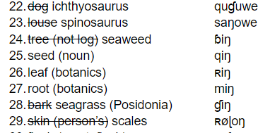
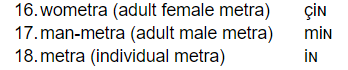
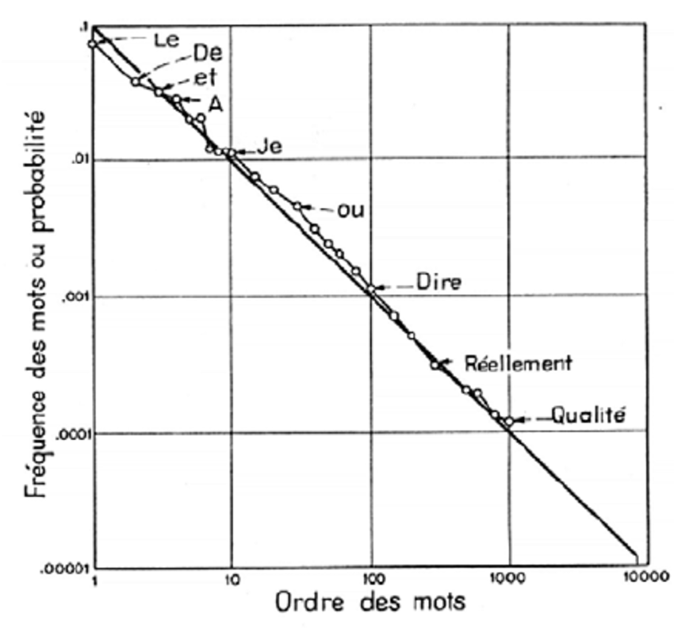

# Week 7: Parts of Speech

## Today

- What is the lexicon?
- What are lexical categories?
  - In English?
  - Beyond?

---

## Review - The Lexicon

- What’s a lexicon?
- What determines what goes into one?
  - Eskimo ‘snow’
  - ‘phubbing’, ‘ghosting’
  - ‘thundersquall’

---

## Group Activity

- What are the parts of speech (lexical categories) of English?
- Identify all eight of them, and give at least two examples of each.

---

## Together

- What is the function of each of these parts of speech?

---

## Group Activity

- Pondering the function of each of these parts of speech, ask yourselves:
- Can any of them be collapsed together?
- Are any of them not necessary?

# Week 7: Parts of Speech

## Review: Parts of Speech

- What is a part of speech (lexical category)?
- What are the parts of speech in English?
- Which ones can we collapse/combine?

---

## Group Activity

- Now jump down the rabbithole that is the internet
  - Google
  - ChatGPT
  - Stack exchange, or whatever!
- What sort of variation do we find in parts of speech?  How might this help you in crafting your lexicon?

---

## Lexical Categories

- What are absolutely required?

---

## Component 3

- 1. What are the parts of speech in your language?  Discuss, using at least three examples of each type. (Be sure to define each word / phrase that you've invented for your language, which you cite)

---

## Pxsinunr

- Elijah's Lexicon.docx

---

## Component 3

- 2. Complete the Swadesh 100 Final List for your language. If your culture lacks a particular word, please replace it with something more culturally/anatomically more appropriate.

---

## Swadesh List?

- Morris Swadesh

---

## Example from Mɤɧøɴ

- Component 3_ The Mɤɧøɴ Word System.docx

---

## Filling in the Swadesh List

- Look through the Swadesh list in your language documents, eliminating any concept that cannot exist in your language and adding those that must exist.

---

## Filling in the Swadesh List

- Input your phonotactics into LanguaGen, and generate new word lists.

---

## Filling in the Swadesh List

- Pay attention to semantically similar words - perhaps they will also be pronounced in a similar way.

---

## Filling in the Swadesh List

- You may want some words to show “onomatopoeia”, but use this sparingly.

---

## Filling in the Swadesh List

- 5.   Zipf's Law

---

## Pxsinunr

- Elijah's Lexicon.docx

---

## Looking Ahead

- For Monday: complete your Swadesh List
  - Identify any words in your Swadesh list that aren't appropriate / necessary, and replace them with ones that are
  - Generate “words” in LanguaGen
  - Semantically similar may mean similar sounds
  - Onomatopoeia
  - Zipf’s Law

# Week 7: Parts of Speech

## Last Time

- Clarification:
  - What are classifiers?
    - Proper nouns – Capitalization
    - What is the name of a group of:
      - People
      - Dogs
      - Cats
      - Fish
      - Crows

---

## What would your grammar look like without certain categories?

- Merging adjectives and adverbs
  - That story is true.	→ ___________________
  - I speak truly.		→ ___________________
  - I am truly happy.		→ ___________________
  - I am truly, truly happy.	→ ___________________
  - Truly, I am happy. 	→ ___________________

---

## What would your grammar look like without certain categories?

- No pronouns
  - The other day, John went to the store. He saw a giant display for Oreo-flavored Coke, and walked up to it.  Right next to it stood his old friend Susie.  He greeted her, and then they laughed at it together.

---

## What would your grammar look like without certain categories?

- No conjunctions
  - Me and my friend wanted to go see a movie, because we were super bored. Which should we see: Aliens or Halloween?

---

## What would your grammar look like without certain categories?

- No adjectives/modifiers at all
  - That story is true.   			→ ___________________
  - I speak truly.    			→ ___________________
  - I am truly happy.				→ ___________________
  - The true story was heard by no one.	→ ___________________

---

## What would your grammar look like without certain categories?

- Only nouns and verbs?
  - John sleeps.
  - John teaches Linguistics.
  - John gives son book.

---

## Today

- For Monday: complete your Swadesh List
  - Identify any words in your Swadesh list that aren't appropriate / necessary, and replace them with ones that are
  - Generate “words” in LanguaGen
  - Semantically similar may mean similar sounds
  - Onomatopoeia
  - Zipf’s Law
