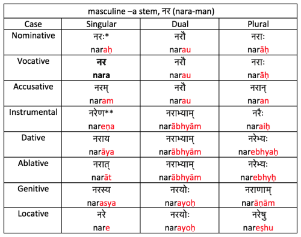
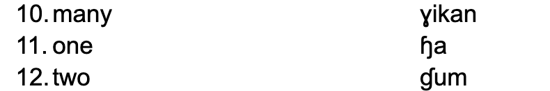
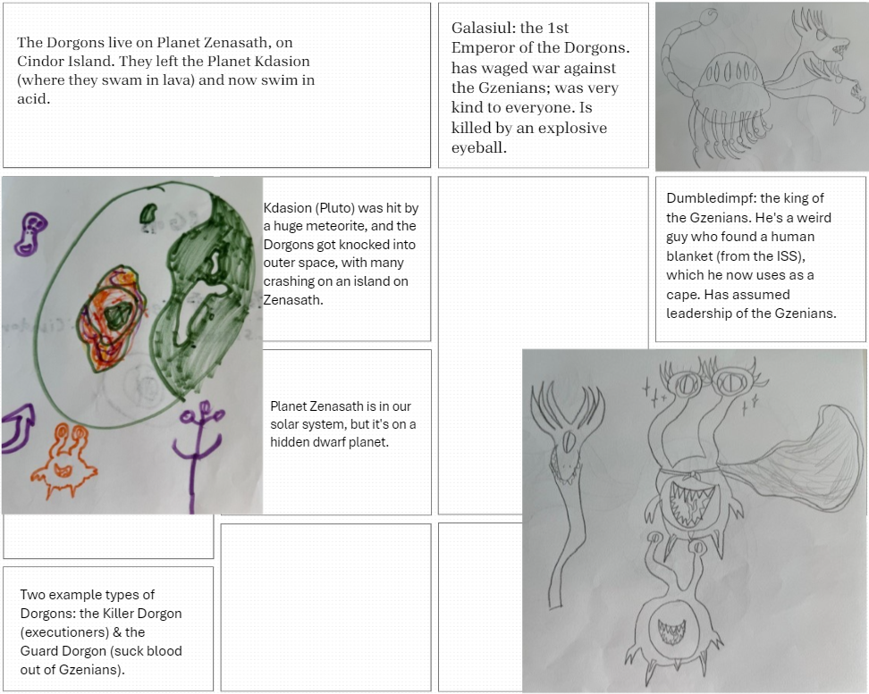

# Week 8: Nominals

## Today: Nominals

- What are nominals?
- What are the three types of nominals?
- What sorts of information can languages add to nominals?
  - Number
  - Gender/Noun Classes
  - Case

---

## Do you want a language with lots of morphology?

---

## Or very little?

---

## For the most part

- Lots of morphology = word order doesn’t matter
- Not much morphology = word order matters A LOT
- Most languages are somewhere in the middle

---

## Last Time

- The Lexicon

---

## The Next 3 Days: Creating your Nominal System

- Go to your lexicon & identify down 7 nouns that you’ve created thus far
- You will decide:
  - Number
  - Gender
  - Case
    - If no case, how do you indicate location, source, instrument, and possession?
- You will decide:
  - Adjectives and their relationship w/ nouns
- You will create:
  - Pronoun system

---

## Group Activity: What is Grammatical Number?

- What is it?
- How many can a language have?
  - Feel free to use Internet/AI

---

## Which type of system did you find coolest?

- https://en.wikipedia.org/wiki/Grammatical_number

---

## But how can number be 'marked'?

- Through "affixes"
  - There are five types:
    - Prefixes
    - Suffixes
    - Infixes
    - Circumfixes
    - Interweaving (Ablaut)

---

## In Mɤɧøɴ: singular, dual, plural

- We could just do this:
- iɴ 			‘metra’
- iɴi 			‘2 metras ’			SUFFIX
- iɴu			‘metras’
- pi			‘foot’
- ipi			‘2 feet’ 				PREFIX
- upi			‘feet’

---

## In Mɤɧøɴ: singular, dual, plural

- We could just do this:
- iɴ 			‘metra’
- iwiɴ			‘2 metras ’			INFIX
- iwuɴ		‘metras’
- pi			‘foot’
- ipiyi			‘2 feet’ 				CIRCUMFIX
- upiwu		‘feet’

---

## In Mɤɧøɴ: singular, dual, plural

- We could just do this:
- iɴ 			‘metra’
- oɴ 			‘2 metras ’		INTERWEAVING
- uɴ			‘metras’

---

## Here’s what we did:

- iɴ 		‘metra’			we		‘dinosaur’
- iɴɠuɴ 	‘2 metras ’		weɠum		‘2 dinos’
- iɴɣikaɴ 	‘metras’			weɣikan	‘dinos’
- qiŋ		‘seed’			pi		‘foot’
- qiŋɠuŋ 	‘2 seeds ’		piɠum		‘2 feet’
- qiŋɣikaŋ 	‘metras’			piɣikan		‘feet’

---

## In Mɤɧøɴ: singular, dual, plural

---

## Something else is going on here, phonologically…

- iɴ 		‘metra’			we		‘dinosaur’
- iɴɠuɴ 	‘2 metras ’		weɠum		‘2 dinos’
- iɴɣikaɴ 	‘metras’			weɣikan	‘dinos’
- qiŋ		‘seed’			pi		‘foot’
- qiŋɠuŋ 	‘2 seeds ’		piɠum		‘2 feet’
- qiŋɣikaŋ 	‘metras’			piɣikan		‘feet’

---

## Let’s think about the Dorgons (Dgon)

- How many numbers should we have?
- Translate:
  - 1 individual from your society (Dorgon)
  - 2 Dorgons
  - 3 Dorgons
  - 4 Dorgons

---

## Activity: with your group, discuss: what grammatical numbers should the Dorgons have?

---

## Affixation?

- dwarf      				ɳm̩pfa
- short                	ɳm̩pf
- dorgon pit             	xʁaɪs
- confused              	dpθ̩mɳ̩
- someone who is confused; idiot  	dpθ̩mɳa
- king 					coɳɟa
- ruling; being in charge 			coɳɟ

---

## Activity -- make different number forms

- How many numbers do you have?
- Translate:
  - 1 individual from your society (Metra, Dorgon, etc.)
  - 2 i.f.y.s.
  - 3 i.f.y.s.
  - 4 i.f.y.s.

---

## For Next Time

- Identify the grammatical numbers you want in your language, if any
- Will you have affixation?  If so, what time?

# Week 8: Nominals

## Review

- Nominals
- Grammatical Number
- Types of Affixes

---

## What is Gender?

- What is it?
- How many can a language have?
- What types of categories can the language have?

---

## Group Activity: How many genders are possible? And what types?

---

## Examples of Gender?

- https://en.wikipedia.org/wiki/Grammatical_gender
- https://en.wikipedia.org/wiki/Noun_class

---

## In Mɤɧøɴ: four genders

- Metras:					çampa 	“Chomper”
- All other animals (including dinosaurs): 	we “dinosaur”
- Underwater plants:				ɓiŋ “seaweed”
- Everything else (including above-water plants): 	ɧø “horn”

---

## How is it marked?

- On adjectives -- insert sound sequence before last vowel of word:
- çampa	ɠuŋɤm 	→ 	çampa ɠuŋowɤm	‘big Chomper’
- we 		ɠuŋɤm	→ 	we ɠuŋʀɤm		‘big dino’
- ɓiŋ 		ɠuŋɤm	→ 	ɓiŋ ɠuŋsɤm		‘big seaweed’
- ɧø		ɠuŋɤm	→ 	ɧø ɠuŋtɤm		‘big horn’

---

## Dorgon - Number

- dpθ̩mɳa 		'idiot'
- kedpθ̩mɳa 		'2 idiots'
- ekedpθ̩mɳa 		'many idiots'
- akedpθ̩mɳa 		‘a few idiots'

---

## Dorgon Gender – What makes sense?

- Elijah's Lexicon.docx

---

## Number, Gender, Case – Order?

- Cross-linguistically, there tends to be a hierarchy:
- Prefixes:
  - NUMBER + CASE + GENDER
- Suffixes:
  - GENDER + CASE + NUMBER

---

## Dorgon - Number

- dpθ̩mɳa 		'idiot'
- kedpθ̩mɳa 		'2 idiots'
- ekedpθ̩mɳa 		'many idiots'
- akedpθ̩mɳa 		'a bunch of idiots'

---

## Activity -- make different gender forms

- How many genders do you have, if any?
- Write out at least one noun for each gender category you’ve created, and indicate how gender is marked.

---

## What is Case?

- What is it?
- How many can a language have?
- What types of categories can the language have?

---

## Examples of Case?

- English
- Latin
- Beyond?

---

## In Mɤɧøɴ: no case

- Subject & object marked by word order, not case.
- Location, source, instrument, possession marked with prepositions:
  - Location: 		in Undersplash		ɓɤ-wisiyesi
  - Source:			from Undersplash	ɧaŋ-wisiyesi
  - Instrument:		with Chomper		ti-çampa
  - Possession:		Chomper’s		xɤ-çampa

---

## Dorgon?

- From Elijah:
  - ‘before’ da
  - ‘after’ ba

---

## Activity -- make different case forms

- Does your language make use of case?  If so, how many cases will you have?
- Does your language have different forms for subject and object nominals?
- Indicate the case forms or prepositions/postpositions used for the following meanings, complete with translated expressions from your language:
  - Location:
  - Source:
  - Instrument:
  - Possession:

# Week 8: Nominals

## Nominals

- We've now talked about:
  - Grammatical Number
  - Gender
  - Case
  - Affixation

---

## Some Clarification about Gender

- Natural vs. Grammatical
  - English pronouns
  - Spanish masculine & feminine

---

## Some Clarification about Case

- Grammatical Cases (Word Order)

- Grammatical Cases (Adpositions)

---

## Dgon: dpθ̩mɳa 'idiot'

- subject     	pfodpθ̩mɳa
- dir. obj.   		dpθ̩mɳa
- indir. obj.			udpθ̩mɳa
- ‘before’			badpθ̩mɳa
- ‘after’			dadpθ̩mɳa
- ‘from’			ikadpθ̩mɳa
- ‘with’			idpθ̩mɳa
- ‘of’				sxdpθ̩mɳa

- Zipf’s

---

## Note what happens when we add number prefixes

- subject     	kepfodpθ̩mɳa
- dir. obj.   		kedpθ̩mɳa
- indir. obj.			keudpθ̩mɳa
- ‘before’			kebadpθ̩mɳa
- ‘after’			kedadpθ̩mɳa
- ‘from’			keikadpθ̩mɳa
- ‘with’			keidpθ̩mɳa
- ‘of’				kesxdpθ̩mɳa

- Zipf’s

---

## Good place for a phonotactic rule

- subject     	kepfodpθ̩mɳa
- dir. obj.   		kedpθ̩mɳa
- indir. obj.			keudpθ̩mɳa
- ‘before’			kebadpθ̩mɳa
- ‘after’			kedadpθ̩mɳa
- ‘from’			keikadpθ̩mɳa
- ‘with’			keidpθ̩mɳa
- ‘of’				kesxdpθ̩mɳa

- Zipf’s

- Diphthong?
- C insertion?
- V deletion?

---

## What does this mean?

- dgon ‘Dorgon’		dçi ‘stick’		dpθ̩mɳa ‘idiot’
- pfo- = subject		-0- = DO		-u- = IO
- “The idiot GAVE the Dorgon a stick.”
- pfodpθ̩mɳa GAVE udgon dçi
- “The Dorgon GAVE the idiot a stick.”
- pfodgon GAVE udpθ̩mɳa dçi
- “The stick GAVE the Dorgon the idiot.”
- pfodçi GAVE udgon dpθ̩mɳa

- Word Order?

---

## Adjectives & Nouns

- How are adjectives marked in relation to the nouns they modify?

---

## Examples in English: Agreement

- The cat is small.
- The cats are small.	  not	*The cats are smalls.
- The black cat walked.

---

## Agreement in English

- Make plural:
- This cat is small.
- That cat is small.

---

## Examples in Spanish (source): Agreement

- El gato es pequeño. 		‘The cat is small.’
- Los gatos son pequeños. 	‘The cats are small.’
- El gato negro caminó. 	‘The black cat walked.’

---

## Examples in German (source)

- der große Baum 		‘the big tree’
- Der Baum ist groß. 		‘The tree is big.’

- Attributive – requires agreement

- Predicative – no agreement

---

## In Mɤɧøɴ: adjectives marked for (natural) gender, not number

- çampa	ɠuŋɤm 	→ 	çampa ɠuŋowɤm		‘big Chomper’
- we 	ɠuŋɤm	→ 	we ɠuŋʀɤm		‘big dino’
- ɓiŋ 	ɠuŋɤm	→ 	ɓiŋ ɠuŋsɤm		‘big seaweed’
- ɧø	ɠuŋɤm	→ 	ɧø ɠuŋtɤm		‘big horn’

---

## Dgon Adjectives: Incorporation

- So far we’ve seen that Dgon has prefixed number & case, suffixed POS markers:
- ke-pfo-dpθ̩mɳ-a
- ‘2 idiots (subject)’

---

## Inuktitut

- aqpik ‘cloudberry’ + juk ‘small’  aqpikjuk ‘small cloudberry’
- sila ‘weather’ + angijuq ‘big’  silangijuq ‘bad weather’
- Adjectives are regularly ‘incorporated’ into the noun.  This is similar to phrases like ‘baby-sitting’ or ‘doom-scrolling’.

---

## Dgon Adjectives: Incorporation

- ke-pfo-dpθ̩mɳ-a
- ‘2 idiots (subject)’

---

## Dgon Adjectives: Incorporation Example

- Let’s incorporate im ‘small’:
- ke-pfo-dpθ̩mɳ-im-a
- ‘2 small idiots (subject)’

- Why here?

---

## Dgon Adjectives: Incorporation Example

- Let’s incorporate gpfa ‘big’.
- ke-pfo-dpθ̩mɳ-a
- ‘2 big idiots (subject)’

---

## Activity – Dorgon adjectives

- Translate the following adjective + noun expressions:
  - red fire
  - many eyes
  - full belly
  - black hair

- ‘fire’				den
- ‘eyes (pl.)’			ekepkin
- ‘belly’			xi
- ‘retractable belly spikes’	ampf
- ‘red’				ge
- ‘many’			gti
- ‘full’				ban
- ‘black’			pça

---

## Activity -- adjectives

- Are your adjectives marked for number? Gender? Case? (Don’t worry about word order for the time being.)
- Translate the following adjective + noun expressions:
  - red fire
  - many eyes
  - full belly
  - black hair

---

## Pronouns

- How are they connected to the nominal system?

---

## In Mɤɧøɴ: match the categories from earlier

- sg.		du.		pl.
- 1st person		kɤ 		kɤɠu		kɤka
- 2nd person		ku 		kuɠu		kuka
- 3rd person (met)		o		oɠu		oka
- (animal)		ʀɤ		ʀɤɠu		ʀɤka
- (plant)		sø		søɠu		søka
- (other)		ta		taɠu		taka

---

## Compare…

- sg.		du.		pl.
- 1st person		kɤ 		kɤɠu		kɤka
- 2nd person		ku 		kuɠu		kuka
- 3rd person (met)		o		oɠu		oka
- (animal)		ʀɤ		ʀɤɠu		ʀɤka
- (plant)		sø		søɠu		søka
- (other)		ta		taɠu		taka

- çampa	ɠuŋɤm 	→ 	çampa ɠuŋowɤm	‘big Chomper’
- we 	ɠuŋɤm	→ 	we ɠuŋʀɤm		‘big dino’
- ɓiŋ 	ɠuŋɤm	→ 	ɓiŋ ɠuŋsɤm		‘big seaweed’
- ɧø	ɠuŋɤm	→ 	ɧø ɠuŋtɤm		‘big horn’

---

## Activity – Dorgon pronoun system

- Let’s create a table of pronouns with 1, 2, 3 on the left side. Include along the top the numbers you’ve posited for your language.

|  | sg. | du. | pl. | paucal |
|---|---|---|---|---|
| 1 | do ‘I’ | ke-do ‘we 2’ | eke-do ‘we’ | ake-do ‘a few of us’ |
| 2 | ço ‘you’ | ke-ço ‘you 2’ | eke-ço ‘y’all’ | ake-ço ‘a few of y’all’ |
| 3 anim. inanim. | a ‘they’ un ‘it’ | ke: ‘they 2’ kew ‘they 2’ | eke: ‘they (pl.)’ ekew ‘they’ | ake: ‘a few of them’ akew ‘a few of them’ |

---

## Summary: Dgon Nominals

- Numbers (4): 	sg., du., pl. paucal
- Genders (2): 	natural – animate, inanimate
- Cases (8):		grammatical & prepositional (oblique)
- Adjectives:	incorporated (compounded within Ns)
- Pronouns:	4 numbers, 2 genders, prefixed cases

---

## Pronouns – need to reflect case, too!

- a ‘they (sg.)’
- subject     	pfodpθ̩mɳa 		pfa	‘they’
- dir. obj.   		dpθ̩mɳa 			a	‘them’
- indir. obj.		udpθ̩mɳa 		wa	‘to/for them’
- ‘before’			badpθ̩mɳa 		ba	‘before them’
- ‘after’			dadpθ̩mɳa 		da	‘after them’
- ‘from’			ikadpθ̩mɳa 		ika	‘from them’
- ‘with’			idpθ̩mɳa 			ja	‘with them’
- ‘of’			sxdpθ̩mɳa 		sxa	‘their’

- By rule!

---

## Activity – Your pronoun system

- Create a table of pronouns with 1, 2, 3 on the left side. Include along the top the numbers you’ve posited for your language.

|  | sg. | du. | pl. |
|---|---|---|---|
| 1 |  |  |  |
| 2 |  |  |  |
| 3 |  |  |  |

---

- 2. If you want your pronouns to be marked for gender, indicate this here.

|  | sg. | du. | pl. |
|---|---|---|---|
| 1 |  |  |  |
| 2 |  |  |  |
| 3 masc. fem. neut. |  |  |  |

---

- 3. Now flesh out the table as appropriate for your language.  May need to create a larger table if your language has case!

|  | sg. | du. | pl. |
|---|---|---|---|
| 1 |  |  |  |
| 2 |  |  |  |
| 3 masc. fem. neut. |  |  |  |
