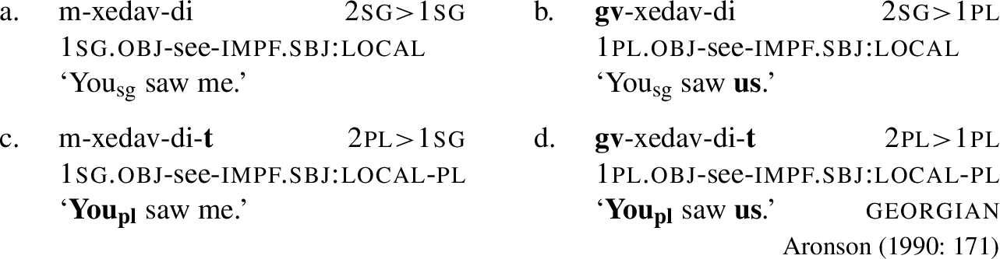
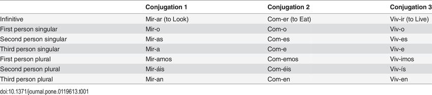
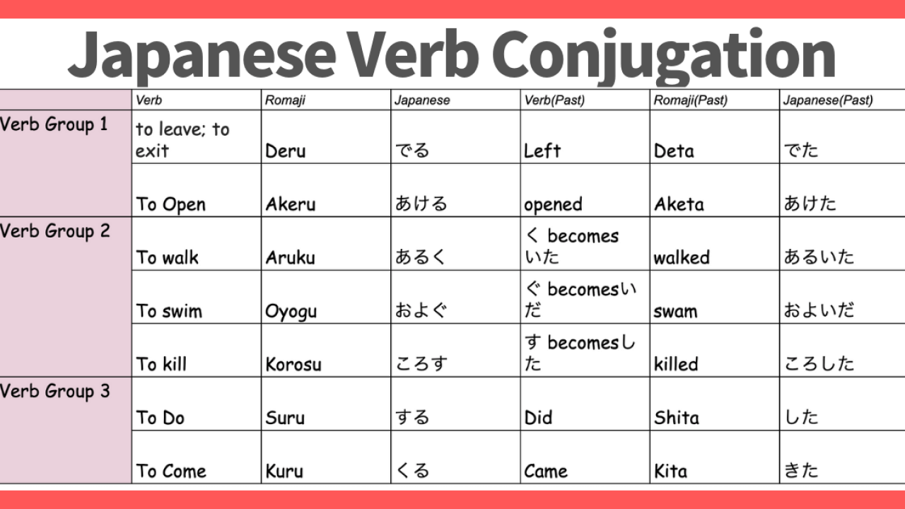
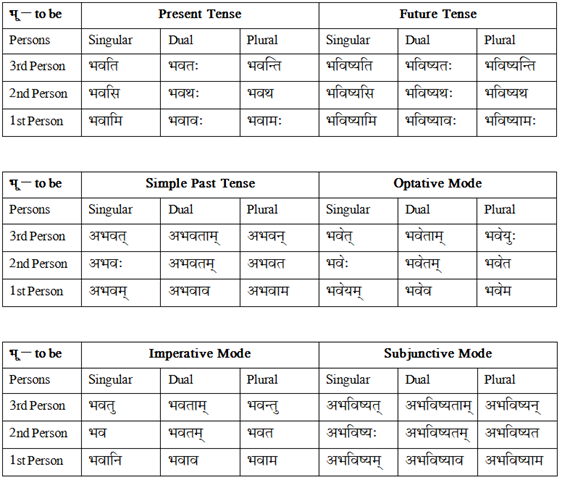
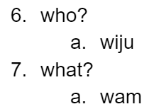
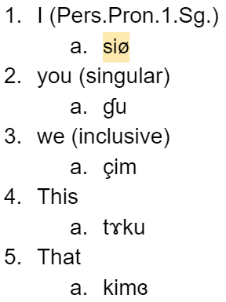
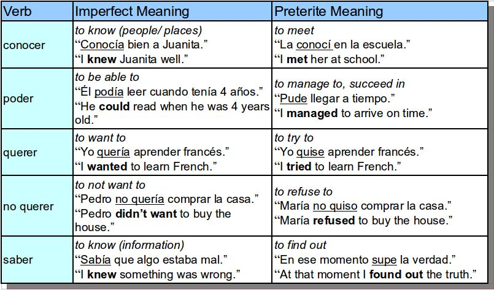

# Weeks 9-10: Verbs

## Last Time

- Nominals:
  - Number, Gender, Case
  - Adjectives
  - Pronouns

---

## For the next 2 weeks: Verbs

- Monday, Wednesday: In person class
  - Friday: work at home, or in groups on component 3
  - Make sure that you’ve got your nominals done
  - Have game plan for: person, number, tense, aspect
- Friday: I'm in LA
- Next Monday: Fall Break
- Next Wednesday, Friday:
  - more verbs

---

## Today: Creating your Verbal System

- Information Encoded in Verbs
  - Person
  - Number
  - Valency
  - Mood
  - Voice
  - Aspect
  - Tense

- ** Key Takeaway **
- NONE of these things have to be encoded in the verbs, but they do have to be marked somehow.

---

## Person

- Consider the following sentences.
- I sleep.
- You sleep.
- He/she/it sleeps.

- We sleep.
- Y’all sleep.
- They sleep.

---

## Person

---

## Person

- Some noun phrase or pronoun is ENCODED within the verb.

---

## Beyond subjects: Georgian

---

## Person - Mɤɧøɴ

- Like Georgian, but no case.			Subject + object + verb

---

## Person Markers

- sg.		du.		pl.
- 1		kɤ		kuu		kaa
- 2		ku		kuu		kwa
- “metra”	o		ow		oa
- “animal”	ʀɤ		ʀuu		ʀaa
- “plant”	sø		suu		saa
- “it”		ta		taw		taa

- We made these for our nominal system

---

## Person

- “I drink”		kɤʛu		“I drink it.”		kɤtaʛu
- “You drink”		kuʛu		“You drink it.”		kutaʛu
- “It (met.) drinks”	oʛu		“It drinks it.”		otaʛu

---

## Person

- No subject pronoun needed if noun specified:
- taʛu çampa.		“Chomper drinks it.”
- kaaɴaɴ we.			“The dinosaur bites us.”
- No object pronoun need if noun specified:
- kɤʛu men. 		“I drink water.” 	not		*kɤtaʛu meɴ.

---

## Number

- Remember this?

---

## Number: Singular & Plural

---

## Number: Unmarked

---

## Number: Singular, Plural, and Dual

---

## Number

- Your verbs should not have more numbers than your nominal system; but you can have overt number in your noun system but not in your verbs.

---

## Number - Mɤɧøɴ

- Already had established 3 in the noun system - singular, dual, plural

---

## The Mɤɧøɴ Pronouns

- sg.		du.		pl.
- 1st person		kɤ 		kɤɠu		kɤka
- 2nd person	ku 		kuɠu		kuka
- 3rd person (met)  o		oɠu		oka
- (animal)	ʀɤ		ʀɤɠu		ʀɤka
- (plant)		sø		søɠu		søka
- (other)		ta		taɠu		taka

---

## Person Markers

- sg.		du.		pl.
- 1		kɤ		kuu		kaa
- 2		ku		kuu		kwa
- “metra”	o		ow		oa
- “animal”	ʀɤ		ʀuu		ʀaa
- “plant”	sø		suu		saa
- “it”		ta		taw		taa

- How did I arrive at these?

---

## Person Markers

- du.			pl.
- kuu			kaa
- kuu			kwa
- ow			oa
- ʀuu		ʀaa
- suu			saa
- taw			taa

- du.	pl.
- 1st person	kɤɠu	kɤka
- 2nd person	kuɠu	kuka
- 3rd person (met) oɠu	oka
- (animal)	ʀɤɠu	ʀɤka	(plant)		søɠu	søka	(other)		taɠu	taka

- What changed?

---

## What to do with Dgon?

- Numbers (4): sg., du., pl. paucal
- Genders (2): natural – animate, inanimate
- Cases (8): grammatical & prepositional (oblique)
- Adjectives: incorporated (compounded within Ns)
- Pronouns: 4 numbers, 2 genders, prefixed cases

---

## Activity – Dorgon pronoun system

- Let’s create a table of pronouns with 1, 2, 3 on the left side. Include along the top the numbers you’ve posited for your language.

|  | sg. | du. | pl. | paucal |
|---|---|---|---|---|
| 1 | do ‘I’ | kto ‘we 2’ | ekto ‘we’ | akto ‘a few of us’ |
| 2 | ço ‘you’ | kço ‘you 2’ | ekço ‘y’all’ | akço ‘a few of y’all’ |
| 3 anim. inanim. | a ‘they’ un ‘it’ | ke: ‘they 2’ kew ‘they 2’ | eke: ‘they (pl.)’ ekew ‘they’ | ake: ‘a few of them’ akew ‘a few of them’ |

---

## Pronouns – need to reflect case, too!

- a ‘they (sg.)’
- subject     	pfodpθ̩mɳa 		pfa	‘they’
- dir. obj.   		dpθ̩mɳa 			a	‘them’
- indir. obj.		udpθ̩mɳa 		wa	‘to/for them’
- ‘before’			badpθ̩mɳa 		ba	‘before them’
- ‘after’			dadpθ̩mɳa 		da	‘after them’
- ‘from’			ikadpθ̩mɳa 		ika	‘from them’
- ‘with’			idpθ̩mɳa 			ja	‘with them’
- ‘of’			sxdpθ̩mɳa 		sxa	‘their’

- By rule!

---

## Elijah LIKES complicated

- kepfodpθ̩mɳgfa           ‘2 big idiots (subject)’

---

## Let's incorporate our nominal subjects into the V

- kepfodpθ̩mɳgfa           ‘2 big idiots (subject)’
- tom         ‘drink’
- e          ‘know’

---

## Alright, for Dgon

- For your language, grab 3 verbs from your Swadesh list.
  - “Eat”
  - “Sleep”
  - “Give”
- As we did with Mɤɧøɴ, arrange the verbs according by:
  - Person
  - Number
- Translate the following sentences (feel free to change nouns to make more appropriate for your culture):
  - “I eat.”
  - “You sleep in the bed.”
  - “He eats and sleeps a lot.”
  - “We give you a book.”
  - “Y’all eat meat.”
  - “They give the man a fish.”

---

## Okay, your turn!

- For your language, grab 3 verbs from your Swadesh list.
  - “Eat”
  - “Sleep”
  - “Give”
- As we did with Mɤɧøɴ, arrange the verbs according by:
  - Person
  - Number
- Translate the following sentences (feel free to change nouns to make more appropriate for your culture):
  - “I eat.”
  - “You sleep in the bed.”
  - “He eats and sleeps a lot.”
  - “We give you a book.”
  - “Y’all eat meat.”
  - “They give the man a fish.”

# Weeks 9-10: Verbs

## Last Time:

- Person
- Number

---

## But how do you create markers for your language?

---

## Creating markers for your language - Sruɗɞr

- What do both interrogative words have in common?

---

## Creating markers for your language - Sruɗɞr

- 1st person?

---

## Creating markers for your language - Sruɗɞr

- 2nd person plural?

---

## Creating markers for your language - Sruɗɞr

- 3rd person?

---

## Creating markers for your language - Sruɗɞr

- 3rd person plural?

---

## Okay, your turn!

- Translate the following sentences (feel free to change nouns to make more appropriate for your culture):
  - “I eat.”
  - “You sleep in the bed.”
  - “He eats and sleeps.”
  - “We give you a book.”
  - “Y’all eat meat.”
  - “They give the man a fish.”

---

## Tense

- Consider the following sentences:
- ‘I walk to school.’
- ‘I walked to school.’
- ‘I will walk to school.’
- ** What is the difference between these three sentences? **

---

## Explore

- Visit https://en.wikipedia.org/wiki/Grammatical_tense; scroll down to “Possible tenses”

---

## Tense - Mɤɧøɴ

- Present --
- Past
- Super past (remote past)
- Future

---

## Tense - Mɤɧøɴ

- Present (nothing)	kɤʛu meɴ.	I drink water.
- Future (ti) 		kɤʛuti meɴ.	I will drink water.
- past (pa)		kɤʛupa meɴ.	I drank water.
- remote past (paa)	kɤʛupaa meɴ.	I drank water a long time ago.

---

## Aspect

- Consider the following sentences:
- ‘I walked to school.’			past tense (simple past; preterit)
- ‘I have walked to school.’			perfect
- ‘I was walking to school.’			past progressive
- ** What is the difference in meaning between these three sentences? **

---

## Aspect

---

## Explore

- Visit https://en.wikipedia.org/wiki/Grammatical_aspect, scroll down to “By language” & browse the examples of aspect marking

---

## Aspect - Mɤɧøɴ

- Like mood, separate words
- kɤʛu meɴ.			“I drink water.”			-- unmarked = indicative
- çi kɤʛu meɴ.			“I am drinking water.”		-- çi ‘now’ + present
- ɣun kɤʛupa meɴ.		“I have drunk water.”		-- ɣun ‘already’ + past

# Weeks 9-10: Verbs

## Today & Friday

- Review
- Final three verbal categories:
  - Voice
  - Valence
  - Mood
- Translation practice

---

## Think back:

- What are:
  - Tense
  - Aspect
  - Person
  - Number

---

## Voice

- Consider the following sentences:
- I baked a pizza in the oven.
- The pizza was baked in the oven.
- The pizza baked in the oven.

---

## Voice

- Consider the following sentences:
- I baked a pizza in the oven.		Subject = I, the baker
- The pizza was baked in the oven.	Subject = The pizza, the baked
- The pizza baked in the oven.		Subject = The pizza, the baked

---

## Voice

- Consider the following sentences:
- I baked a pizza in the oven.		Active - subject focused
- The pizza was baked in the oven.	Passive - object focused in subject
- The pizza baked in the oven.		Middle - in between
- Common for reciprocals: “We punched each other.”
- reflexives: “I punched myself.”

---

## Voice

- अहं नरं स्मरामिahaṃ naraṃ smarāmiI remember the man.
- नरः स्मरतेnaraḥ smarateThe man remembers himself.
- नरो मया स्मर्यतेnaro mayā smaryateThe man is remembered by me.

---

## Voice - Mɤɧøɴ

- Active, Middle, Passive

---

## Voice - Mɤɧøɴ

- Active, Middle, Passive
- Middle marked by doubling of final syllable of verb (ʛu → ʛuʛu, ʀuɗe → ʀuɗeɗe).
- “I drink water.”				→ 	kɤʛu meɴ.
- “I drink myself.”				→ 	kɤʛuʛu.
- “I drink me some water.”		→ 	kɤʛuʛu meɴ.
- “Water is drunk by me.”			can’t say this!

---

## Valency

- Consider the following sentences:
- It’s raining.
- It’s sleeping.
- It’s hugging the wall.
- It’s giving the people candy.
- ** How many nominals are in each sentence? **

---

## Valency

- Consider the following sentences:
- It’s raining.			= 		0
- It’s sleeping.			=		1 (it)
- It’s hugging the wall.		= 		2 (it, the wall)
- It’s giving the people candy.	=		3 (it, the people, candy)
- ** How many nominals are in each sentence? **

---

## Valency

- Consider the following sentences:
- It’s raining.			= 		avalent
- It’s sleeping.			=		intransitive
- It’s hugging the wall.		= 		transitive
- It’s giving the people candy.	=		ditransitive
- ** How many nominals are in each sentence? **

---

## Valency

- In English, we don’t mark for valency
- It’s pouring outside.		= 		avalent
- It pours well.			=		intransitive
- He pours a drink.		= 		transitive
- He pours water on himself.	=		ditransitive

---

## Valency

- Some languages do mark for valency, though. Imagine the following:
- poura		= 		avalent
- pouru		=		intransitive
- pouri		= 		transitive
- pouro		=		ditransitive

---

## Valency - Mɤɧøɴ

- No explicit marking except for ditransitives (the one with 2 objects) “It’s giving the people candy.”

---

## Valency

- Insert -n- before verb:
- kɤʀuɗe meɴ 	“I give water.” (generally) → kɤkunʀuɗe meɴ “I give you water.”
- If both subject and object are specified nouns, the correct gendered pronoun will be used, followed by -n.
- ʀuɗe çampa meɴ. “Chomper gives water” (generally) →
- ʀɤnʀuɗe çampa meɴ we. “Chomper gives water to the dinosaur.”
- onʀuɗe çampa meɴ iɴ. “Chomper gives water to the metra.”
- sønʀuɗe çampa meɴ ɓiŋ. “Chomper gives water to the seaweed.”

---

## Mood

- Consider the following sentences:
- I am a fish, and I like to eat fish food.
- Were I a fish, I would eat fish food.
- Be a fish! Eat fish food!
- Am I a fish? Do I eat fish food?
- ** What is the purpose of each sentence? **

---

## Mood

- Consider the following sentences:
- I am a fish, and I like to eat fish food.	=	Statement
- Were I a fish, I would eat fish food.	=	Hypothetical
- Be a fish! Eat fish food!		=	Command
- Am I a fish? Do I eat fish food?		=	Question
- ** What is the purpose of each sentence? **

---

## Mood

- Consider the following sentences:
- I am a fish, and I eat fish food.	=	Statement
- Were I a fish, I would eat fish food.	=	Hypothetical
- Be a fish! Eat fish food!		=	Command
- Am I a fish? Do I eat fish food?	=	Question
- ** How is each mood expressed? **

---

## Mood

- In Latin:
- Pisces sum.	Cibum edo.	=	Statement
- Pisces sim, cibum edam.	=	Hypothetical
- Es pisces! Ede cibum!		=	Command
- Pisces sum? Cibum edo?	=	Question
- ** How is each mood expressed? **

---

## Mood - Mɤɧøɴ

- Different word orders?
- Different words?
- New words that indicate mood?

---

## Mood - Mɤɧøɴ

- Has helping verbs for hypothetical (na), question (ɓu); no subject specified for imperative. Helping verbs placed before verb and prefixes.
- kɤʛu meɴ.			“I drink water.”
- na kɤʛu meɴ.			“Were I to drink water…”
- ʛu meɴ!				“Drink water!”
- ɓu kɤʛu meɴ?			“Am I drinking water?”

# Weeks 9-10: Verbs

## Putting it all together...

- You now have the strategies to address the following seven categories for verbs in language:
- Person
- Number
- Valency
- Mood
- Voice
- Tense
- Aspect

---

## Dgon Verbs

- Person: no marker; pronoun/subj. required (except for avalent)
- Number: no marker, pronoun/subj. required (except for avalent)
- Tense: non-future: no marker; future: tx-
- Aspect: no contrast
- Voice: only active
- Valency: only marker to increase: mo- (immediately before root)
  - co ‘sleep’ → moco ‘make sleep; bore’
  - dipθ ‘be confused; be ignorant’ → modipθ ‘confuse; befuddle’
- Mood: prefix; hypothetical: sn-; imperative: omit subject marker

---

## Dgon Verbs

- Order of prefixes: TA + mood  + valency + root
- tx-sn-mo-di-gizi-pθ pfa
- FUT-HYPO-VAL-‘be.confused’< ‘Gzenian (ACC)’ >
- ‘they (sg.) might confuse the Gzenian (in the future)’

---

## Let’s begin by translating the following sentences

- ‘He drinks’
- ‘I drink.’
- ‘They drink.’
- ‘They drink water.’
- ‘Drink water!’
- ‘If I drink water...’

- tom ‘drink’
- tso ‘lava’

- ​
- subject   pfodpθ̩mɳa  		pfa ‘they’​
- dir. obj.  dpθ̩mɳa  		a ‘them’​
- indir. obj. 	udpθ̩mɳa  		wa ‘to/for them’​
- ‘before’ 	badpθ̩mɳa  		ba ‘before them’​
- ‘after’ 	dadpθ̩mɳa  		da ‘after them’​
- ‘from’ 	ikadpθ̩mɳa  		ika ‘from them’​
- ‘with’ 	idpθ̩mɳa 		ja ‘with them’​
- ‘of’ 	sxdpθ̩mɳa  		sxa ‘their’ ​
- ​

|  | sg. | du. | pl. | paucal |
|---|---|---|---|---|
| 1 | do ‘I’ | ke-do ‘we 2’ | eke-do ‘we’ | ake-do ‘a few of us’ |
| 2 | ço ‘you’ | ke-ço ‘you 2’ | eke-ço ‘y’all’ | ake-ço ‘a few of y’all’ |
| 3 anim. inanim. | a ‘they’ un ‘it’ | ke: ‘they 2’ kew ‘they 2’ | eke: ‘they (pl.)’ ekew ‘they’ | ake: ‘a few of them’ akew ‘a few of them’ |

---

## For your language...

- ‘He drinks’
- ‘I drink.’
- ‘They drink.’
- ‘They drink water.’
- ‘Drink water!’
- ‘If I drink water...’

---

## Putting it all together...

- You now have the strategies to address the following seven categories for verbs in language:
- Person
- Number
- Valency
- Mood
- Voice
- Tense
- Aspect

---

## Okay, your turn!

- Translate the following sentences:
  - “I eat (every day).”
  - “I am eating.”
  - “You ate (yesterday).”
  - “He/she/it was eating (yesterday).”
  - “They ate (a long time ago).”
  - “The fish was eaten.”
  - “The snake ate itself.”
